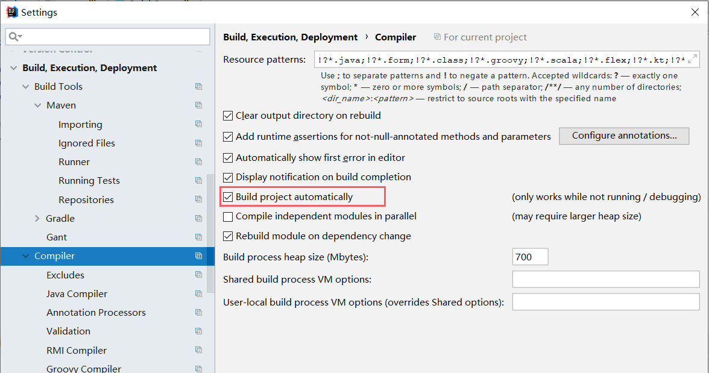
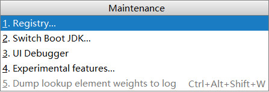
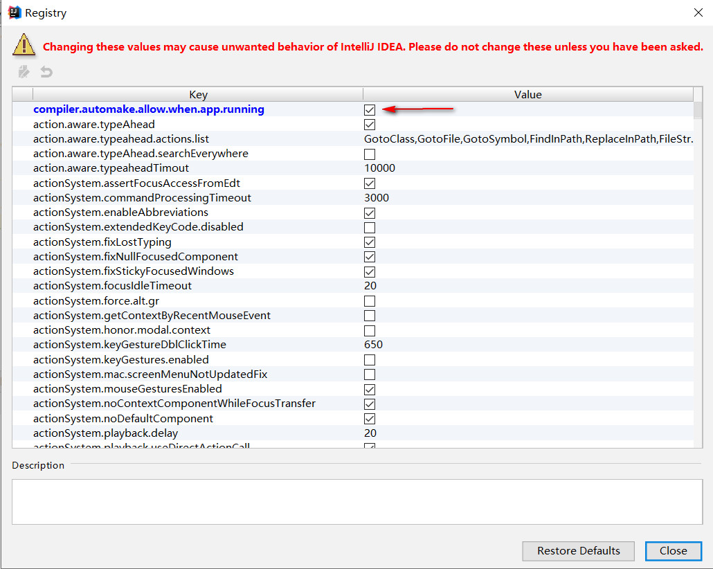

# Developer tools

## pom.xml 中引入依赖

```xml
<dependencies>
    <dependency>
        <groupId>org.springframework.boot</groupId>
        <artifactId>spring-boot-devtools</artifactId>
        <optional>true</optional>
    </dependency>
</dependencies>
```

## 配置自动编译

1、IDEA 中启用项目自动构建



2、maintenance 维护设置

按 `Ctrl + Alt + Shift + /` 选 Resigtry...



勾选 `compiler.automake.allow.when.app.running` 选项



## 配置触发热部署

1、新建触发文件（任意名字，必须在META-INF文件夹中）

```xml
src
 ├─main
 │  ├─java 
 │  │
 │  └─resources
 │      └─META-INF
 │          └─.trigger
```

2、`application.properties` 配置文件添加配置

```yaml
#热部署触发文件
spring.devtools.restart.trigger-file=.trigger
```

3、 触发热部署

项目内容变动后，只有修改了 `.trigger` 文件，才会自动重启
