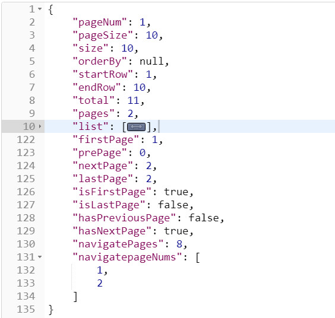

## 1. 引入 pom 依赖

```
<dependency>
  <groupId>com.github.pagehelper</groupId>
  <artifactId>pagehelper</artifactId>
  <version>4.1.0</version>
</dependency>
```

## 2. 编写配置类

```
/**
 * Mybatis 分页插件配置
 */
@Configuration
public class MyBatisConfig {
    @Bean
    public PageHelper pageHelper() {
        PageHelper pageHelper = new PageHelper();
        Properties prop = new Properties();

        // 设置为true时，回将RowBounds第一个参数offset当成pageNum页码使用
        prop.setProperty("offsetAsPageNum", "true");

        // 设置为true时，使用RowBounds分页会进行count查询
        prop.setProperty("rowBoundsWithCount", "true");
        prop.setProperty("reasonable", "true");
        pageHelper.setProperties(prop);

        return pageHelper;
    }
}
```

## 3. 代码中分页查询使用

```
    /**
     * 分页接口
     * @param page 当前第几页，默认第一页
     * @param size 每页显示几条
     * @return
     */
    @GetMapping("page")
    public Object pageVideo(@RequestParam(value = "page",defaultValue = "1") int page,
                            @RequestParam(value = "size",defaultValue = "10") int size) {

        PageHelper.startPage(page,size);
        List<Video> list = videoService.findAll();

        return new PageInfo<>(list);
    }
```

## 4. 发送get请求获取数据


## 5. 返回的数据

```
JDBC Connection [com.mysql.cj.jdbc.ConnectionImpl@feb3ffe] will not be managed by Spring
==>  Preparing: SELECT count(*) FROM video
==> Parameters:
<==    Columns: count(*)
<==        Row: 11
<==      Total: 1
==>  Preparing: select * from video limit ?,?
==> Parameters: 0(Integer), 10(Integer)
<==    Columns: id, title, summary, cover_img, view_num, price, create_time, online, point
<==        Row: 1, SpringBoot+Maven整合Websocket课程, 这是概要, https://xd-video-pc-img.oss-cn-beijing.aliyuncs.com/upload/video/video_cover.png, 12, 1000, null, 0, 8.7
<==        Row: 2, 2018年 6.2新版本ELK ElasticSearch , 这是概要, https://xd-video-pc-img.oss-cn-beijing.aliyuncs.com/upload/video/video_cover.png, 43, 500, null, 0, 9.7
<==        Row: 3, JMeter接口测试入门到实战, 这是概要, https://xd-video-pc-img.oss-cn-beijing.aliyuncs.com/upload/video/video_cover.png, 53, 123, null, 0, 8.7
<==        Row: 4, Spring Boot2.x零基础入门到高级实战, 这是概要, https://xd-video-pc-img.oss-cn-beijing.aliyuncs.com/upload/video/video_cover.png, 23, 199, null, 0, 6.2
<==        Row: 5, 亿级流量处理搜索, 这是概要, https://xd-video-pc-img.oss-cn-beijing.aliyuncs.com/upload/video/video_cover.png, 64, 10, null, 0, 9.1
<==        Row: 6, reidis消息队列高级实战, 这是概要, https://xd-video-pc-img.oss-cn-beijing.aliyuncs.com/upload/video/video_cover.png, 12, 10, null, 0, 6.7
<==        Row: 7, 谷歌面试题, 这是概要, https://xd-video-pc-img.oss-cn-beijing.aliyuncs.com/upload/video/video_cover.png, 52, 23, null, 0, 5.1
<==        Row: 8, js高级前端视频, 这是概要, https://xd-video-pc-img.oss-cn-beijing.aliyuncs.com/upload/video/video_cover.png, 54, 442, null, 0, 8.7
<==        Row: 9, List消息队列高级实战, 这是概要, https://xd-video-pc-img.oss-cn-beijing.aliyuncs.com/upload/video/video_cover.png, 13, 32, null, 0, 4.3
<==        Row: 10, 1111111111111111, null, null, null, null, null, null, null
<==      Total: 10
```


