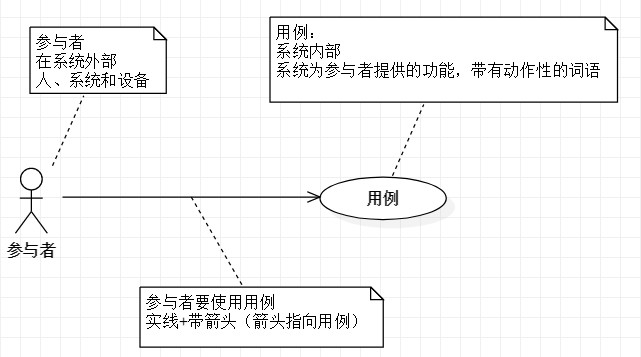
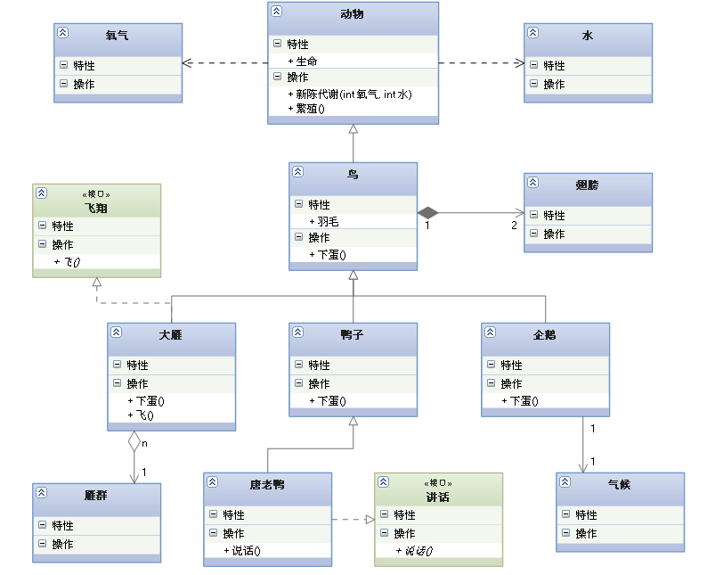
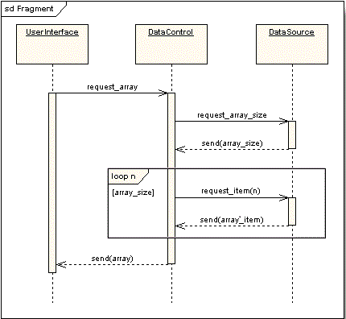

# UML 简介

## 概要

UML(Unified Modeling Language ,统一建模语言或标准建模语言).     
UML图形有13种,UML规范用来描述建模的概念有，类（对象的）、对象、关联、职责、行为、接口、用例、包、顺序、协作，以及状态.一起细细品读下

----

## 静态建模

- 创建并记录一个系统的静态特征
- 反映一个软件系统基础、固定的框架结构
- 创建相关问题域主要元素的视图
- 静态建模包括：  
  -- 用例图（use case diagram）  
  -- 类图（class Diagram）  
  -- 对象图（object Diagram）  
  -- 组件图（component Diagram）  
  -- 部署图（deployment Diagram）

---

## 动态建模

- 动态建模用于展示系统的行为
- 动态建模包括：  
  -- 时序图（sequence Diagram）  
  -- 协作图（collaboration Diagram）  
  -- 状态图（state chart Diagram）  
  -- 活动图（Activity Diagram）

---

## 其他重要的 UML 元素

- 包（package）
- UML 的扩展机制：  
  -- 注释（comments）  
  -- 构造型（stereotypes）  
  -- 标记值（tagged values）  
  -- 限制（constraints）  

---

## 1. 用例图（UseCase Diagram）

- 由`参与者`、`用例`以及`用例`与`用例`之间的关系构成的用于描述系统功能的动态视图称为用例图
- 参与者
- 用例
- 用例关系
  - 包含关系(include)
    - 
  - 扩展(extend)
    - 
  - 泛化(Generalization)
    - 
  - 关联
  - 依赖
  - 项目
  - 注释

---

**参与者与用例**



> **扩展关系：**将基用例中一段相对`独立`并且`可选`的动作，用扩展用例加以封装，再让它从基用例中声明的扩展点上进行扩展，从而使基用例行为更简练和目标更集中


>**泛化关系：**一般和特殊的关系  
接口和实现类 | 抽象类和子类


对系统的使用方式分类. 帮助开发团队以一种可视化的方式理解系统的功能需求。  

**元素关系包含有: **参与者,用例,子系统,关系(关联,泛化,包含,扩展,依赖,项目,注释)  


---

## 2. 类图（Class Diagram）

显示类和它们的相互关系.

- 泛化（Generalization）
- 实现（Realization）
- 关联（Association)
- 聚合（Aggregation）
- 组合(Composition)
- 依赖(Dependency)  

**泛化**（Generalization）：父子

> - 一种继承关系  
- 在 java 此类关系通过关键字 extends 明确标识，依赖的特例


**实现**（Realization）：接口和实现类

> - 类是接口所有特征和行为的实现  
- 在 java 中此类关系通过关键字 implements 明确标识，依赖的特例


**关联**（Association)：在 Field 中出现了其他类的引用  
&emsp;&emsp;一种拥有的关系，它使一个类知道另一个类的属性和方法

> 1. 单向关联
2. 双向关联
3. 自关联
4. 聚合
5. 组合


##### 单向关联


##### 双向关联


##### 自关联


**聚合**（Aggregation）:是整体与部分的关系，且部分可以离开整体而单独存在


**组合**(Composition):是整体与部分的关系，但部分不能离开整体而单独存在.
如公司和部门是整体和部分的关系，没有公司就不存在部门.
组合关系是关联关系的一种，是比聚合关系还要强的关系.  


**依赖**(Dependency): 是一种使用的关系，即一个类的实现需要另一个类的协助，所以要尽量不使用双向的互相依赖  

  > 在 java 中，依赖关系体现为：局部变量、方法中的参数、和对静态方法的调用


##### UML 综合示例图




---

## 3. 对象图（Object Diagram）

对象图只显示对象及它们的相互关系  
概述：  


##### 和类图对比


##### 对象图示例


----

## 4. 组件图（Component Diagram）

- 表现软件组件之间的关系


---

## 5. 部署图（Deployment Diagram）

- 表现用于部署软件应用的物理设备信息


---

## 6. 时序图（Sequence Diagram）

&emsp;&emsp;时序图（Sequence Diagram）是显示对象之间交互的图，强调消息交互的时间顺序，这些对象是按时间顺序排列的。顺序图中显示的是参与交互的对象及其对象之间消息交互的顺序。时序图中包括的建模元素主要有：对象（Actor）、生命线（Lifeline）、控制焦点（Focus of control）、消息（Message）等等。

#### 元素

##### 角色（Actor）

系统角色，可以是人、及其甚至其他的系统或者子系统。

##### 对象（Object）

对象包括三种命名方式：
  - 第一种方式包括对象名和类名；
  - 第二中方式只显示类名不显示对象名，即表示他是一个匿名对象；
  - 第三种方式只显示对象名不显示类明。

##### 生命线（Lifeline）

生命线在顺序图中表示为从对象图标向下延伸的一条虚线，表示对象存在的时间

##### 控制焦点（Focus of Control）

控制焦点是顺序图中表示时间段的符号，在这个时间段内对象将执行相应的操作。用小矩形表示

##### 消息（Message）

- 同步消息（Synchronous Message）
- 异步消息（Asynchronous Message）
- 返回消息（Return Message）
- 自关联消息（Self-Message）

> 同步消息=调用消息（Synchronous Message）  

消息的发送者把控制传递给消息的接收者，然后停止活动，等待消息的接收者放弃或者返回控制。用来表示同步的意义。

> 异步消息（Asynchronous Message）

消息发送者通过消息把信号传递给消息的接收者，然后继续自己的活动，不等待接受者返回消息或者控制。异步消息的接收者和发送者是并发工作的。

> 返回消息（Return Message）

返回消息表示从过程调用返回


> 自关联消息（Self-Message）

表示方法的自身调用以及一个对象内的一个方法调用另外一个方法


#### 组合片段（Combined Fragments）

> Alternative fragment（denoted “alt”） 与 if…then…else对应


> Option fragment (denoted “opt”) 与 Switch对应


> Parallel fragment (denoted “par”) 表示同时发生,同步：用于描述多线程的情况。


> Loop fragment(denoted “loop”) 与 for 或者 Foreach对应


#### 综合图



#### 时序图的引用
在一个顺序图中，可以引用另一个顺序图，其引用方式类似于复合片段，

标签为：ref


#### 画时序图的步骤
1. 确定交互的范围

2. 确定参与交互的活动者与对象

3. 确定活动者、对象的生存周期

4. 确定交互中产生的消息

5. 细化消息的内容

---

## 7. 通信图（Communication Diagram）

- UML 2.0 之前叫协作图（Collaboration Diagram）

- 表现一定范围内对象之间协作的信息，强调参与信息交流的对象之间的组织架构

#### 作用

> - 强调的是发送和接收消息的对象之间的组织结构。   
- 说明系统的动态情况。  
- 描述协作对象间的交互和链接，显示对象、对象间的链接以及对象间如何发送消息。  
- 表示一个类操作的实现

#### 协作图中的要素


#### 协作图中的关系


---

## 8. 状态图（state chart diagram）

状态图（Statechart Diagram）主要用于描述一个对象在其生存期间的动态行为，表现为一个对象所经历的状态序列，引起状态转移的事件（Event），以及因状态转移而伴随的动作（Action）。一般可以用状态机对一个对象的生命周期建模，状态图用于显示状态机（State Machine Diagram），重点在与描述状态图的控制流。


- 状态有
> Opened、Closed、Locked

- 事件有
> Open、Close、Lock 、 Unlock

注意：  
1、 并不是所有的事件都会引起状态的转移，比如当门是处于【Opened】状态，不能进行【Lock】事件。  
2、 转移（Transition）有警备条件（guard condition），比如只有doorWay->isEmpty 条件满足时，才会响应事件。

#### 状态图元素（State Diagram Elements）

##### 1. 状态（States）

  ```
  指在对象的生命周期中的某个条件或者状况，在此期间对象将满足某些条件、执行某些活动活活等待某些事件。
  所有对象都有状态，状态是对象执行了一系列活动的结果，当某个事件发生后，对象的状态将发生变化。
  ```
状态用圆角矩形表示

初态和终态（Initial and Final States）

初态用实心圆点表示，终态用圆形内嵌圆点表示。


##### 2. 转移（Transitions）

```
转移（Transitions）是两个状态之间的一种关系，表示对象将在源状态（Source State）中执行一定的动作，
并在某个特定事件发生而且某个特定的警界条件满足时进入目标状态（Target State）
```

- **事件标记（Trigger）：**是转移的诱因，可以是一个信号，事件、条件变化（a change in some condition）和时间表达式。

- **警界条件（Guard Condition）：**当警界条件满足时，事件才会引发转移（Transition）。

- **结果（Effect）：**对象状态转移后的结果。

##### 3. 动作（State Actions）

```
动作（Actions）是一个可执行的原子操作,也就是说动作是不可中断的，其执行时间是可忽略不计的。
```


##### 4. 自身转移（Self-Transitions）

```
状态可以有返回自身状态的转移，称之为自身转移（Self-Transitions）
```
2S后，Poll input事件执行，转移到自己状态【Waiting】


##### 5. 组合状态（Compound States）

```
嵌套在另外一个状态中的状态称之为子状态（sub-state）,一个含有子状态的状态被称作组合状态（Compound States）. 如下图，【Check PIN】是组合状态，【Enter PIN】是子状态。
```


也可用以下方式进行描述


如上图，状态机【Check PIN】的细节被分割到另外一个图中了。

##### 6. 进入节点（Entry Point）

```
如下图所示，由于一些原因并不会执行初始化（initialization），而是直接通过一个节点进入状态【Ready】，则此节点称之为进入节点（Entry Point）
```


##### 7. 退出节点（Exit Point）


##### 8. 历史状态（History States）

```
历史状态是一个伪状态（Pseudostate）,其目的是记住从组合状态中退出时所处的子状态，当再次进入组合状态，可直接进入这个子状态，而不是再次从组合状态的初态开始。
```


在上图的状态图中，正常的状态顺序是:【Washing】- >【Rinsing】->【Spinning】。  
如果是从状态【Rinsing】突然停电（Power Cut）退出，,洗衣机停止工作进入状态【Power Off】，当电力恢复时直接进入状态【Running】。

##### 9. 并发区域（Concurrent Regions）

```
状态图可以分为区域，而区域又包括退出或者当前执行的子状态。说明组合状态在某一时刻可以同时达到多个子状态。如下图刹车系统，同时进入前刹车【Applying Front Brakes】状态和后刹车【Applying Rear Brakes】状态。
```


#### 状态图案例分析（State Diagram Example Analysis）


##### 订单成立状态主要有：

>订单成立  
订单取消（Guard:会员订单-缴款期限已过期）  
备货中（Guard:已付款、订单成立、库存量足够）  
出货中（Effect:扣除商品可接单量及移除购物车中的购买资料）  
出货确认（Guard:实际配达日及发票代码、号码均不为空值）  
出货完毕（Guard:实际配达日不为空）  
出货失败  
订单成立（Guard:出货完毕，已付款、鉴赏期结束日期小于等于 [系统日期]）  

##### 分析：
> 1、购物车生成订单进入状态【订单成立】  
2、系统检测订单已经付款并且库存量足够，则进入状态【备货中】  
3、物流发货，进入状态【发货中】，状态转移为【发货中】后，需要做的操作有“扣除商品可接单量及移除购物车中的购买资料”  
4、发货完毕后，状态分为【出货确认】和状态【出货失败】，如果状态是【出货失败】，则【结束】，如果状态为【出货确认】，则进入下一步。  
5、配货人员填写实际配达日期，进入状态【出货完毕】。  
6、如果”已付款、鉴赏期结束日期小于等于 [系统日期]”,则【订单成立】。  

---

## 9. 活动图（Activity Diagram）

```
活动图是UML用于对系统的动态行为建模的另一种常用工具，它描述活动的顺序，展现从一个活动到另一个活动的控制流。
活动图在本质上是一种流程图。活动图着重表现从一个活动到另一个活动的控制流，是内部处理驱动的流程。
```

#### 活动图的组成元素 （Activity Diagram Element）

##### 1. 活动状态图（Activity）

活动状态用于表达状态机中的非原子的运行，其特点如下：

  1. 活动状态可以分解成其他子活动或者动作状态。
  2. 活动状态的内部活动可以用另一个活动图来表示。
  3. 和动作状态不同，活动状态可以有入口动作和出口动作，也可以有内部转移。
  4. 动作状态是活动状态的一个特例，如果某个活动状态只包括一个动作，那么它就是一个动作状态。

UML中活动状态和动作状态的图标相同，但是活动状态可以在图标中给出入口动作和出口动作等信息。


##### 2. 动作状态（Actions）

动作状态是指原子的，不可中断的动作，并在此动作完成后通过完成转换转向另一个状态。动作状态有如下特点：

  1. 动作状态是原子的，它是构造活动图的最小单位。
  2. 动作状态是不可中断的。
  3. 动作状态是瞬时的行为。
  4. 动作状态可以有入转换，入转换既可以是动作流，也可以是对象流。动作状态至少有一条出转换，这条转换以内部的完成为起点，与外部事件无关。
  5. 动作状态与状态图中的状态不同，它不能有入口动作和出口动作，更不能有内部转移。
  6. 在一张活动图中，动作状态允许多处出现。

UML中的动作状态图用平滑的圆角矩形表示，如下：


##### 3. 动作状态约束（Action Constraints）

```
动作状态约束：用来约束动作状态
```

##### 4. 动作流（Control Flow）

```
动作之间的转换称之为动作流，活动图的转换用带箭头的直线表示，箭头的方向指向转入的方向。
```


##### 5. 开始节点（Initial Node）

```
开始节点：表示成实心黑色圆点
```


##### 6. 终止节点（Final Node）

```
分为活动终止节点（activity final nodes）和流程终止节点（flow final nodes）。
```

活动终止节点表示整个活动的结束


而流程终止节点表示是子流程的结束。


##### 7. 对象（Objects）


##### 8. 数据存储对象（DataStore）


使用关键字«datastore»

##### 9. 对象流（Object Flows）

```
对象流是动作状态或者活动状态与对象之间的依赖关系，表示动作使用对象或动作对对象的影响。用活动图描述某个对象时，可以把涉及到的对象放置在活动图中并用一个依赖将其连接到进行创建、修改和撤销的动作状态或者活动状态上，对象的这种使用方法就构成了对象流。
```

**对象流中的对象有以下特点：**

> 1. 一个对象可以由多个动作操作。
2. 一个动作输出的对象可以作为另一个动作输入的对象。
3. 在活动图中，同一个对象可以多次出现，它的每一次出现表面该对象正处于对象生存期的不同时间点。

对象流用带有箭头的虚线表示。如果箭头是从动作状态出发指向对象，则表示动作对对象施加了一定的影响。施加的影响包括创建、修改和撤销等。如果箭头从对象指向动作状态，则表示该动作使用对象流所指向的对象。

状态图中的对象用矩形表示，矩形内是该对象的名称，名称下的方括号表明对象此时的状态。


##### 10. 分支与合并（Decision and Merge Nodes）

```
分支与合并用菱形表示
```


##### 11. 分叉与汇合（Fork and Join Nodes）

```
分为水平风向和垂直方向。
```


对象在运行时可能会存在两个或多个并发运行的控制流，为了对并发的控制流建模，UML中引入了分叉与汇合的概念。分叉用于将动作流分为两个或多个并发运行的分支，而汇合则用于同步这些并发分支，以达到共同完成一项事务的目的。

##### 12. 异常处理（Exception Handler）

```
当受保护的活动发生异常时，触发异常处理节点。
```


##### 13. 活动中断区域（Interruptible Activity Region）

```
活动中断区域围绕一些可被中断的动作状态图。比如下图，  
正常情况下【Process Order】顺序流转到【Close Order】，  
订单处理流程完毕；但在【Process Order】过称中，会发送【Cancel Order】请求，  
这时会流转到【Cancel Order】，从而订单处理流程结束  
```


##### 14. 泳道（Partition）

> 泳道将活动图中的活动划分为若干组，并把每一组指定给负责这组活动的业务组织，即对象。在活动图中，泳道区分了负责活动的对象，它明确地表示了哪些活动是由哪些对象进行的。在包含泳道的活动图中，每个活动只能明确地属于一个泳道。


> 泳道是用垂直实线绘出，垂直线分隔的区域就是泳道。在泳道的上方可以给出泳道的名字或对象的名字，该对象负责泳道内的全部活动。泳道没有顺序，不同泳道中的活动既可以顺序进行也可以并发进行，动作流和对象流允许穿越分隔线。


#### 活动图案例分析


1. **泳道分为：**会员泳道和系统泳道。会员选择商品并加入购物车，系统完成订单生成及其支付完毕。

2. **开始节点：**会员添加商品到购物车，点击【订单确认】，开始交于系统处理订单流程

3. **结束节点：**商品发送完毕和付款成功，订单处理流程结束

4. **活动状态：**产生订单、Check Credit Cart核对信用卡、Check Stock 核对库存量、Deliver Goods 发送商品、Process Credit Cart付款

5. **分叉与汇合：**【产生订单】份叉为检查库存量和会员支付金额是否足够，如果不足，取消订单，如过库存量和支付金额足够，发送商品和付款，最后汇合为订单完成。

---

### 包（package）

```
引用一组相关实体
通常可用于划分类的命名空间
```

**包可用于：**

>  命名   （Naming）  
成员可见度（Member visibility）  
导入（Importing）  
继承（Extending）   
泛化（Generalization）
