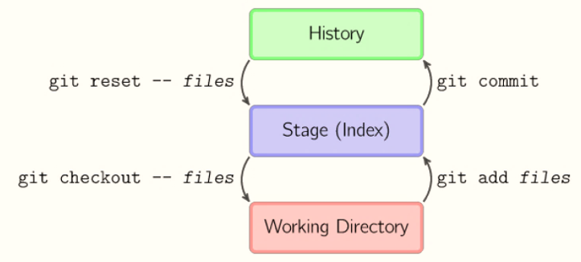

# Git 回撤操作



## git reset 回撤

### 回撤暂存区内容到工作目录

```bash
git reset HEAD
```

回撤暂存区的 a.txt 文件：

```bash
git reset HEAD a.txt
```

### 回撤提交到暂存区

```bash
git reset HEAD --soft
```

### 回撤提交，放弃变更

```bash
git reset HEAD --hard
```

### 回撤远程仓库，-f 即 --force

```bash
git push -f
```

### 回撤上一次提交

```bash
git add .

git commit --amend -m "message"
```

### 变基操作，改写历史提交

```bash
git rebase -i HEAD~3
```

---

## git checkout 回撤

```bash
git checkout -- readme.txt
```

命令 `git checkout -- readme.txt` 意思就是，把 `readme.txt` 文件在工作区的修改全部撤销，这里有两种情况：

一种是 `readme.txt` 自修改后还没有被放到暂存区，现在，撤销修改就回到和版本库一模一样的状态；

一种是 `readme.txt` 已经添加到暂存区后，又作了修改，现在，撤销修改就回到添加到暂存区后的状态。

总之，就是让这个文件回到最近一次 `git commit` 或 `git add` 时的状态。


