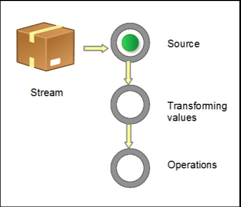

## Stream（重点）

-  Collection提供了新的stream()⽅方法

-  流不存储值，通过管道的⽅式获取值

- 本质是函数式的，对流的操作会⽣成⼀个结果，不过并不会修改底层的数据源，集合可以作为流的底层数据源

- 延迟查找，很多流操作（过滤、映射、排序等）都可以延迟实现

- Java 8 中的 Stream 是对集合对象功能的增强，它专注于对集合 对象进行各种⾮常便利、⾼效的聚合操作，或者大批量数据操作

-  Stream API 借助于Lambda 表达式，极⼤地提高了编程效率和程序可读性

- 提供串行和并行两种模式进行汇聚操作，并发模式能够充分利⽤ 多核处理器的优势，使用 fork/join 并行⽅式来拆分任务和加速处理过程

- Stream 不是集合元素，它不是数据结构，并不保存数据，它是 有关算法和计算的

-  Stream 更像一个高级版本的 Iterator。

- 原始版本的 Iterator，⽤用户只能显式地一个一个遍历元素并 对其执⾏行行某些操作；⾼高级版本的 Stream，⽤用户只要给出需 要对其包含的元素执⾏什么操作，⽐如 “过滤掉长度⼤于 10 的字符串”、“获取每个字符串的首字母”等，Stream 会 隐式地在内部进行遍历，并做出相应的数据转换

- Stream 就如同⼀个迭代器（Iterator），单向，不可往复， 数据只能遍历一次

- 和迭代器⼜不同的是，Stream 可以并⾏化操作，迭代器只能命令式地、串⾏化操作

- 当使⽤串⾏⽅式去遍历时，每个 item 读完后再读下⼀个item

- 使⽤并⾏去遍历时，数据会被分成多个段，其中每⼀个都在不同的线程中处理，然后将结果⼀起输出

- Stream 的并⾏操作依赖于 Java7 中引⼊的 Fork/Join 框架

## Stream 构成

#### 获取⼀个数据源（source）→ 数据转换→执⾏操作获取想要的结果

1. 源
2. 零个或多个中间操作
3. 终止操作

每次转换原有 Stream 对象不改变，返回⼀个新的 Stream 对象（可以有多次转换），这就允许对其操作可以像链条⼀样排列，变成⼀个管道（Pipeline）

## Stream 操作类型

### Intermediate 中间操作

⼀个流可以后⾯跟随零个或多个 intermediate 操作。其⽬的主要是打开流，做出某种程度的数据映射/过滤，然后返回⼀个新的流，交给下⼀个操作使⽤，这类操作都是延迟的（lazy），就是说，仅仅调⽤到这类⽅法，并没有真正开始流的遍历

### Terminal 终止操作

⼀个流只能有⼀个 terminal 操作，当这个
操作执⾏后，流就被使⽤“光”了，⽆法再被操作。所以这必定是流的最后⼀个操。Terminal 操作的执⾏，才会真正开始流的遍历，并且会⽣成⼀个结果
