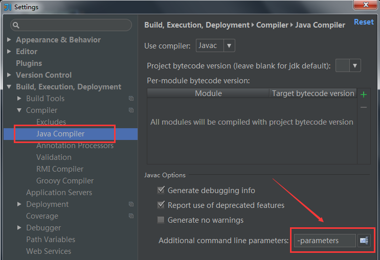
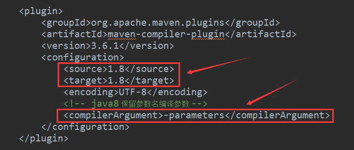

## 3.3 Action 参数注入

Action 参数注入是指为 action 方法传入参数，可以省去 getPara(...) 代码直接获得参数值，以下是代码示例:

```
public class ProjectController extends Controller {
    public void index(Project project) {
       project.save();
       render("index.html");
    }
}
```

Action 参数注入可以代替 `getPara、getBean、getModel` 系列方法获取参数，使用 `File、UploadFile` 参数时可以代替 getFile 方法实现文件上传。这种传参方式还有一个好处是便于与 swagger 这类第三方无缝集成，生成API文档。

**重要用法**：如果 action 形参是一个 model 或者 bean，原先通过 getBean(User.class, "") 获取时第二个参数为空字符串或 null，那么与之等价的形参注入只需要用一下 @Para("") 注解即可：

```
public void action(@Para("")User user) { .... }
```

---

使用 Action 参数注入功能需要在开发工具中配置打开编译参数保留住方法参数名称。注意过于老旧的 eclipse 版本不支持 java 8 和该配置项，建议至少使用eclipse mars版本，以下是eclipse中的设置：

> 如果使用IDEA，添加一个编译参数 -parameters即可，其配置方法如下：



> 如果要使用maven插件进行编译，为maven-compiler-plugin编译插件配置一个<compilerArgument>-parameters</compilerArgument> 属性即可：



> 以上截图中的红色箭头指向部分是配置关键，以下 XML 配置内容与上面截图完全一样，提供出来便于复制使用：

```
<plugin>
   <groupId>org.apache.maven.plugins</groupId>
   <artifactId>maven-compiler-plugin</artifactId>
   <version>3.6.1</version>
   <configuration>
      <source>1.8</source>
      <target>1.8</target>
      <encoding>UTF-8</encoding>
      <!-- java8 保留参数名编译参数 -->
      <compilerArgument>-parameters</compilerArgument>
   </configuration>
</plugin>
```

> 最后要注意：jfinal 3.5 版直接支持 action 参数注入功能，但如果使用的 jfinal 3.2、3.3、3.4 这三个老版本希望支持该功能需要使用 jfinal 的 jfinal-java8 这个分支发行版，其 maven坐标如下：

```
<dependency>
    <groupId>com.jfinal</groupId>
    <artifactId>jfinal-java8</artifactId>
    <version>3.4</version>
</dependency>
```

如果用的是 jfinal 3.5 可以不必理会。
