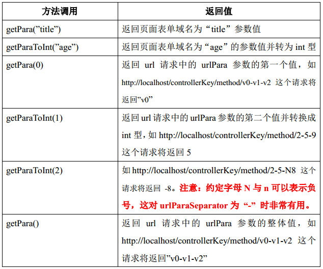

## 3.4 getPara 系列方法

Controller 提供了getPara 系列方法用来从请求中获取参数。getPara 系列方法分为两种类型。第一种类型为第一个形参为 String 的 getPara 系列方法。该系列方法是对 HttpServletRequest.getParameter(String name) 的封装，这类方法都是转调了 HttpServletRequest.getParameter(String name)。  

第二种类型为第一个形参为 int 或无形参的 getPara 系列方法。该系列方法是去获取 urlPara 中所带的参数值。getParaMap 与 getParaNames 分别对应 HttpServletRequest 的 getParameterMap 与 getParameterNames。

记忆技巧：第一个参数为 String 类型的将获取表单或者 url 中问号挂参的域值。第一个参数为 int 或无参数的将获取 urlPara 中的参数值。
 

**getPara使用例子**：

