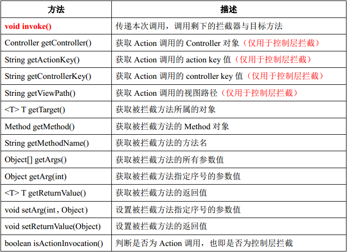

## 4.2 Interceptor

Interceptor 可以对方法进行拦截，并提供机会在方法的前后添加切面代码，实现 AOP 的核心目标。Interceptor 接口仅仅定义了一个方法 public void intercept(Invocation inv)。以下是简单示例：

```
public class DemoInterceptor implements Interceptor {
    public void intercept(Invocation inv) {
       System.out.println("Before method invoking");
       inv.invoke();
       System.out.println("After method invoking");
    }
}
```

以上代码中的 DemoInterceptor 将拦截目标方法，并且在目标方法调用前后向控制台输出文本。inv.invoke() 这一行代码是对目标方法的调用，在这一行代码的前后插入切面代码可以很方便地实现 AOP。

<font color=red>注意：必须调用 inv.invoke() 方法，才能将当前调用传递到后续的 Interceptor 与 Action。</font>

 Invocation 作为 Interceptor 接口 intercept 方法中的唯一参数，提供了很多便利的方法在拦截器中使用。以下为 Invocation 中的方法：


