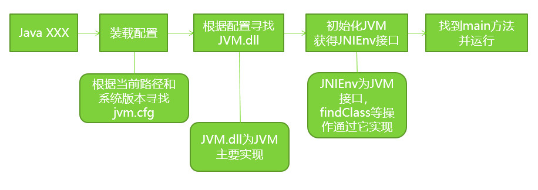
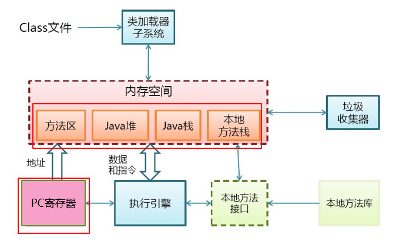
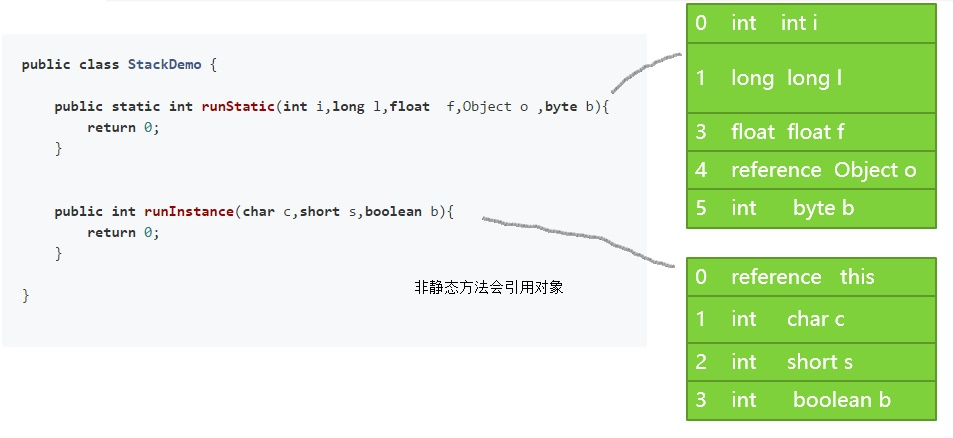
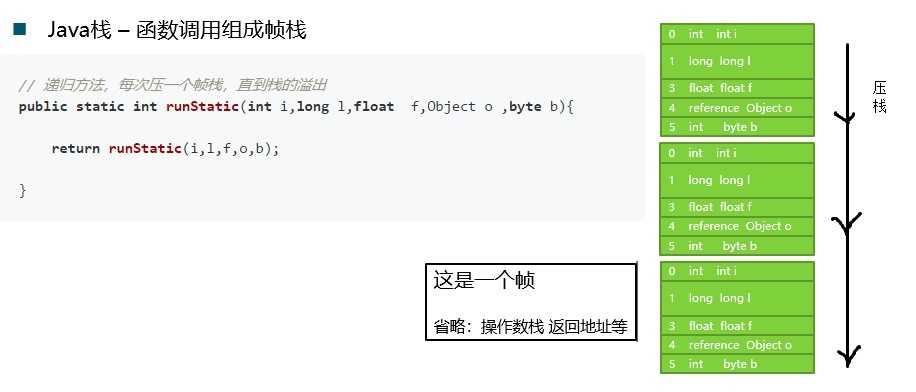
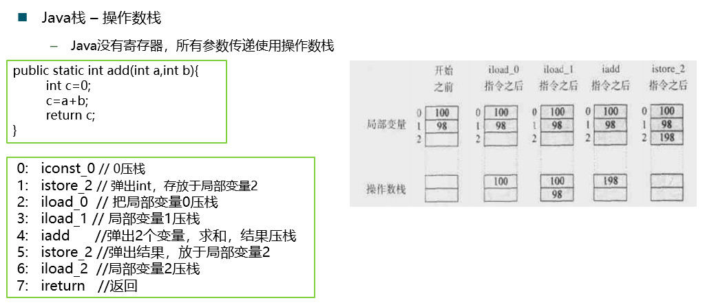
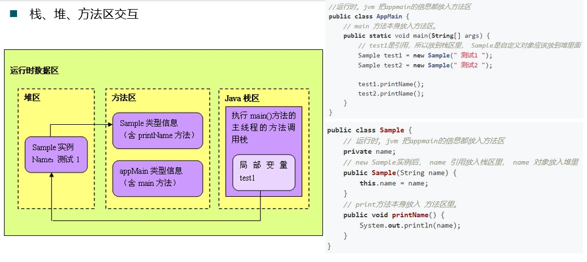
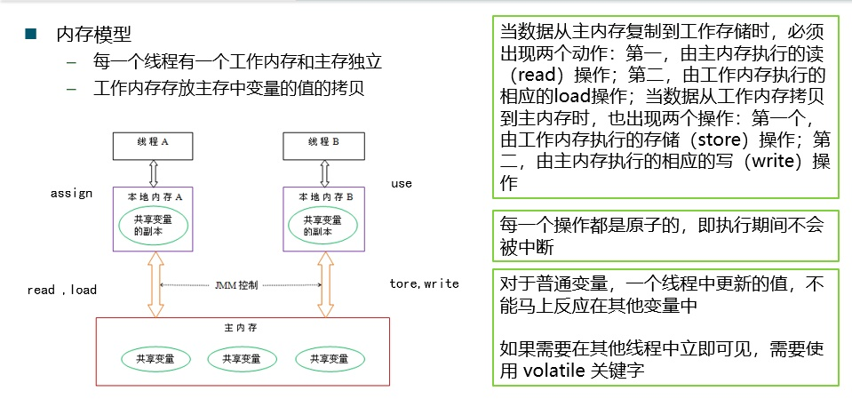

# JVM学习笔记（java7）

## 初始 JVM - JVM 概念 
- JVM 是 java Virtual Machine 的简称。意为 java 虚拟机
- 虚拟机
  - 指通过软件模拟的具有完成硬件系统功能的、运行在一个完全隔离环境中完整计算机系统
- 有哪些虚拟机
  - VMWare
  - Visul Box
  - JVM
- VMWare 或者 Visual Box 都是使用软件模拟物理 CPU 的指令集
- JVM 使用软件模拟 java 字节码的指令集

## [JVM 组成部分](#id-section2)
  - Class 文件格式
  - 运行时数据
  - PC 寄存器
  - 堆
  - 栈
  - 方法区
  - 本地方法区

## JVM 需要对 java Library 提供以下支持
  - 反射 java.lang.reflect
  - ClassLoader
  - 初始化 class 和 interface
  - 安全相关 java.security
  - 多线程
  - 弱引用
  
## JVM 运行机制
  - [JVM 启动流程](#id-section1)
  - [JVM 基本结构](#id-section2)
  - [内存模型](#id-section3)
  - 编译和解释运行的概念

### JVM 启动流程
<div id='id-section1'/>



### JVM 基本结构
<div id='id-section2'/>



1. PC 寄存器
    - 每个线程拥有 1 个 PC 寄存器
    - 在线程创建时 创建
    - 指向下一条指令的地址
    - 执行本地方法时，PC 的值为 undefined
2. 方法区
    - 保存装在的类的信息
      - 类型的常量池
      - 字段，方法信息
      - 方法字节码
    - 通常和永久区（Perm）关联在一起
3. java 堆
    - 和程序开发密切相关
    - 应用系统对象都保存在 java 堆中
    - 所有线程共享 java 堆
    - 对分代 GC 来说，堆也是分代的
    - GC 的主要工作区间
4. java 栈
	- 线程私有
	- 栈由一系列帧组成（因此 java 栈也叫做帧栈）
	- 帧保存一个方法的`局部变量`、`操作数栈`、`常量池指针`
	- 每一次方法调用创建一个帧，并压栈
	- 栈上分配
	  - 小对象（一般几十个 bytes），在没有逃逸的情况下，可以直接分配在栈上
	  - 直接分配在栈上，可以自动回收，减轻 GC 压力
	  - 大对象或者逃逸对象无法栈上分配
	  
> java 栈 - 局部变量表，包含参数和局部变量









## 内存模型
<div id='id-section3'/>



## byte code 字节码的编译和解释运行的概念

#### 解释运行  
  - 解释执行已解释方式运行字节码
  - 解释执行的意思是：读一句执行一句

#### 编译运行（JIT） 
  - 将字节码编译成机器码
  - 直接执行机器码
  - 运行时编译
  - 编译后性能数量级的提升

## 常用 JVM 配置参数

#### Trace 跟踪参数

```
# 打印 GC 的简要信息
-verbose:gc
-XX:+printGC

# 打印GC详细信息
-XX:+PrintGCDetails

# 打印CG发生的时间戳
-XX:+PrintGCTimeStamps

# 指定GC log的位置，以文件输出
-Xloggc:log/gc.log

# 监控类的加载
-XX:+TraceClassLoading

# 按下Ctrl+Break后，打印类的信息：
-XX:+PrintClassHistogram

# 指定最大堆和最小堆 -Xmx20m -Xms5m  
-Xmx –Xms

# 设置新生代大小
-Xmn

# 设置永久区的初始空间和最大空间
-XX:PermSize  -XX:MaxPermSize

```


