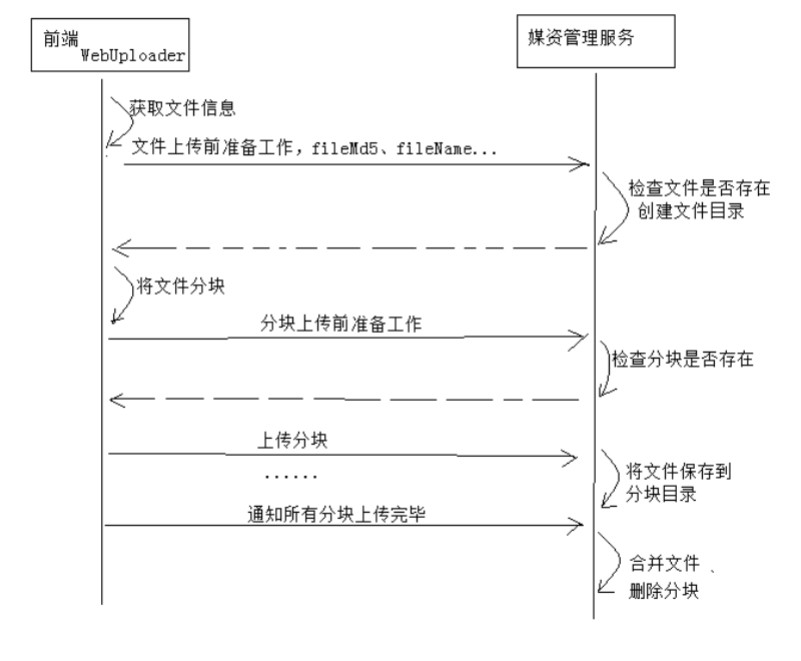

# 前端使用 Html5 + WebUploader 组件

## 使用 WebUploader 上传流程如下：



## 页面显示效果


## `upload.vue` 页面代码

```html
<template>
  <div><br/>
    操作步骤：<br/>
    1、点击“选择文件”，选择要上传的文件<br/>
    2、点击“开始上传”，开始上传文件<br/>
    3、如需重新上传请重复上边的步骤。<br/><br/>

    <div id="uploader" class="wu-example">
      <div class="btns" style="float:left;padding-right: 20px">
        <div id="picker">选择文件</div>
      </div>

      <div id="ctlBtn" class="webuploader-pick" @click="upload()">开始上传</div>

    </div>

    <!--用来存放文件信息-->
    <div id="thelist" class="uploader-list" >
      <div v-if="uploadFile.id" :id='uploadFile.id'>
        <span>{{uploadFile.name}}</span>&nbsp;
        <span class='percentage'>{{percentage}}%</span>
      </div>
    </div>
  </div>
</template>

....js部分代码
```

js 部分代码：

```html
<script>
import $ from ../static/plugins/jquery/dist/jquery.js'
import webuploader from ../static/plugins/webuploader/dist/webuploader.js'
import '../static/css/webuploader/webuploader.css

export default {
  data() {
    return {
      uploader: {},
      uploadFile: {},
      percentage: 0,
      fileMd5: ""
    };
  },
  methods: {
    //开始上传
    upload() {
      if (this.uploadFile && this.uploadFile.id) {
        this.uploader.upload(this.uploadFile.id);
      } else {
        alert("请选择文件");
      }
    }
  },
  mounted(){
    /**
    * 构建 webUploader 对象
    */
    this.uploader = new WebUploader.Uploader({
        swf: "/static/plugins/webuploader/dist/Uploader.swf", //上传文件的flash文件，浏览器不支持h5时启动flash
        server: "/api/media/upload/uploadchunk", //上传分块的服务端地址，注意跨域问题
        fileVal: "file",         // 文件上传域的name
        pick: "#picker",         // 指定选择文件的按钮容器
        auto: false,             // 手动触发上传
        disableGlobalDnd: true,  // 禁掉整个页面的拖拽功能
        chunked: true,           // 是否分块上传
        chunkSize: 1*1024*1024,  // 分块大小（默认5M）
        threads: 3,              // 开启多个线程（默认3个）
        prepareNextFile: true    // 允许在文件传输时提前把下一个文件准备好
    });

    /**
    * 注册钩子方法
    */
    WebUploader.Uploader.register(
        {
        "before-send-file":"beforeSendFile",
        "before-send":"beforeSend",
        "after-send-file":"afterSendFile"
        },
        {
          beforeSendFile: function(file) {
            var deferred = WebUploader.Deferred(); // 创建一个deffered,用于通知是否完成操作
            // 计算文件的唯一标识，用于断点续传
            new WebUploader.Uploader().md5File(file, 0, 100 * 1024 * 1024).then(
                function(val) {
                this.fileMd5 = val;
                this.uploadFile = file;
                //向服务端请求注册上传文件
                $.ajax({
                    type: "POST",
                    url: "/api/media/upload/register",
                    data: {
                        fileMd5: this.fileMd5, // 文件唯一表示
                        fileName: file.name,   // 文件名称
                        fileSize: file.size,   // 文件大小
                        mimetype: file.type,   // 文件类型
                        fileExt: file.ext      // 文件后缀名
                    },
                    dataType: "json",
                    success: function(response) {
                        if (response.success) {
                            //alert('上传文件注册成功开始上传');
                            deferred.resolve();
                        } else {
                            alert(response.message);
                            deferred.reject();
                        }
                    }
                });
                }.bind(this)
            );
            return deferred.promise();
        }.bind(this),

        beforeSend: function(block) {
          var deferred = WebUploader.Deferred();
          // 每次上传分块前校验分块，如果已存在分块则不再上传，达到断点续传的目的
          $.ajax({
            type: "POST",
            url: "/api/media/upload/checkchunk",
            data: {
              fileMd5: this.fileMd5,       // 文件唯一表示
              chunkIndex: block.chunk,     // 当前分块下标
              chunkSize: block.end - block.start // 当前分块大小
            },
            dataType: "json",
            success: function(response) {
              if (response.fileExist) {
                deferred.reject();  // 分块存在，跳过该分块
              } else {
                deferred.resolve(); // 分块不存在或不完整，重新发送
              }
            }
          });
          //构建fileMd5参数，上传分块时带上fileMd5
          this.uploader.options.formData.fileMd5 = this.fileMd5;
          this.uploader.options.formData.chunk = block.chunk;
          return deferred.promise();
        }.bind(this),

        afterSendFile: function(file) {
          // 合并分块
          $.ajax({
            type: "POST",
            url: "/api/media/upload/mergechunks",
            data: {
              fileMd5: this.fileMd5,
              fileName: file.name,
              fileSize: file.size,
              mimetype: file.type,
              fileExt: file.ext
            },
            success: function(response) {
              //在这里解析合并成功结果
              if (response && response.success) {
                alert("合并成功");
              } else {
                alert("合并失败");
              }
            }
          });
        }.bind(this)
      }
    );

    // 将文件添加到队列
    this.uploader.on("fileQueued", function(file) {
        this.uploadFile = file;
        this.percentage = 0;
    }.bind(this));

    //选择文件后触发
    this.uploader.on("beforeFileQueued", function(file) {
        //重置uploader
        this.uploader.reset()
        this.percentage = 0;
    }.bind(this));

    // 监控上传进度
    // percentage:代表上传文件的百分比
    this.uploader.on("uploadProgress", function(file, percentage) {
        this.percentage = Math.ceil(percentage * 100);
    }.bind(this));

    //上传失败触发
    this.uploader.on("uploadError", function(file, reason) {
        this.$message.error("上传文件失败！");
    });

    //上传成功触发
    this.uploader.on("uploadSuccess", function(file, response ) {
        console.log(response)
    });

    //每个分块上传请求后触发
    this.uploader.on( 'uploadAccept', function( file, response ) {
        if(!(response && response.success)){//分块上传失败，返回false
            return false;
        }
    });

  }

}
</script>

<style scoped>
</style>
```

## WebUploader 钩子方法说明

| 名称 | 参数 | 说明 |
|:----:|:----:|:----|
| `add-file` | files: File对象或者File数组 | 用来向队列中添加文件。 |
| `before-send-file` | file: File对象 | 在文件发送之前request，此时还没有分片（如果配置了分片的话），可以用来做文件整体md5验证。 |
| `before-send-file` | block: 分片对象 | 在分片发送之前request，可以用来做分片验证，如果此分片已经上传成功了，可返回一个rejected promise来跳过此分片上传 |
| `after-send-file` | file: File对象 | 在所有分片都上传完毕后，且没有错误后request，用来做分片验证，此时如果promise被reject，当前文件上传会触发错误。 |

### 本项目使用如下钩子方法：

1、`before-send-file`

在开始对文件分块儿之前调用，可以做一些上传文件前的准备工作，比如检查文件目录是否创建完成等。

```js
beforeSendFile: function(file) {
    ......
}.bind(this),
```

2、`before-send`

在上传文件分块之前调用此方法，可以请求服务端检查分块是否存在，如果已存在则此分块儿不再上传。

```js
beforeSend: function(block) {
    ......
}.bind(this)
```

3、`after-send-file`

在所有分块上传完成后触发，可以请求服务端合并分块文件。

```js
after-send-file: function(file) {
    ......
}.bind(this),
```
