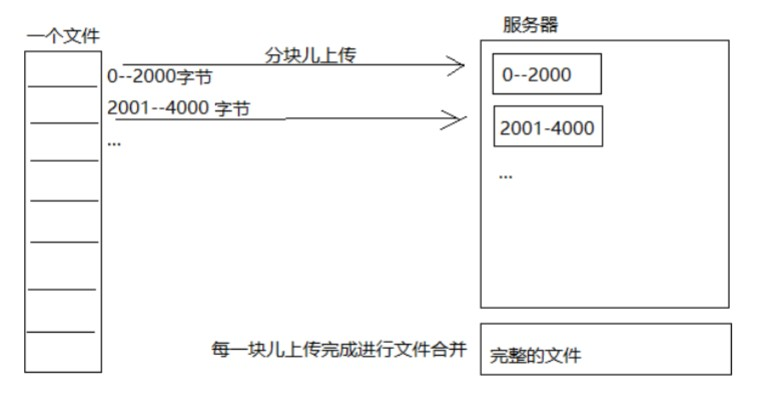

# 什么是断点续传

断点续传指的是在下载或上传时，将下载或上传任务（一个文件或一个压缩包）人为的划分为几个
部分，每一个部分采用一个线程进行上传或下载，如果碰到网络故障，可以从已经上传或下载的部分开始继续上传下载未完成的部分，而没有必要从头开始上传下载，断点续传可以提高节省操作时间，提高用户体验性。

如下图：

上传流程如下：

1、上传前先把文件分成块

2、一块一块的上传，上传中断后重新上传，已上传的分块则不用再上传

3、各分块上传完成最后合并文件

## 1. 文件分块与合并

### 1.1 文件分块

文件分块的流程如下：

1、获取源文件长度

2、根据设定的分块文件的大小计算出块数

3、从源文件读数据依次向每一个块文件写数据。

