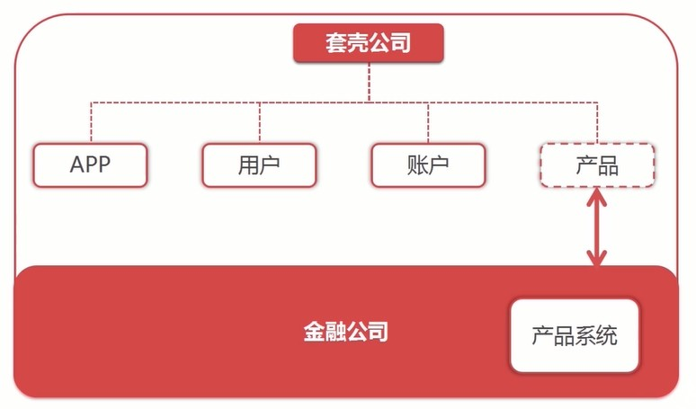
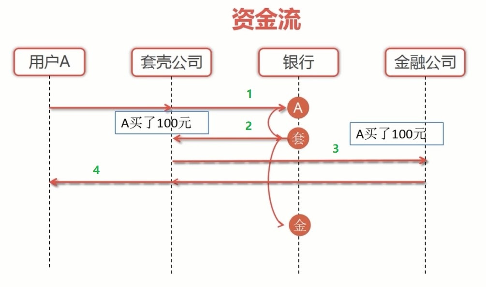
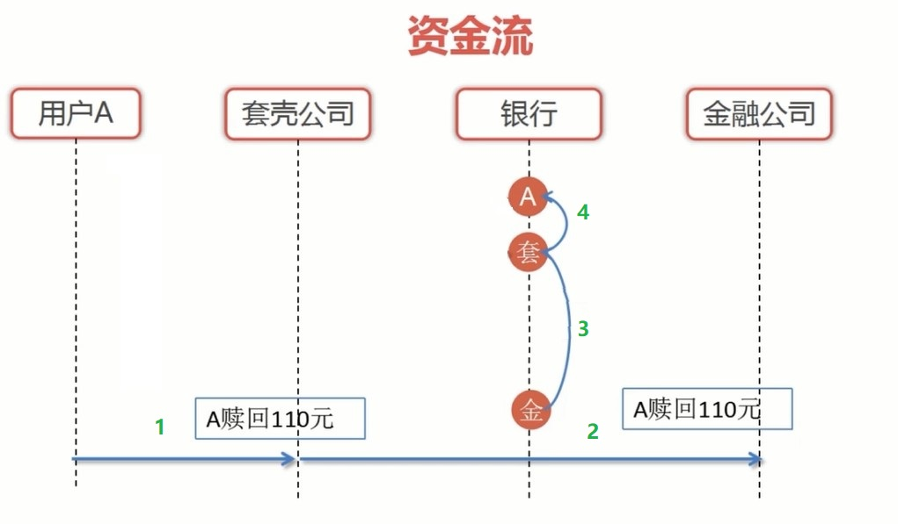
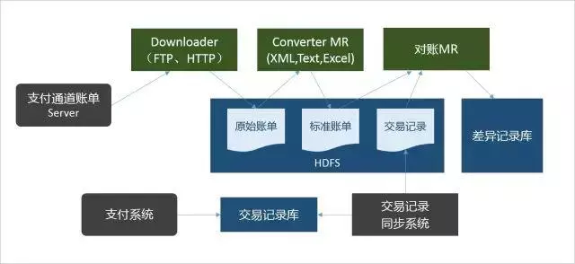
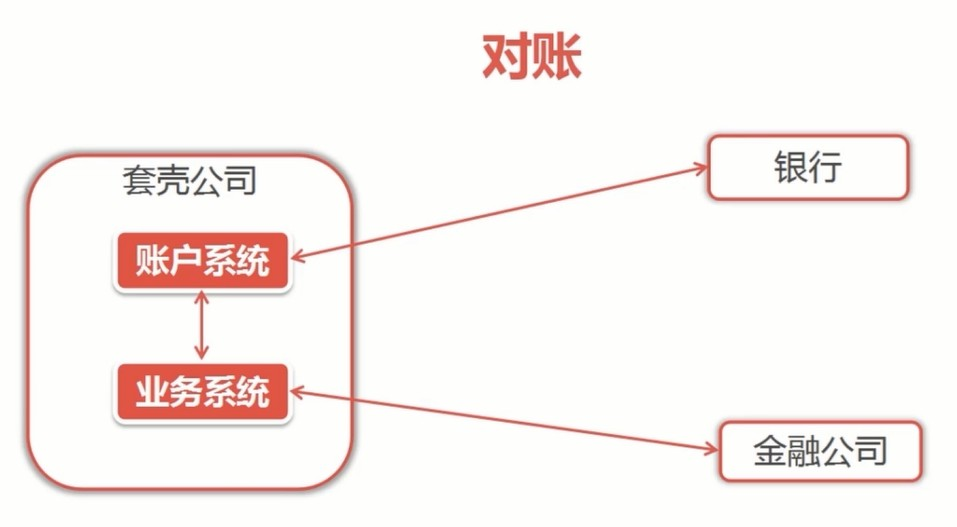
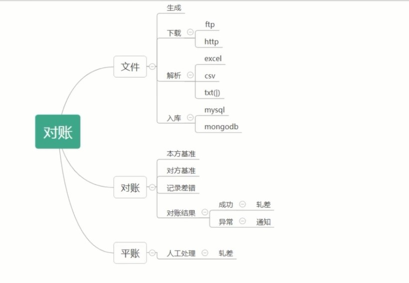
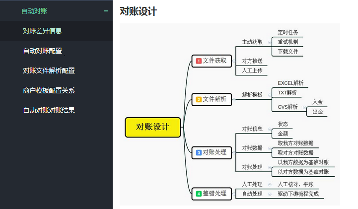

# 理财产品对账业务流程

用户购买理财产品，申购、赎回资金流对账的流程

套壳公司：值一些无名公司自己没有金融产品，与金融公司合作自己购买金融公司的产品，然后放在自己的平台卖给自己的客户

## 1. 用户申购产品流程

### 申购流程：

1. 用户A购买了100元理财产品，从银行扣除100元

2. 银行扣款成功响应给套壳公司，转给套壳公司100元，并记录用户A购买100元记录

3. 套壳公司将用户A购买记录响应给金融公司

4. 金融公司记录用户A购买记录，响应给套壳公司，再由套壳公司响应用户A已经购买了100元的申购。（此时订单：等待确认状态）

5. 交易日（购买第二日为交易日）套壳公司转给金融公司100元，金融公司修改用户A的订单状态：申购完成

---

## 2. 用户赎回资金流程

### 赎回流程：

1. 用户A向套壳公司发起赎回申请，套壳公司记录用户赎回110元

2. 套壳公司将用户A赎回申请发给金融公司，金融公司记录用户赎回110元

3. 第二天交易日，金融公司转账110元给套壳公司

4. 套壳公司划账110元给用户A。（银行从套壳公司扣除110元，转给用户A账户110元）

---

## 3. 对账

凡是涉及支付的场景都需要对账，对账时支付体系中最重要的一环，也是保证交易、资金安全的重要手段。

在互联网金融行会也或者电商行业中，对账其实就是确认在固定周期内和支付提供方（银行和第三方支付）的交易、资金的真确性，保证双方的交易、资金一致正确。一般都是在第二天银行或者第三方支付公司对前一日交易进行清分，生成对账单供平台商户下载，并将应结算款结算给平台商户。

对账分为信息流对账和资金流对账，信息流对账一般在自己内部系统的对账，比如支付系统和支付数据和业务系统的业务数据进行对账，保证资金交易和业务交易的一致性。资金流对账也就是支付系统和银行或者第三方支付系统之间的资金交易对账。

### 3.1 对账系统的设计

一个简单的微服务参考架构

对账系统的设计阶段，将对账系统分为四个模块，每个模块的负责自己的职能。

- 文件获取模块：下载或者读取各渠道对账文件

- 文件解析模块：创建不同的解析模板，根据渠道和文件类型获取对应的解析模板进行解析

- 对账处理模块：对账的业务逻辑处理

- 差错处理模块：处理差错池中的订单

一般会设计一个定时任务，每天固定的时间点触发，定时驱动调度类分别调用四个模块来处理对账。也有的银行会主动的推送对账单，再通过 http 回调来触发对账流程。

### 3.2 此业务中有三种对账

1. **`银行` 与 `套壳公司账户系统` 的对账**

    &emsp;账户系统资金的变动与银行的操作是否一致

2. **套壳公司的 `账户系统` 与 `业务系统` 之间的对账**

    &emsp;`业务系统`记录用户的申购和赎回与`账户系统`资金变动是否一致

3. **`业务系统` 与 `金融公司` 之间的对账**

    &emsp;`业务系统`记录的申购、赎回，和`金融公司`记录的申购、赎回是否操作一致

### 3.3 对账流程

1、获取第三方对账文件，里面保存相应的订单数据

2、将当天的数据与第三方对账文件数据比对进行对账

3、对账结果平账处理

---

## 4.对账系统中的相关名词

**轧账：** 发现有差异的记录；

**平账：** 通过自动或人工的方式解决这些差异；

**长款（多账）：** 以平台交易为基准的情况下和银行对账，发现周期内的交易，平台有此订单而第三方支付中没有订单，形成平台长款，平台长款一般是由于用户在支付的时候跨天的情况，23:58分创建了订单，在第二天00:03分进行了支付；

**漏单（短账）：** 银行有，而平台无的订单，平台漏单很少见，一般直接转人工处理；

**清算：** 计算各方应收应付款的时间与金额；

**结算：** 根据清算的结果在指定的时间对各方进行实际的资金转移操作；

**不一致：** 双发对账文件中相同的订单出现数据不一致

---

## 5. 目前对账系统普遍存在的问题及改进措施

问题：

    1. 如果对账过程中查询数据量巨大，对数据库性能影响较大；

    2. 逐行比对算法效率较低，对账服务器及数据库服务器负荷较高；

    3. 导入批量文件，逐行入库效率较为低下（每一次都需要建立网络连接、关闭连接）

改进：

    1. 涉及网络传输的，尽量采用批量方式操作，减少网络消耗及时间消耗；

    2. 使用 redis 等 NOSQL 数据库，降低数据库服务器的压力，一台redis服务器不够，可以无限制增加用于对账用的服务器；

    3. 使用 redis 的 set 集合的 sdiff 功能，利用 redis sdiff 算法的高性能，比对上游记录和我方记录的差异。

    4. 生成、解析文件分批次
