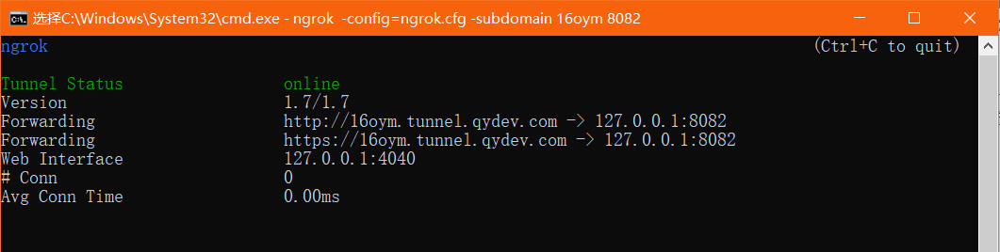

# 域名映射工具 Ngrock

## windows 版本

#### 使用方法

1. 下载 windows 版本的客户端，解压到喜欢的目录，最好是英文的，dos 在命令行下进入到当前解压好的文件夹下

2. 执行 `ngrok -config=ngrok.cfg -subdomain xxx 80` (xxx 是你自定义的域名前缀)

  

3. 如果开启成功 你就可以使用 `xxx.tunnel.qydev.com` 来访问你本机的 127.0.0.1:80 的服务啦

4. 如果你自己有顶级域名，想通过自己的域名来访问本机的项目，那么先将自己的顶级域名解析到 123.57.165.240 (域名需要已备案哦)，然后执行 `ngrok -config=ngrok.cfg -hostname xxx.xxx.xxx 80` (xxx.xxx.xxx是你自定义的顶级域名)

5. 如果开启成功 你就可以使用你的顶级域名来访问你本机的 127.0.0.1:80 的服务啦
