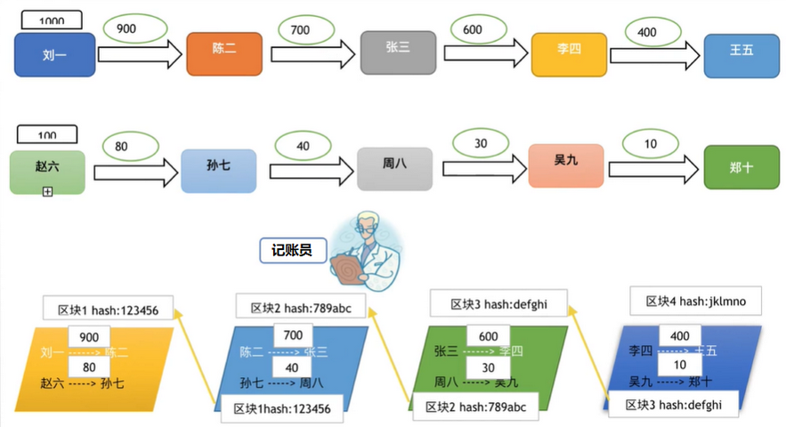
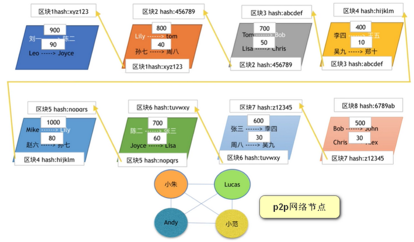

# 区块链基本原理

## 区块链的起源

### 创始者介绍

姓名：中本聪（英语：SatoshiNakamoto），自称日裔美国人，日本媒体常译为中本哲史，此名是比特币协议及其相关软件 Bitcoin-Qt 的创造者，但真实身份未知。

中本聪于 2008 年发表了一篇名为《比特币：一种点对点式的电子现金系统》（Bitcoin: A Peer-to-Peer Electronic Cash System）的论文，描述了一种被他称为“比特币”的电子货币及其算法。2009 年，他发布了首个比特币软件，并正式启动了比特币金融系统。

2009年1月3日，比特币的创始人中本聪在创世区块里留下一句永不可修改的话：
“The Times 03/Jan/2009 Chancellor on brink of second bailout for banks（2009年1月3日，财政大臣正处于实施第二轮银行紧急援助的边缘）。

2010年，他逐渐淡出并将项目移交给比特币社区的其他成员。

### 先有区块链还是先有比特币

比特币面世之初是没有区块链的概念的，但比特币确确实实是基于底层区块链实现的。区块链是后来人们对于比特币底层的认可而提取出来的概念。

### 从技术上看区块链

- 任何人都可以看到所有的源码。
- 任何人都可以下载完整的账本。
- 整套系统没有任何防火墙。
- 即使全世界大部分的网络出现了故障，仍然可以运行。

## 区块链运行机制

