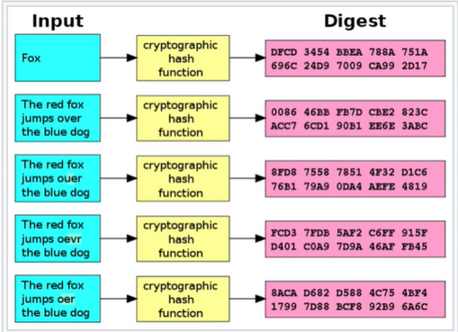
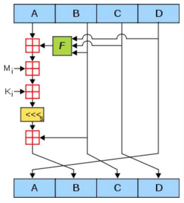
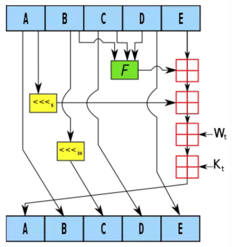
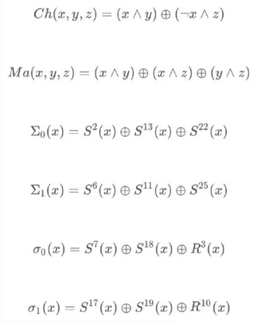
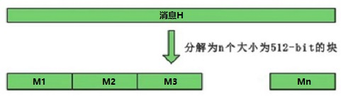
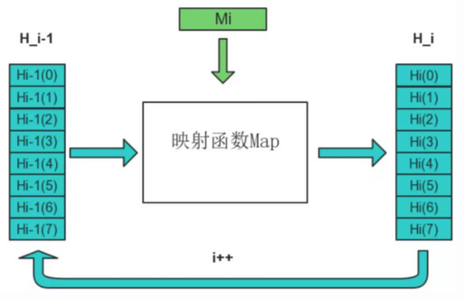
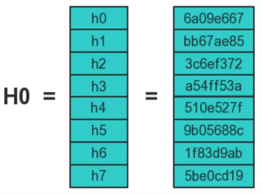

# HASH256 算法



SHA 系列算法是一种密码散列函数，由美国国家安全局设计，并由美国国家标准技术研究所（NIST）发布为联邦数据处理标准（FIPS）。现在已经被破解。

我们本文主要研究 SHA256 算法, SHA256 是 SHA-2下细分出的一种算法, SHA-2 下又可再分为六个不同的算法标准。

包括了：SHA-224、SHA-256、SHA-384、SHA-512、SHA-512/224、SHA-512/256。

这些变体除了生成摘要的长度 、循环运行的次数等一些微小差异外，算法的基本结构是一致的。

回到 SHA256 上，说白了，它就是一个哈希函数。

哈希函数，又称散列算法，是一种从任何一种数据中创建小的数字“指纹”的方法。散列函数把消息或数据压缩成摘要，使得数据量变小，将数据的格式固定下来。该函数将数据打乱混合，重新创建一个叫做散列值（或哈希值）的指纹。散列值通常用一个短的随机字母和数字组成的字符串来代表。

对于任意长度的消息，SHA256 都会产生一个 256bit 长的哈希值，称作消息摘要。

## 什么是SHA

SHA 算法的名称是安全散列算法，英文名称是 Secure Hash Algorithm。

SHA 算法分为很多版本。可以分为 SHA-1 和 SHA-2 两大类。其中 SHA-2 的子版本包括SHA-224，SHA-256，SHA-384，SHA-512,其输出结果分别为224、256、384、512位。与之对应的 MD5 算法的输出只有128位。

## HASH 算法的特点

- 输入长度不固定，输出出长度固定：任意长度的输入，都将会得到固定长度。
- 输入敏感：原始输入信息修改一点信息，产生的 hash 值看起来应该都有很大不同。
- 逆向困难：给定（若干） hash 值，基本不可能逆推出明文。
- 冲突避免：很难找到两段内容不同的明文，使得它们的 hash 值一致（发生冲突）。

除此之外 SHA256 相比于 MD5 算法还具有优势。我们来看：

- 2 的 128 次方为 340282366920938463463374607431768211456，也就是 10 的 39 次方级别
- 2 的 160 次方为 1.4615016373309029182036848327163e+48，也就是 10 的 48 次方级别
- 2 的 256 次方为 1.1579208923731619542357098500869 × 10 的 77 次方，也就是 10 的 77 次方

宇宙中原子数大约在 10 的 60 次方到 80 次方之间，所以 2 的 256 次方有足够的空间容纳所有的可能，算法好的情况下冲突碰撞的概率很低。

此外，我们还可以将 SHA256 和 MD5 进行混合使用，我们可以取 MD5 摘要的一部分和 SHA256 摘要的一部分，拼成一个合成摘要。这样别人不知道规则，自然无从破解。

## 常用哈希算法

- MD4 、MD5
- SHA-1 、SHA-2
- RIPEMD-160

## SHA256算法的底层原理

### MD5的原理和SHA原理的对比

MD5 把 128bit 的信息摘要分成 A，B，C，D 四段（Words），每段 32bit，在循环过程中交替运算 A，B，C，D，最终组成 128bit 的摘要结果。如下图所示：



SHA-1 算法，核心过程大同小异，主要的不同点是把 160bit 的信息摘要分成了 A，B，C，D，E 五段。



SHA-2 系列算法，核心过程更复杂一些，把信息摘要分成了 A，B，C，D，E，F，G，H 八段。


MD5 算法大概可以分为以下四步：原文处理，设置初始值，循环加工，拼接结果。下面我们进行详细的分析。

### 设置初始值

SHA256 算法中用到了 8 个哈希初值以及 64 个哈希常量：

SHA256 算法的 8 个哈希初值如下：

```text
h0 := 0x6a09e667
h1 := 0xbb67ae85
h2 := 0x3c6ef372
h3 := 0xa54ff53a
h4 := 0x510e527f
h5 := 0x9b05688c
h6 := 0x1f83d9ab
h7 := 0x5be0cd19
```

这些初值是对自然数中前 8 个质数（2,3,5,7,11,13,17,19）的平方根的小数部分取前 32bit 而来。我们容易知道 2 的平方根为 0.414213562373095048 , 小数部分转为 16 进制，即为 0x6a09e667。

在 SHA256 算法中，用到 64 个常量，这些常量是对自然数中前 64 个质数的立方根的小数部分取前 32bit 而来。这 64 个常量如下：

```text
428a2f98 71374491 b5c0fbcf e9b5dba5

3956c25b 59f111f1 923f82a4 ab1c5ed5

d807aa98 12835b01 243185be 550c7dc3

72be5d74 80deb1fe 9bdc06a7 c19bf174

e49b69c1 efbe4786 0fc19dc6 240ca1cc

2de92c6f 4a7484aa 5cb0a9dc 76f988da

983e5152 a831c66d b00327c8 bf597fc7

c6e00bf3 d5a79147 06ca6351 14292967

27b70a85 2e1b2138 4d2c6dfc 53380d13

650a7354 766a0abb 81c2c92e 92722c85

a2bfe8a1 a81a664b c24b8b70 c76c51a3

d192e819 d6990624 f40e3585 106aa070

19a4c116 1e376c08 2748774c 34b0bcb5

391c0cb3 4ed8aa4a 5b9cca4f 682e6ff3

748f82ee 78a5636f 84c87814 8cc70208

90befffa a4506ceb bef9a3f7 c67178f2
```

​和 8 个哈希初值类似，这些常量是对自然数中前 64 个质数 (2,3,5,7,11,13,17,19,23,29,31,37,41,43,47,53,59,61,67,71,73,79,83,89,97…) 的立方根的小数部分取前 32bit 而来。

### 数据预处理

由于用户输入的信息的长度不一致，所以我们需要对其进行处理，对其进行补位。和 MD5 补位的原理类似。

SHA256 算法的原理是：用输入的长度对 448 取余，不足 448 的进行补位，填充的方法是第一位补 1，其他位补 0。经过补位后，现在的长度为 512*N+448。事实上，补位之后的结果已经不能代表真正的字符串，所以我们还需要记录下原来字符串的长度，方法是用（512-448=64）来记录实际的长度。

经过上面的处理之后，我们处理之后的信息的长度为 512*(N+1)。

SHA256算法中的预处理就是在想要Hash的消息后面补充需要的信息，使整个消息满足指定的结构。

信息的预处理分为两个步骤：附加填充比特 和 附加长度。

#### STEP1：附加填充比特

在报文末尾进行填充，使报文长度在对 512 取模以后的余数是 448

填充是这样进行的：先补第一个比特为 1，然后都补 0，直到长度满足对 512 取模后余数是 448。

需要注意的是，信息必须进行填充，也就是说，即使长度已经满足对 512 取模后余数是 448，补位也必须要进行，这时要填充 512 个比特。

因此，填充是至少补一位，最多补 512 位。

#### 例：以信息“abc”为例显示补位的过程

- a,b,c 对应的 ASCII 码分别是 97,98,99

- 于是原始信息的二进制编码为：01100001 01100010 01100011

- 补位第一步，首先补一个“1” ： 0110000101100010 01100011 1

- 补位第二步, 补 423 个 “0”：01100001 01100010 01100011 10000000 00000000 … 00000000

补位完成后的数据如下（为了简介用 16 进制表示）：

```go
61626380 00000000 00000000 00000000
00000000 00000000 00000000 00000000
00000000 00000000 00000000 00000000
00000000 00000000
```

#### 为什么是448?

因为在第一步的预处理后，第二步会再附加上一个64bit的数据，用来表示原始报文的长度信息。而448+64=512，正好拼成了一个完整的结构。

#### STEP2：附加长度值

附加长度值就是将原始数据（第一步填充前的消息）的长度信息补到已经进行了填充操作的消息后面。

wiki 百科中给出的原文是：append length of message (before pre-processing), in bits, as 64-bit big-endian integer

SHA256 用一个 64 位的数据来表示原始消息的长度。

因此，通过 SHA256 计算的消息长度必须要小于$2^{64}$，当然绝大多数情况这足够大了。

长度信息的编码方式为 64-bit big-endian integer

关于 Big endian 的含义，文末给出了补充

回到刚刚的例子，消息“abc”，3 个字符，占用 24 个 bit

因此，在进行了补长度的操作以后，整个消息就变成下面这样了（16 进制格式）

```go
61626380 00000000 00000000 00000000
00000000 00000000 00000000 00000000
00000000 00000000 00000000 00000000
00000000 00000000 00000000 00000018
```

### 循环加工

我们首先学习下预备知识，SHA256 散列函数中涉及的操作全部是逻辑的位运算。



其中 Sn 表示循环右移 n 个 bit，Rn 表示右移 n 个 bit。

首先：将消息分解成 512-bit 大小的块。



假设消息 M 可以被分解为 n 个块，于是整个算法需要做的就是完成 n 次迭代，n 次迭代的结果就是最终的哈希值，即 256bit 的数字摘要。

一个 256-bit 的摘要的初始值 H0，经过第一个数据块进行运算，得到 H1，即完成了第一次迭代。H1 经过第二个数据块得到 H2，……，依次处理，最后得到 Hn，Hn 即为最终的 256-bit 消息摘要。



256 位被分为 8 个小块，每个小块 32 位。此外，第一次迭代中，映射的初值设置为前面介绍的 8 个哈希初值，如下图所示：



下面来学习 Map(H_{i-1}) = H_{i} 的具体算法：

将每一块（512位）分解为 16 个 32 位的字，记为 w[0], …, w[15]。

```go
for i := 0; i < 16; i++ {
    j := i * 4
    w[i] = uint32(p[j])<<24 | uint32(p[j+1])<<16 | uint32(p[j+2])<<8 | uint32(p[j+3])
}

for i := 16; i < 64; i++ {
    v1 := w[i-2]
    t1 := (v1>>17 | v1<<(32-17)) ^ (v1>>19 | v1<<(32-19)) ^ (v1 >> 10)
    v2 := w[i-15]
    t2 := (v2>>7 | v2<<(32-7)) ^ (v2>>18 | v2<<(32-18)) ^ (v2 >> 3)
    w[i] = t1 + w[i-7] + t2 + w[i-16]
}
```

然后是 64 步迭代运算：

```java
for i := 0; i < 64; i++ {
    t1 := h + ((e>>6 | e<<(32-6)) ^ (e>>11 | e<<(32-11)) ^ (e>>25 | e<<(32-25))) + ((e & f) ^ (^e & g)) + _K[i] + w[i]

    t2 := ((a>>2 | a<<(32-2)) ^ (a>>13 | a<<(32-13)) ^ (a>>22 | a<<(32-22))) + ((a & b) ^ (a & c) ^ (b & c))

    h = g
    g = f
    f = e
    e = d + t1
    d = c
    c = b
    b = a
    a = t1 + t2
}

h0 += a
h1 += b
h2 += c
h3 += d
h4 += e
h5 += f
h6 += g
h7 += h
```

生成 256-bit 的报文摘要 所有的 512-bit 分组处理完毕后，对于 SHA-256 算法最后一个分组产生的输出便是 256-bit 的报文摘要。

```go
dig.h[0], dig.h[1], dig.h[2], dig.h[3], dig.h[4], dig.h[5], dig.h[6], dig.h[7] = h0, h1, h2, h3, h4, h5, h6, h7
```

## java实现SHA256算法

```java
import java.nio.ByteBuffer;

/**
 * Offers a {@code hash(byte[])} method for hashing messages with SHA-256.
 */
public class Sha256
{
    private static final int[] K = { 0x428a2f98, 0x71374491, 0xb5c0fbcf,
            0xe9b5dba5, 0x3956c25b, 0x59f111f1, 0x923f82a4, 0xab1c5ed5,
            0xd807aa98, 0x12835b01, 0x243185be, 0x550c7dc3, 0x72be5d74,
            0x80deb1fe, 0x9bdc06a7, 0xc19bf174, 0xe49b69c1, 0xefbe4786,
            0x0fc19dc6, 0x240ca1cc, 0x2de92c6f, 0x4a7484aa, 0x5cb0a9dc,
            0x76f988da, 0x983e5152, 0xa831c66d, 0xb00327c8, 0xbf597fc7,
            0xc6e00bf3, 0xd5a79147, 0x06ca6351, 0x14292967, 0x27b70a85,
            0x2e1b2138, 0x4d2c6dfc, 0x53380d13, 0x650a7354, 0x766a0abb,
            0x81c2c92e, 0x92722c85, 0xa2bfe8a1, 0xa81a664b, 0xc24b8b70,
            0xc76c51a3, 0xd192e819, 0xd6990624, 0xf40e3585, 0x106aa070,
            0x19a4c116, 0x1e376c08, 0x2748774c, 0x34b0bcb5, 0x391c0cb3,
            0x4ed8aa4a, 0x5b9cca4f, 0x682e6ff3, 0x748f82ee, 0x78a5636f,
            0x84c87814, 0x8cc70208, 0x90befffa, 0xa4506ceb, 0xbef9a3f7,
            0xc67178f2 };

    private static final int[] H0 = { 0x6a09e667, 0xbb67ae85, 0x3c6ef372,
            0xa54ff53a, 0x510e527f, 0x9b05688c, 0x1f83d9ab, 0x5be0cd19 };

    // working arrays
    private static final int[] W = new int[64];
    private static final int[] H = new int[8];
    private static final int[] TEMP = new int[8];

    /**
     * Hashes the given message with SHA-256 and returns the hash.
     *
     * @param message The bytes to hash.
     * @return The hash's bytes.
     */
    public static byte[] hash(byte[] message)
    {
        // let H = H0
        System.arraycopy(H0, 0, H, 0, H0.length);

        // initialize all words
        int[] words = toIntArray(pad(message));

        // enumerate all blocks (each containing 16 words)
        for (int i = 0, n = words.length / 16; i < n; ++i) {

            // initialize W from the block's words
            System.arraycopy(words, i * 16, W, 0, 16);
            for (int t = 16; t < W.length; ++t) {
                W[t] = smallSig1(W[t - 2]) + W[t - 7] + smallSig0(W[t - 15])
                        + W[t - 16];
            }

            // let TEMP = H
            System.arraycopy(H, 0, TEMP, 0, H.length);

            // operate on TEMP
            for (int t = 0; t < W.length; ++t) {
                int t1 = TEMP[7] + bigSig1(TEMP[4])
                        + ch(TEMP[4], TEMP[5], TEMP[6]) + K[t] + W[t];
                int t2 = bigSig0(TEMP[0]) + maj(TEMP[0], TEMP[1], TEMP[2]);
                System.arraycopy(TEMP, 0, TEMP, 1, TEMP.length - 1);
                TEMP[4] += t1;
                TEMP[0] = t1 + t2;
            }

            // add values in TEMP to values in H
            for (int t = 0; t < H.length; ++t) {
                H[t] += TEMP[t];
            }

        }

        return toByteArray(H);
    }

    /**
     * Internal method, no need to call. Pads the given message to have a length
     * that is a multiple of 512 bits (64 bytes), including the addition of a
     * 1-bit, k 0-bits, and the message length as a 64-bit integer.
     *
     * @param message The message to pad.
     * @return A new array with the padded message bytes.
     */
    public static byte[] pad(byte[] message)
    {
        final int blockBits = 512;
        final int blockBytes = blockBits / 8;

        // new message length: original + 1-bit and padding + 8-byte length
        int newMessageLength = message.length + 1 + 8;
        int padBytes = blockBytes - (newMessageLength % blockBytes);
        newMessageLength += padBytes;

        // copy message to extended array
        final byte[] paddedMessage = new byte[newMessageLength];
        System.arraycopy(message, 0, paddedMessage, 0, message.length);

        // write 1-bit
        paddedMessage[message.length] = (byte) 0b10000000;

        // skip padBytes many bytes (they are already 0)

        // write 8-byte integer describing the original message length
        int lenPos = message.length + 1 + padBytes;
        ByteBuffer.wrap(paddedMessage, lenPos, 8).putLong(message.length * 8);

        return paddedMessage;
    }

    /**
     * Converts the given byte array into an int array via big-endian conversion
     * (4 bytes become 1 int).
     *
     * @param bytes The source array.
     * @return The converted array.
     */
    public static int[] toIntArray(byte[] bytes)
    {
        if (bytes.length % Integer.BYTES != 0) {
            throw new IllegalArgumentException("byte array length");
        }

        ByteBuffer buf = ByteBuffer.wrap(bytes);

        int[] result = new int[bytes.length / Integer.BYTES];
        for (int i = 0; i < result.length; ++i) {
            result[i] = buf.getInt();
        }

        return result;
    }

    /**
     * Converts the given int array into a byte array via big-endian conversion
     * (1 int becomes 4 bytes).
     *
     * @param ints The source array.
     * @return The converted array.
     */
    public static byte[] toByteArray(int[] ints)
    {
        ByteBuffer buf = ByteBuffer.allocate(ints.length * Integer.BYTES);
        for (int i = 0; i < ints.length; ++i) {
            buf.putInt(ints[i]);
        }

        return buf.array();
    }

    private static int ch(int x, int y, int z)
{
        return (x & y) | ((~x) & z);
    }

    private static int maj(int x, int y, int z)
{
        return (x & y) | (x & z) | (y & z);
    }

    private static int bigSig0(int x)
{
        return Integer.rotateRight(x, 2) ^ Integer.rotateRight(x, 13)
                ^ Integer.rotateRight(x, 22);
    }

    private static int bigSig1(int x)
{
        return Integer.rotateRight(x, 6) ^ Integer.rotateRight(x, 11)
                ^ Integer.rotateRight(x, 25);
    }

    private static int smallSig0(int x)
{
        return Integer.rotateRight(x, 7) ^ Integer.rotateRight(x, 18)
                ^ (x >>> 3);
    }

    private static int smallSig1(int x)
{
        return Integer.rotateRight(x, 17) ^ Integer.rotateRight(x, 19)
                ^ (x >>> 10);
    }
}
```

## 总结

经过上面的学习，我们已经详细的了解了 SHA256 算法的历史，特点，应用，实现原理。其中，实现原理是十分重要的。实现原理部分其实和 MD5 十分的相似。在我们的学习过程中，我们可以和 MD5 算法进行类比学习。其实这两类算法都属于 Hash 算法。

最后，我们用 java 代码实现了 SHA256 加密算法。

源代码：[https://github.com/Anapodoton/Encryption/blob/master/hash/SHA256/java/Sha256.java](https://github.com/Anapodoton/Encryption/blob/master/hash/SHA256/java/Sha256.java)
