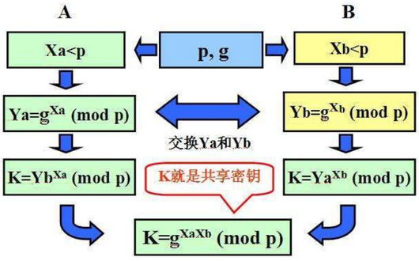
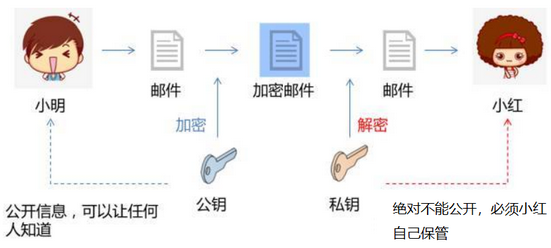
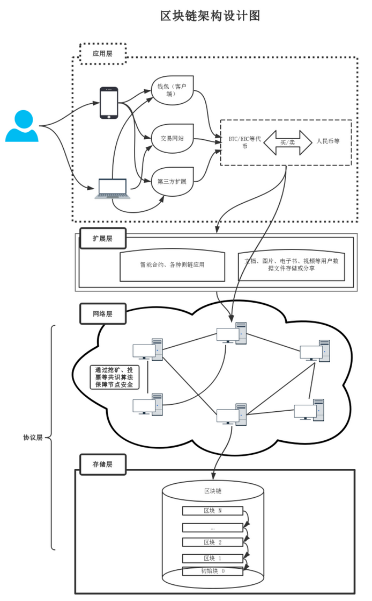
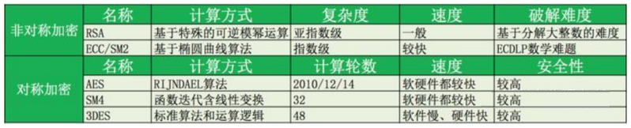
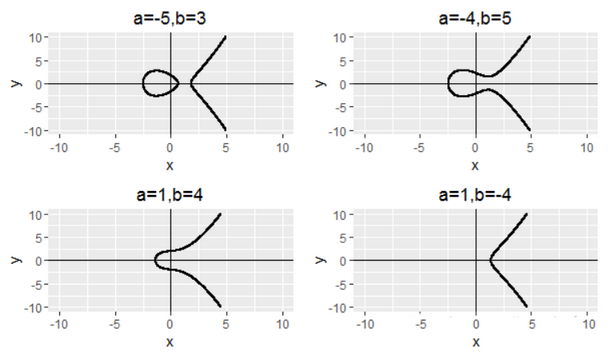
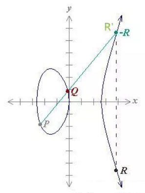
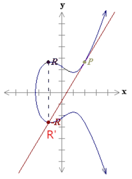
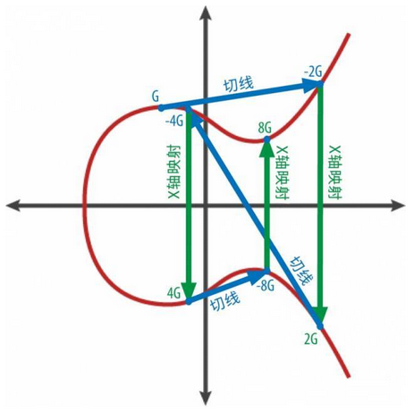
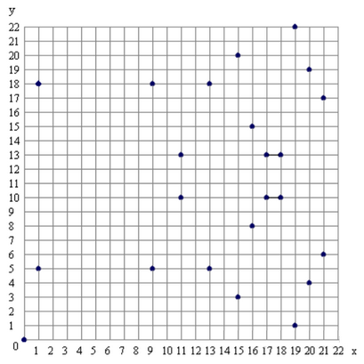

# 非对称密匙加密&椭圆曲线

## 区块链加密技术

区块链技术的应用和开发，数字加密技术是关键。一旦加密方法遭到破解，区块链的数据安全将受到挑战，区块链的不可篡改性将不复存在。

加密算法一般分为对称加密和非对称加密，区块链中主要应用非对称加密算法。非对称加密指为满足安全性需求和所有权验证需求而集成到区块链中的加密技术。非对称加密通常在加密和解密过程中使用两个非对称的密码，分别称为公钥和私钥。非对称密钥对具有两个特点：一是用其中一个密钥(公钥或私钥)加密信息后，只有另一个对应的密钥才能解开。二是公钥可向其他人公开，私钥则保密，其他人无法通过该公钥推算出相应的私钥。

## 非对称加密应用场景

非对称加密技术在区块链的应用场景主要包括信息加密、数字签名和登录认证等，其中信息加密场景主要是由信息发送者(记为 A)使用接受者(记为 B)的公钥对信息加密后再发送给 B，B 利用自己的私钥对信息解密。比特币交易的加密即属于此场景。数字签名场景则是由发送者A 采用自己的私钥加密信息后发送给 B，B 使用 A 的公钥对信息解密、从而可确保信息是由 A 发送的。登录认证场景则是由客户端使用私钥加密登录信息后发送给服务器，后者接收后采用该客户端的公钥解密并认证登录信息。

## 非对称加密科普

### 密钥配送问题

我们在平时生活中对我们的账号、文件进行加密的时候，通常都用的都是对称密码。所谓对称密码就是加密和解密用的是同一个密码。比如我们在注册自己的微信账号时，会输入一个密码防止别人来登录。以后如果因为你手动退出，或者换了台手机需要再次登录微信的时候，只要再把这个密码输一遍就可以了。

对称密码在大多数情况下使用起来都没有问题。但是在一些特定场合，就不那么好用了。举个例子，如果小明想通过电子邮件给小红写一份情书，作为一个害羞而谨慎的人，他不想让任何其他人偷看到，于是他在这封邮件中设置了一个密码，收件人只有输入了这个密码才能看到邮件的内容。假设小红的爸爸有经常检查（tou kan）小红邮件的习惯，但如果他不知道密码，也就只能作罢。或者小明有一个情敌小强，他是个计算机高手，能够利用黑客手段截获小明和小红之间发送的邮件，但是如果邮件加了密（并且密码强度足够的话），他也只能望洋兴叹了。

但问题来了，小明怎么才能把这个密码告诉小红呢。如果小明在和小红见面的时候，直接当面告诉小红密码，并且约定以后两个人的邮件往来都会用这个密码加密，那自然是没有问题。但是如果小明和小红是异地恋呢。要是小明把密码也通过一份邮件发给小红，这个密码就同样有泄漏的可能，那加密邮件也就没有任何意义了。当然通过电话、寄信、放鸽子等等方式传递密码，在理论上都有可能被手段高明的小强截获。所以这就是所谓的密钥配送难题。



## 非对称加密机制

针对密钥配送这一难题，密码学历史上最伟大的发明——非对称加密（公钥加密）出现了。它解决了密钥的发布和管理问题，是目前商业密码的核心。在公钥加密体制中，没有公开的是私钥，公开的是公钥。

和对称密码不同，公钥密码体系由加密和解密两组密钥构成，他们之间是不同的。信息的发送者可以通过加密密钥将信息进行加密，而接收者则会用解密密钥来进行解密。

回到之前的那个例子，小红同时拥有一对加密密钥和解密密钥。小红把加密密钥发送给小明，让小明用这个密钥把他想发的邮件进行加密后发给小红自己。这个加密密钥可以通过任何方式发送，邮件、电话、微信、信鸽都没问题，甚至可以把它贴在家门口（当然，也没必要这么张扬）。之所以胆子这么大，是因为这封被加密的邮件只有小红通过自己手里掌握着的解密密钥才能进行解密读取。也就是说，即使小强通过黑客手段拿到了加密邮件，并且也知道了加密密钥，只要他不知道解密密钥，他还是没有办法读到邮件。而这个关键的解密密钥是被小红自己保管的，它不会也不需要被发送给任何其他人，甚至包括小明。

由于加密密钥通常是可以被公开的，所以它又被称为`公钥`；而解密密钥是不能公开的，只能由自己来使用，所以又被称为`私钥`。公钥和私钥是永远是成双成对的，它们是不能分开生成的。



## RSA算法

知道公钥密码的大致概念后，再来对它的实现方法作一下说明，好让我们有一个更加直观的认识。公钥密码有很多不同的实现方法，其中 RSA 算法是最为知名的一种，也可以说是现在公钥密码的事实标准，

RSA 中的明文和密钥都是数字。首先，RSA 的加密公式为：

```bash
密文=明文^a % b
```

密文是将明文的 a 次方对 b 求余数的结果。任何人只要知道了 a 和 b 两个数字，就可以通过这个公式把明文进行加密。换句话说，a 和 b 共同构成了 RSA 加密算法的公钥。

而 RSA 的解密公式：

```bash
明文=密文^c % b
```

这个公式与之前唯一不同的就是把 a 换成了另一个数字 c，而 c 和 b 则共同构成了 RSA 的私钥。

把数字代进去举个更加具体的例子，

比如，小明有一个明文数字 123 ，想要把它加密后传送给小红。同时小红手头有一组密钥对，其中公钥是（a=5,b=323），私钥是（c=29，b=323）。于是小红把公钥发给了小明。小明通过公钥来对明文 123 进行加密计算后，得到了密文数字 225，并把它发给了小红：

```bash
密文=123^5 % 323=225
```

小红拿到密文之后，用自己手中的私钥进行了解密：

```bash
明文=225^29 % 323=123
```

这样小红就得到了原来的明文数字 123，这里有很多细节被省去了，比如其中公钥和私钥中的数字 5, 29, 323 不是随便取的，而是由特定算法生成的。



## 区块链加密算法

加密简单而言就是通过一种算法手段将对原始信息进行转换，信息的接收者能够通过秘钥对密文进行解密从而得到原文的过程。按照加密方和解密方秘钥相同与否可以将加密算法大致分为三种子类型：

### 对称加密

加密解密方使用相同的秘钥，这种方式的好处在于加解密的速度快但是秘钥的安全分发比较困难，常见对称加密算法有 DES , AES 。

- 加解密方公用一个密钥
- 加/解密速度快，但密钥分发比较困难

### 哈希或散列函数（Hash）, 典型算法 SHA, MDT

- 如果两个散列值是不相同的，那么这两个散列值的原始输入也是不相同的
- 用于信息压缩，并发现信息是否发生变化
- 计算速度快，特定算法其结果长度统一
- 目前至少使用 SHA256

### 非对称加密

- 加解密时，通讯一方有一对密钥（公钥和私钥）
- 公钥可以公开，分发给任何人
- 私钥不可以公开，严格持有，例如 U 盾中存放私钥等
- 公钥加密，只能用私钥解密，反之亦然
- 加/解密速度慢，但无密钥分发问题
- 区块链主要使用 ECC 椭圆曲线算法

常见的其他非对称加密算法有 RSA , ECC 。

### 对称加密与非对称加密的结合

这种方式将加密过程分为两个阶段，阶段一使用非对称加密进行秘钥的分发使得对方安全地得到对称加密的秘钥，阶段二使用对称加密对原文进行加解密。

- 公钥体系通常运算性能低，做大量数据加解密力不从心
- 通常利用公钥体系实现对称密钥的安全交换



区块链中主要使用非对称加密的 ECC 椭圆曲线算法。

## 椭圆曲线加密算法ECC

椭圆曲线长什么样

椭圆曲线如果用公式表示的话，可以写成下面这样：

```go
y^2 = x^3 + ax + b
```

其中，a 和 b 取不同的值时，曲线的样子也有所不同，比如说：



是不是感觉样子有些怪，不管 a 和 b 取什么值，看上去都不像是椭圆形。据说椭圆曲线的名字来源于它的表达式有点像计算椭圆周长的积分公式，而不是说这个曲线画出来是椭圆形~

### 椭圆曲线的加法和乘法

椭圆曲线的世界里，定义了一种奇怪的加法法则：任意取椭圆曲线上的两点 P、Q 画一条直线，这条直线与曲线上的另个一交点为 R'，而 R' 关于 x 轴的镜像点为 R，那么 P、Q、R 这三个点相互之间就会形成这样的关系：P+Q=R（其中 R'=-R）。是不是有点特别，这个加法法则和我们平常理解的 1+2=3 是不同的，它建立了一种椭圆曲线上点和点之间的关系。



如果 P 和 Q 是同一个点，姑且都叫 P 吧，那么我们过 P 点画一条椭圆曲线的切线，也可以得到一个它和曲线的另一个交点 R' ，而 R' 同样有一个相对于 x 轴的镜像点 R，这时候的加法就变成了 P+P=2P=R，也就是变成了一个乘法运算。



再延伸一步，如果以 R 为起点，还可以画出一个新的点用来表示 2R，也就是 4P，然后再以这个新的点为起点还可以继续画下去……下面这个图就是以 G 为起点，画出了 2G，4G，8G 的样子。



## 离散椭圆曲线

上面的讲解中，我们看到椭圆曲线是条连续的曲线，之所以连续，是因为我们是在实数范围内取值的，也就是说曲线上各个点的横坐标和纵坐标都是实数。

可是，如果要把椭圆曲线应用于加密，是不能用实数的。因为实数包括了整数和小数，而小数不仅会让计算速度大幅降低，计算结果还会涉及到四舍五入的问题，从而使计算精度受到影响。由于密码学对于速度和精度都有严格的要求，所以我们是没法用实数来对信息进行加密的。

为了让椭圆曲线应用于加密，必须对其离散化，说白了也就是曲线上各个点的横坐标和纵坐标都必须是整数，而且这些点的数量还得是有限的。让我们举个例子看看吧。

假设我们把椭圆曲线 `y^2= x^3 + x（a=1，b=0）` 离散化，并且规定只能取 23 个点，那么这 23 个点的横坐标和纵坐标必须是 0-22 之间的整数，且横纵坐标之间必须满足下面这种关系（其中%表示取余数）：

```go
y^2 % 23 = x^3 + x % 23
```

如果将这 23 个点画出来，将会变成下图的样子。是不是感觉和连续的椭圆曲线有些不大一样呢。



我们可以随便取一个点(9,5)来看看是不是满足上面的公式：

```go
5^2 % 23 = 9^3 + 9 % 23

25 % 23 = 738 % 23

2=2
```

离散椭圆曲线上的加法和乘法也遵循类似于连续椭圆曲线的规则，不过因为都是一个个离散点，其运算过程也就没有办法像连续椭圆曲线中那样形象地表示出来了。举两个例子感受一下吧，比如

**加法：** P(11,10)+Q(1,5) = R(17,10)

**乘法：** 2P(11,10) = R(13,18)

（由于不是在上数学课，所以这里相应的计算公式也就不再列出了，我们不去深挖细节，只要知道大致原理就好）

也就是说，所有的 23 个点之间都有一种奇妙的联系，任意两个点相加，或者任意一个点的倍数得到的结果都会是这 23 个点中的另一个点。就好像这 23 个点之间形成了一套自己的封闭的数学体系。

## 应用于比特币中的椭圆曲线

那么应用到区块链中的椭圆曲线到底是个什么样子呢？

事实上，不是所有的椭圆曲线都能够保证足够的安全性从而用于加密，而区块链技术的最典型应用比特币中所使用的椭圆曲线遵循了一种叫做 secp256k1 的标准，这个标准所定义的椭圆曲线方程是这个样子的：

```go
y^2 % p = x^3 + 7 % p
```

其中p是一个非常非常大的素数：

```go
p = 2^256 – 2^32 – 2^9 – 2^8 – 2^7 – 2^6 – 2^4 – 1
```

也就是说，这是一个由p个点构成的离散椭圆曲线。

### 使用椭圆曲线生成公钥

说了一大堆椭圆曲线的基本原理，那么它到底是怎么应用到比特币中去的呢？

其实，椭圆曲线在比特币中扮演的角色说起来也很简单，就是用来生成公钥。

在上一篇文章中我们讲到，公钥加密体系的机制是一条信息可以通过公钥来加密，并且通过私钥来解密，而公私钥必须是成对出现的。事实上，公钥是由私钥通过一定的算法计算出来的。而在比特币中，公钥是通过椭圆曲线算法由私钥生成的。

具体来说，假设我们有一个私钥k，只要将其与椭圆曲线上的一个初始点G相乘，就可以获得曲线上的另一点，也就是相应的公钥K。而这个乘法的计算方式用的就是我们之前所讲到的运算法则。

`K(公钥) = k(私钥) * G(椭圆曲线上的初始点)`

事实上，初始点 G 作为 secp256k1 标准的一部分，是一个固定的点，相当于一个常数。所以，`私钥k` 和 `公钥K` 之间的关系是固定的。不过，这个计算只能单向运算，即我们可以从 `私钥k` 得到 `公钥K`，但反过来就做不到了，而这就是可以把公钥与任何人共享而不会泄露私钥的原因。下面举个例子，让我们看一下比特币的公私钥是什么样子。

比特币的私钥是一个 256 位的二进制数字，通常用 64 位的 16 进制数显示，就像下面这样：

```bash
k=1E99423A4ED27608A15A2616A2B0E9E52CED330AC530EDCC32C8FFC6A526AEDD
```

通过把 k 与椭圆曲线上的初始点 G 相乘，就会得到公钥 K(x,y)，x 和 y 分别是 K 的横纵坐标，其中：

```bash
x=F028892BAD7ED57D2FB57BF33081D5CFCF6F9ED3D3D7F159C2E2FFF579DC341A

y=07CF33DA18BD734C600B96A72BBC4749D5141C90EC8AC328AE52DDFE2E505BDB
```

