# Solidity语言

- 写在后缀名 `.sol` 文件中
- 强类型的编程语言
- 和 JavaScript 相似
- 有许多巨大的陷阱

remix 浏览器地址：[https://remix.ethereum.org](https://remix.ethereum.org)

## 编写HelloWorld

1、点击 + 号创建 `helloworld.sol` 文件

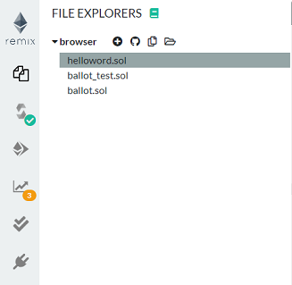

2、`helloworld.sol` 代码内容

```go
pragma solidity ^0.4.23;

contract HelloWorld{

    string public name = "jonson";

    function getName() public view returns(string) {
        return name;
    }

    function changeName(string _name) public {
        name = _name;
    }

    function testPure(uint a, uint b) public pure returns(uint) {
        return a + b;
    }

}
```

3、编译文件

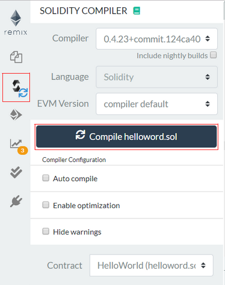

4、部署合约

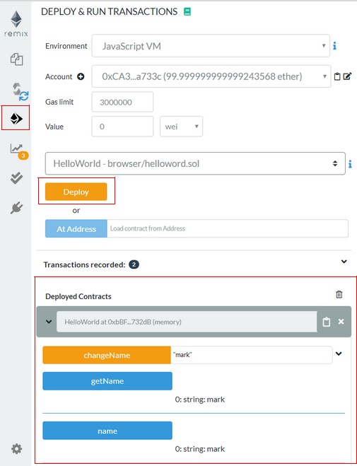

## 合约代码结构

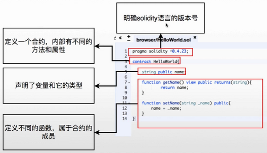

## 函数

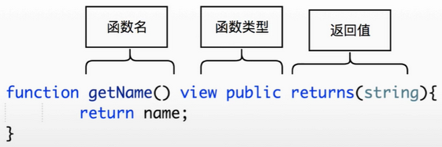

### 函数修饰符

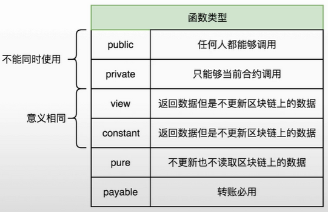

## pure与view差别

**view：** 读取区块链上面的数据，但是不修改区块链上面的数据

**pure：** 不修改也不读取区块链上面的数据

## 一笔事务的控制台信息

| 参数 | 数值 |
|--- | --- |
| status    | 0x1 Transaction mined and execution succeed |
| transaction hash  | 0x79bcfcedbc7b2a1187d9be2e35c9b90dc9be21b441c680d0e927ee47986afc5b |
| from  | 0xca35b7d915458ef540ade6068dfe2f44e8fa733c |
| to    | HelloWorld.changeName(string) 0xbbf289d846208c16edc8474705c748aff07732db |
| gas   | 3000000 gas  |
| transaction cost  | 23448 gas  |
| execution cost    | 1408 gas  |
| hash  | 0x79bcfcedbc7b2a1187d9be2e35c9b90dc9be21b441c680d0e927ee47986afc5b |
| input | 0x535...00000 |
| decoded input | { "string _name": "mark" } |
| decoded output    | {} |
| logs  | [] |
| value | 0 wei  |

### input 内容解析

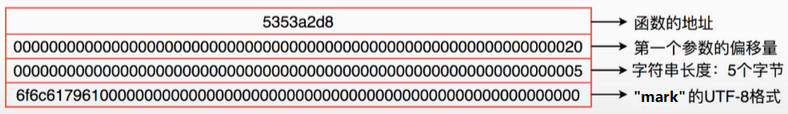

## solidity变量类型

### 基本的 solidity 类型

| Type | Example |
| --- | --- |
| bool | true , false |
| string | "hello world" |
| int | 0 , -10000 , 9999 |
| byte | 0x12 , 0xab |

### 布尔值

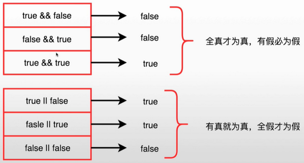

### 代码

```go
pragma solidity ^0.4.23;

contract BooleanTest {

    bool _a;
    int num1 = 100;
    int num2 = 200;

    function getBool() public view returns(bool) {
        return _a;
    }

    function getBool2() public view returns(bool) {
        return !_a;
    }

    function equal() public view returns(bool) {
        return num1 == num2;
    }

}
```

## 整型运算与溢出

### 整型变量

- **int** 有符号整型, 默认使用 int256

    ```bash
    int8    int16   int24   int32   .... int256
    ```

- **uint** 无符号整型, 默认使用 uint256

    ```bash
    uint8   uint16  uint24  uint32  .... uint256
    ```

### 代码

```go
pragma solidity ^0.4.23;

contract integerTest {

    uint numa = 4;
    uint numb = 2;
    int numc = 5;

    function getNum() public view returns(uint, uint, int) {
        return (numa, numb, numc);
    }

    function add(uint a,uint b) public pure returns(uint){
        return a+b;
    }

    function chu(uint a, uint b) public pure returns(uint) {
        return a/b;
    }

    function yu(uint a, uint b) public pure returns(uint) {
        return a%b;
    }

    function pingfang(uint a,uint b) public pure returns(uint) {
        return a**b;
    }

    function overflow(uint8 a) public pure returns(uint8) {
        return a +1;
    }

}
```

### 整型变量在底层


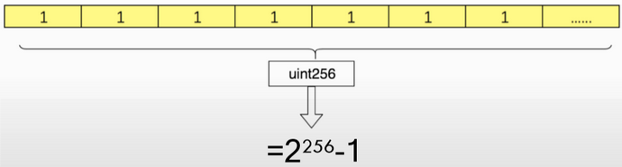

## 位运算

### 与

都为 1 则为 1 ， 都为 0 则为 0

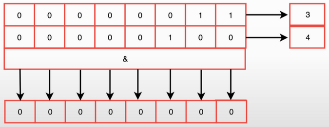

### 或

有 1 则为 1

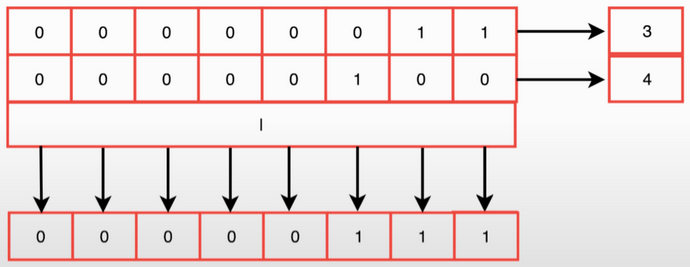

### 异或

相等为 0，不等为 1

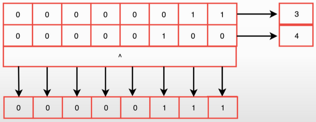

### 取反

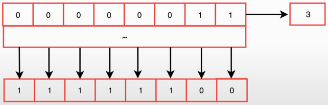

### 左移

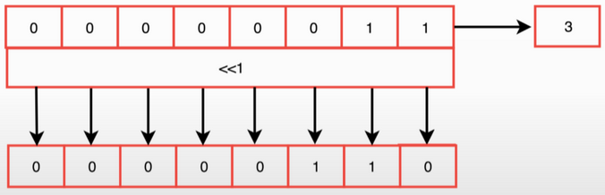

### 右移


### 代码

```go
pragma solidity ^0.4.23;

contract weiTest {

    uint8 a = 3;
    uint8 b = 4;

    function weiyu() public view returns(uint8) {
        return a & b;
    }

    function huo() public view returns(uint8) {
        return a | b;
    }

    function yihuo() public view returns(uint8) {
        return a ^ b;
    }

    function qufan() public view returns(uint8) {
        return ~a;
    }

    function leftMove() public view returns(uint8) {
        return a>>1 ;
    }

}
```

## byte类型

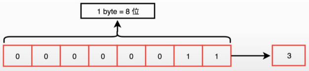

**byte == bytes1**

```bash
bytes1  bytes2   bytes3   ....   bytes32
```

最大到 bytes32 , 1 个 byte 8 位 , 32 x 8 = 256 也刚好对应 uint256 类型

### 用16进制表示

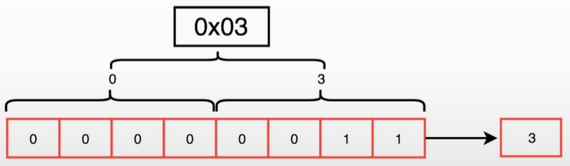

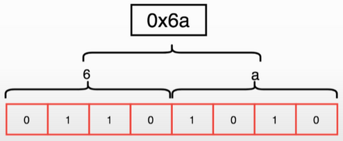

### 代码

```go
pragma solidity ^0.4.23;

contract bytesTest {

    // "jonson" 16进制 0x6a6f6e736f6e
    bytes1 public num1 = 0x6a;       // 106
    bytes2 public num2 = 0x6a6f;     // 27247
    bytes6 public num3 = 0x6a6f6e736f6e;

    bytes1 public a = 0x6a;     // 0110   1010  =  106
    bytes1 public b = 0x6f;     // 0110   1111  =  111

    function getLength() public view returns(uint, uint, uint) {
        return (num1.length, num2.length, num3.length);
    }

    function test() public view returns(bool) {
        return a > b;
    }

    function test1() public view returns(bool) {
        return a < b;
    }

    function test2() public view returns(bool) {
        return a >= b;
    }

    function test3() public view returns(bool) {
        return a <= b;
    }

    function test4() public view returns(bool) {
        return a == b;
    }

    function test5() public view returns(bool) {
        return a != b;
    }

    function test6() public view returns(bool) {
        return num2 > num1;
    }

}
```

### 动态长度字节数组

```go
pragma solidity ^0.4.23;

contract DynamicTest {

    // "jonson" 16进制 0x6a6f6e736f6e
    bytes public name = new bytes(2);

    function InitName() public {
        name[0] = 0x6a;
        name[1] = 0x6f;
    }

    function getLength() view public returns(uint) {
        return name.length;
    }

    function changeName() public {
        name[0] = 0x88;
    }

    function changeLength() public {
        name.length = 3;
    }

    function pushBytes() public {
        name.push(0x99);
    }

}
```

## 字符串——特殊的动态字节数组

solidity 中 string 类型不支持 `length` 属性，和下标操作 `name[0]` 。

```go
pragma solidity ^0.4.23;

contract StringTest{

    string public name="jonson";//6a6f6e736f6e
    string public name1="!@#$%^&*())*";
    string public name2="我爱你";

    function getLength() public view returns(uint){
        return bytes(name).length;
    }

    function getName() public view returns(bytes1){
        return bytes(name)[1];
    }

    function changeName() public{
        // bytes(name)[0]=0x55;
        bytes(name)[0]='P';
    }

    function  getBytes() public view returns(bytes){
        return bytes(name);
    }

    function getLength1() public view returns(uint){
        return bytes(name1).length;
    }

    function  getBytes1() public view returns(bytes){
        return bytes(name1);
    }

    function getLength2() public view returns(uint){
        return bytes(name2).length;
    }

    function  getBytes2() public view returns(bytes){
        return bytes(name2);
    }

}
```


