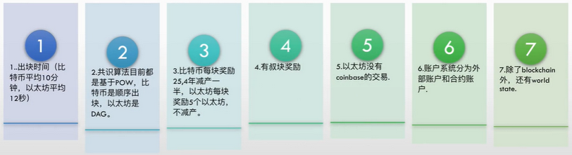
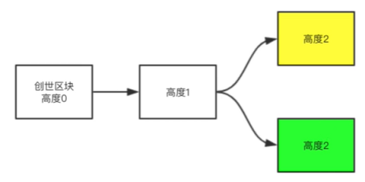
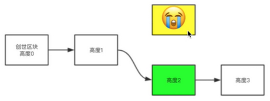
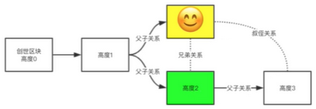
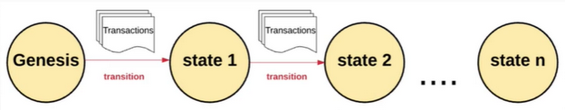
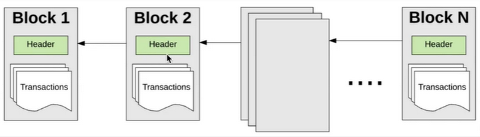
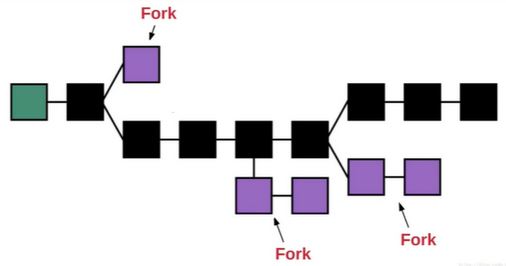
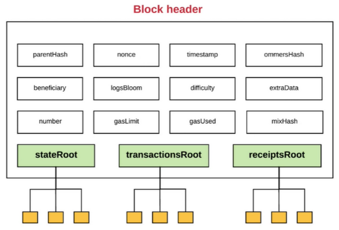
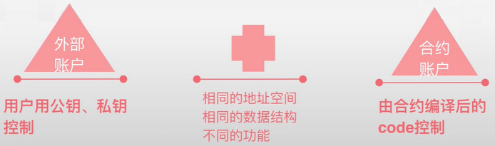
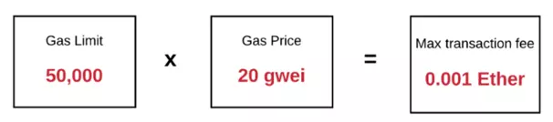

# 以太坊原理

## 介绍

以太坊（ETH）是有图灵完备的智能合约功能的公有区块链。以太坊通过建立终极的抽象的基础层——内置有图灵完备编程语言的区块链——使得任何人都能够创建合约和去中心化应用（Dapp）并在其中设立他们自由定义的所有权规则、交易方式和状态转换函数。

以太坊虚拟机（EVM）是以太坊中智能合约的运行环境。它不仅被沙箱封装起来，事实上它被完全隔离，也就是说运行在 EVM 内部的代码不能接触到网络、文件系统或者其他进程。甚至智能合约与其他智能合约之间也只有有限的接触。

## 对比比特币

## 有向无环图DAG（Directed Acyclic Graph）

## 以太坊处理方式

状态转移：

## 以太坊区块链

### 临时分叉

### 以太坊区块头

| 参数 | 说明 |
| --- | --- |
| ommerHash      | 包含叔区块的 Hash |
| beneficiary    | 挖洞矿后奖励的存放地址 |
| logsBloom      | 日志过滤器 |
| number         | 交易数量 |
| gasLimit       | 要运行以太坊付出的花费限制 |
| gasUsed        | 运行以太坊的花费 |
| mixHash        | 和 nonce 结合起来做挖矿运算 |
| stateRoot      | 账户所有信息会生成一个 Merkle patricia tree，把树根存储在其中 |
| transactionsRoot   | 所有的 transaction 形成 Merkle patricia tree，把树根存储集中 |
| receiptsRoot       | 为每一个 transaction 做了一个收据，把收据集合起来形成 Merkle patricia tree |

## 以太坊账户

以太坊的全局“共享状态”是有很多小对象（账户）来组成的，这些账户可以通过消息传递架构来与对方进行交互。

每个账户都有一个与之关联的状态(state)和一个 20 字节的地址(address)。

### 以太坊有两种类型的账户

- 外部账户

    外部账户没有代码，可以通过创建和签名一笔交易从一个外部账户发送消息。

- 合约账户

    与外部拥有的账户不同，合约账户不能自行发起新的交易，合约帐户只能触发交易以响应其他交易。每当合约账户收到一条消息，合约内部的代码就会被激活，允许它对内部存储进行读取和写入，和发送其它消息或者创建合约。

🎈tips：外部账户和内部账户，是在相同的地址空间，相同的数据结构有不同的功能

### 外部账户与合约账户的比较

一个外部拥有账户可以通过创建和用自己的私钥来对交易进行签名，来发送消息给另一个外部拥有账户或合约账户。

在两个外部拥有账户之间传送的消息只是一个简单的价值转移。

从外部拥有账户到合约账户的消息会激活合约账户的代码，允许它执行各种动作。

不像外部拥有账户，合约账户不可以自己发起一个交易。相反，合约账户只有在接收到一个交易之后(从一个外部拥有账户或另一个合约账户接)，为了响应此交易而触发一个交易。

因此，在以太坊上任何的动作，总是被外部控制账户触发的交易所发动的。

### 账户状态

以太坊的账户包含四个部分：

**nonce：** 用于确定每笔交易只能被处理一次的随机数。如果账户是一个外部拥有账户，nonce 代表从此账户地址发送的交易序号；如果账户是一个合约账户，nonce 代表此账户创建的合约序号

**balance：** 账户目前的以太币余额

**storageRoot：** Merkle 树的根节点 Hash 值。Merkle 树会将此账户存储内容的 Hash 值进行编码，默认是空值

**codeHash：** 此账户 EVM 代码的 Hash 值，对于合约账户，就是被 Hash 的代码并作为 codeHash 保存；对于外部拥有账户，codeHash 域是一个空字符串的 Hash 值

### 账户信息你被称为 world state

### 世界状态

以太坊的全局状态由账户地址和账户状态的映射组成，这个映射被保存在一个叫做 Merkle Patricia 树的数据结构中。

Merkle Patricia 树由大量叶子节点、一系列中间节点、一个根节点组成。

树的底部包含了源数据的大量叶子节点，中间节点是两个子节点的 Hash 值，根节点同样是两个子节点的 Hash 值，代表着整棵树。

这棵树要求存在里面的值（value）都有一个对应的 key。从树的根节点开始，key 会告诉你顺着哪个子节点可以获得对应的值，这个值存在叶子节点。在以太坊中，key/value 是地址和与地址相关联的账户之间状态的映射。

## Gas

### 什么是Gas

由以太坊网络上的交易而产生的每一次计算，都会产生费用，这个费用是以称之为 `gas` 的来支付，`gas` 就是用来衡量在一个具体计算中要求的费用单位，智能合约最原子运算所需花费的单位。

例如 ：一个位移运算需要 1 气，一个相加运算需要 3 气。

### GasPrice

1 气和以太币(wei)的兑换价格

### 一次 Transaction 的所有花费

Total_fee = value (转移给对方账户的以太币数量）

- transaction fee
- gas * gasPrice (执行智能合约的花费，此为上限，以实际执行步数为准，gasReal * gasPrice)

### Gas Limit

允许的最大花费：以太坊中有循环操作和一些其他复杂的操作，限制最大花费。

