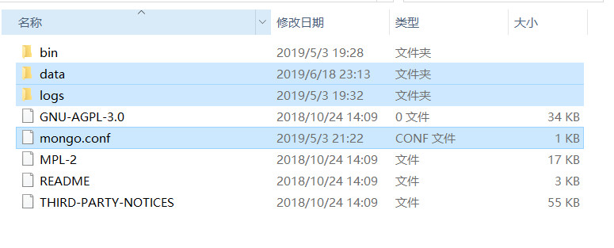

# MongoDB 安装与启动

## 下载

官方地址：[https://www.mongodb.com/
](https://www.mongodb.com/
)

## 安装

1、安装 mongodb 需要 vc++ 运行库，，如果没有则会提示“无法启动此程序，因为计算机中丢失 `VCRUNTIME140.dll`

2、下载 `.msi` 程序，点击下一步默认完成安装

## 启动 MongoDB

### 1. 创建目录和文件

在 MongoDB 安装目录创建几个文件夹具体如下：数据库路径（data目录）、日志路径（logs目录）和 logs目录下创建日志文件（mongo.log文件）



### 2. 配置文件 `mongo.conf`

```yml
#数据库路径
dbpath=D:\MongoDBServer\data
#日志输出文件路径
logpath=D:\MongoDBServer\logs\mongo.log
#错误日志采用追加模式
logappend=true
#启用日志文件，默认启用
journal=true
#这个选项可以过滤掉一些无用的日志信息，若需要调试使用请设置为false
quiet=true
#端口号 默认为27017
port=27017
#开启用户
auth=true
```

### 3. 安装 MongoDB 服务

1、通过执行 bin/mongod.exe，使用 --install 选项来安装服务，使用 --config 选项来指定之前创建的配置文件。cmd 进入 `d:\MongoDB\Server\3.4\bin`

```yml
mongod.exe ‐‐config "d:\MongoDB\Server\3.4\mongo.conf" ‐‐install
```

启动 MongoDB 服务

```yml
net start MongoDB
```

关闭 MongoDB 服务

```yml
net stop MongoDB
```

移出 MongoDB 服务

```yml
"d:\MongoDB\Server\3.4\bin\mongod.exe" ‐‐remove
```

2、访问启动界面

浏览器中输入 [http://127.0.0.1:27017](http://127.0.0.1:27017) 看到页面显示如下信息即说明启动成功：

`It looks like you are trying to access MongoDB over HTTP on the native driver port.`

也可以通过 bin 目录下的 mongo.exe 连接 mongodb
