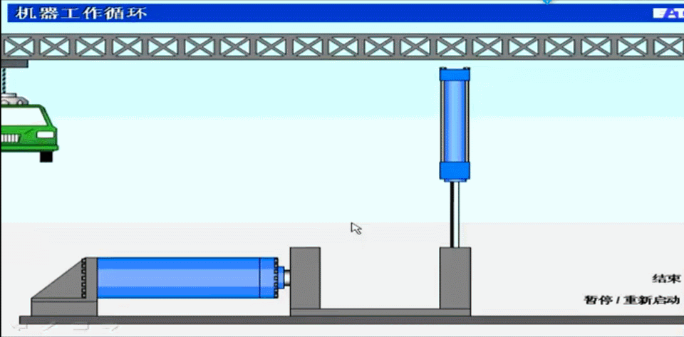

# 液压传动基础知识

教学内容：

1. 液压传动的工作原理

2. 液压传动的组成和各组成部分的作用

3. 液压传动的基本理论

4. 液压油的分类和选用原则

## 液压能传动图解

## 液压驱动的工作工程

- 液压升降机

- 钢板折弯机

- 废车压扁机

## 三种传动形式

- 机械传动
- 电气传动
- 流体传动

机电液一体化技术中：电子是神经，液压是肌肉，机械是骨头。

## 液压传动的发展历史

液压传动是以流体作为工作介质对能量进行传动和控制的一种传动形式，相对于机械传动来说，是一门新兴的技术。人类使用水利机械及液压技术虽然有很长历史，但液压技术在工业上的真正推广使用，则是第二次世界大战以来的事。近几十年来，随着微电子技术的迅速发展及液压传动许多突出的优点，其应用领域普遍及各个工业部门。只要稍加注意，我们就可以发现许多工程实际中应用液压传动的例子。

## 液压传动的应用领域和发展趋势

- 液压传动技术应用在机床、工程机械、塑料机械、农林机械、汽车、船舶、航天航空等国民经济各行各业，是自动化技术不可缺少的手段。

- 元件小型化、系统集成化、机电液一体化是液压传动技术的必然发展趋势；元件与系统的 CAD/CAT 与计算机实时控制是当前的发展方向。

## 什么是液压传动（Hydraulics）？

液压传动（Hydraulics）是以液体为工作介质，通过`动力元件`将原动机的机械能转换为液体的压力能，然后通过`管道等附件`、`液压控制元件`、通过`执行元件`将液体的压力能转换为机械能，驱动负载实现直线或回转运动。

## 液压驱动的功能

- 方向控制
- 定位技术
- 运行速度控制
- 控制压力

实现这些功能所需要的元件：

- 方向控制阀
- 流量控制阀
- 压力控制阀

## 机床工作台液压系统的工作原理

## 液压系统的组成

**液压泵：** 是由电动机所带动，将机械能转换成液体压力能。

**执行元件：** 把油液的液压能转换成机械能的元件。有作直线运动的液压缸，或作回转运动的液压马达。

**控制元件：** 对系统中油液压力、流量或油液流动方向进行控制或调节的元件。这些和元件的不同组合形成了不同功能的液压系统。

**辅助元件：** 例如油箱、过滤器、油管等。他们对保证系统正常工作有重要作用。

