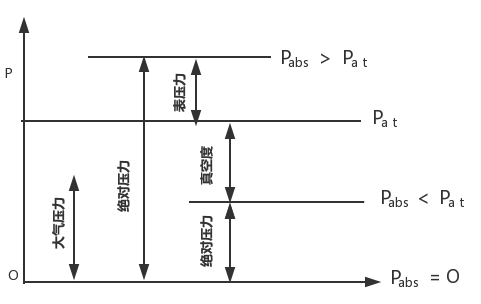

# 液压传动基本理论

## 液体静压力

静止液体在单位面积上所受的法向力称为静压力。

在液体的面积 A 上所受的作用力 F 为均匀分布时，静压力可表示为 `p = F / A`

## 液体静压力的特性

**静液体**压力垂直于承压面，方向为该面内法线方向。液体内任一点所受的静压力在各个方向上都相等。

我国采用法定计量单位 `Pa` 来计量压力：$1Pa = 1N/m^{2}$

液压技术中习惯用 $Mpa (N/mm^{2})$, 在企业中还习惯使用 bar (kgf/$cm^{2}$) 作为压力单位

各单位关系：$1Mpa = 10^{6}Pa = 10bar$

## 绝对压力、表压力及真空度

以当地大气压力（atomosphere）为基准所表示的压力成为表压力（gauge pressure）。以绝对零压力作为基准所表示的压力称为绝对压力（absolute pressure）。

如液体中某点处的绝对压力小于大气压力，这时该点的绝对压力比大气压力小的那部分压力值，称为**真空度**(真空度 = 大气压力 - 绝对压力)。

