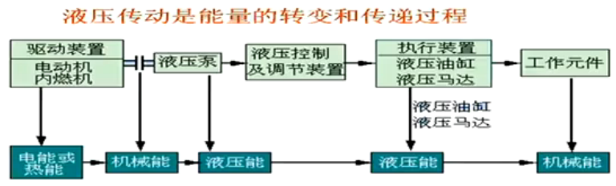
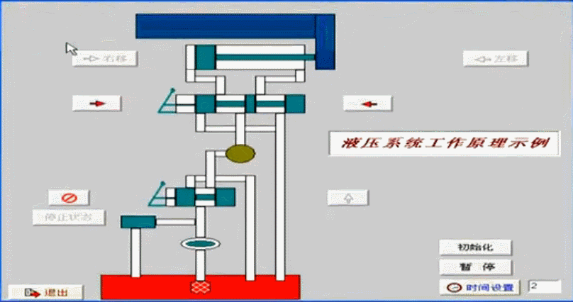
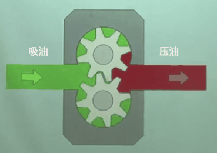
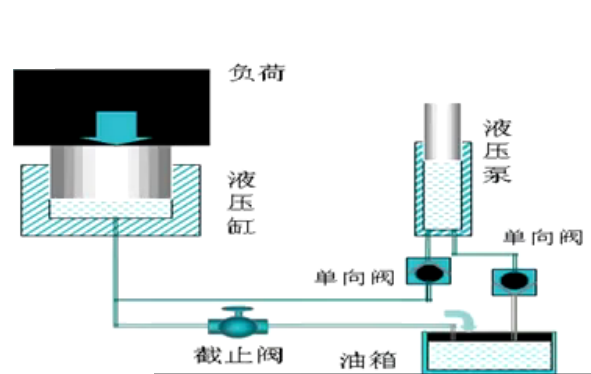

# 液压传动基础知识

教学内容：

1. 液压传动的工作原理

2. 液压传动的组成和各组成部分的作用

3. 液压传动的基本理论

4. 液压油的分类和选用原则

## 液压能传动图解

## 液压驱动的工作工程

- 液压升降机

- 钢板折弯机

- 废车压扁机

## 三种传动形式

- 机械传动
- 电气传动
- 流体传动

可以这样理解在机电液一体化技术中：电子是神经，液压是肌肉，机械是骨头。

## 液压传动的发展历史

液压传动是以流体作为工作介质对能量进行传动和控制的一种传动形式，相对于机械传动来说，是一门新兴的技术。人类使用水利机械及液压技术虽然有很长历史，但液压技术在工业上的真正推广使用，则是第二次世界大战以来的事。近几十年来，随着微电子技术的迅速发展及液压传动许多突出的优点，其应用领域普遍及各个工业部门。只要稍加注意，我们就可以发现许多工程实际中应用液压传动的例子。

## 液压传动的应用领域和发展趋势

- 液压传动技术应用在机床、工程机械、塑料机械、农林机械、汽车、船舶、航天航空等国民经济各行各业，是自动化技术不可缺少的手段。

- 元件小型化、系统集成化、机电液一体化是液压传动技术的必然发展趋势；元件与系统的 CAD/CAT 与计算机实时控制是当前的发展方向。

## 什么是液压传动（Hydraulics）？

液压传动（Hydraulics）是以液体为工作介质，通过`动力元件`将原动机的机械能转换为液体的压力能，然后通过`管道等附件`、`液压控制元件`、通过`执行元件`将液体的压力能转换为机械能，驱动负载实现直线或回转运动。

## 液压驱动的功能

- 方向控制
- 定位技术
- 运行速度控制
- 控制压力

实现这些功能所需要的元件：

- 方向控制阀
- 流量控制阀
- 压力控制阀

## 机床工作台液压系统的工作原理

## 液压系统的组成

液压传动系统由以下五部分组成：

（1）**`液压动力元件`**。液压动力元件指液压泵。它是将动力装置的械能转换成为液压能的装置，其作用是为液压传动系统提供压力油（压力和流量）。是液压传动系统的动力源。

（2）**`液压执行元件`**。液压执行元件指液压缸或液压马达，它是将液压能转换为机械能的装置，其作用是在压力油的推动下输出力和速度或转矩和转速，以驱动工作装置作功。

（3）**`液压控制调节元件`**。它包括各种液压阀类元件，其作用是用来控制液压传动系统中油液的流动方向、压力和流量，以保证液压执行元件和工作装置完成指定工作。

（4）**`液压辅助元件`**。例如油箱、油管、过滤器等，它们对保证液压传动系统正常工作有着重要的作用。

（5）**`液压工作介质`**。工作介质指传动液体、通常被称为液压油或液压液。

---

什么是液压系统？

    答：液压系统是以有压液体作为工作介质进行能量转换的系统，它可在动力源与工作点之间传递能量。
