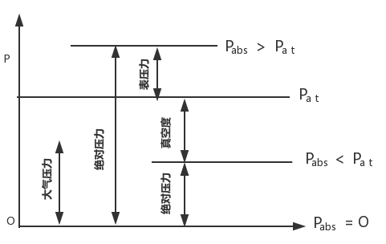
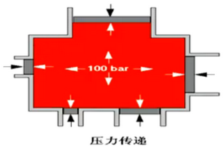
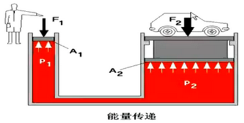
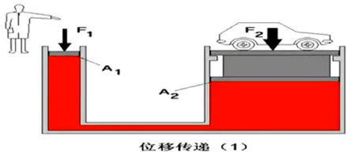
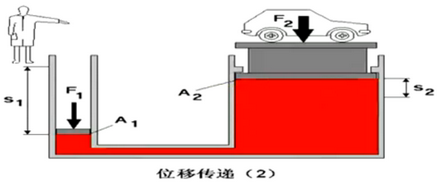
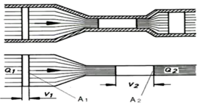
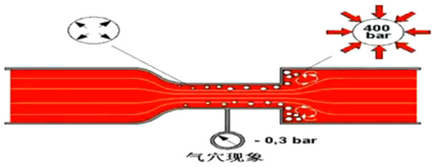

# 液压传动基本理论

**液体静压力**

静止液体在单位面积上所受的法向力称为静压力。

在液体的面积 A 上所受的作用力 F 为均匀分布时，静压力可表示为 `p = F / A`

- F 表示液体表面所受的力
- A 表示液体的受力面积

**液体静压力的特性**

液体静压力垂直于承压面，方向为该面内法线方向。液体内任一点所受的静压力在各个方向上都相等。

我国采用法定计量单位 `Pa` 来计量压力：$1Pa = 1N/m^2$

液压技术中习惯用 $Mpa (N/mm^{2})$, 在企业中还习惯使用 bar (kgf/$cm^{2}$) 作为压力单位

各单位关系：$1Mpa = 10^{6}Pa = 10bar$

**绝对压力、表压力及真空度**

以当地大气压力（atomosphere）为基准所表示的压力成为表压力（gauge pressure）。以绝对零压力作为基准所表示的压力称为绝对压力（absolute pressure）。

如液体中某点处的绝对压力小于大气压力，这时该点的绝对压力比大气压力小的那部分压力值，称为**真空度**。

```txt
真空度 = 大气压力 - 绝对压力
```



## 1. 液压传动中的基本原理

### 1.1 帕斯卡原理

在密闭容器内，施加于禁止液体的压力可以等值地传递到液体各点。也称为静压传递原理。



### 1.2 静压传递原理

如果力 F1 作用于面积为 A1 的液体上，则会产生压力 P，此时，如果压力 P 作用在较大面积 A2 上，则产生较大力 F2。

如果面积 A2 为面积 A1 的三倍，则力 F2 就为力 F1 的三倍。（能量传递与机械杠杆原理相似）



### 1.3 位移传递





### 1.4 连续定理

- 液体在流动时，通过任一通流横截面的速度、压力和密度不随时间改变的流动称为稳流，反之速度、压力和密度其中一项随时间而变，就称为非稳流。

- 对稳流而言，液体以稳流流动通过管内任一界面的液体质量必然相等（质量守恒原理）。如图所示管内两个流通截面面积为 A1 和 A2 ，流速分为为 V1 和 V2 ，则通过任一截面的流量：

```text
Q = A x V = A1 x V1 = A2 x V2 = 常量
```

基本概念：运动速度取决于流量，而与流体的压力无关。

流量的单位通常用 L/min 表示，与 $m^{3}/s$ ，换算式如下：

1L = 1 X $10^{-3}m^{3}$

$1m^{3}/s$ = 6 X $10^{4}L/min$



### 1.5 伯努利方程（流体能量守恒定律）

在密闭管道内稳定流动的理想液体有三种形式的能量，即压力能、动能、位能。

`压力能 + 动能 + 位能 = 常量`

## $\frac{p}{pg} + \frac{V^2}{2g} + h$ = cons't

综合液体连续性定理，从上式可知：

1、水平放置的管道，流体的流速越高，它的压力就越低。

2、在流量不变的情况下，液体流过不同截面时，截面越大，流速越低；压力越大：截面越小，流速越大，压力越小。

在液压传动系统中，位能和动能与压力能相比小很多，可以忽略不计。

液压系统中的能量主要以**压力能**形式体现。

## 2. 液体流动中的压力和流量损失

### 2.1. 压力损失

由于液体具有粘性，在管路中流动时又不可避免地存在着摩擦力，所以液体在流动过程中必然要损耗一部分能量。这部分能量损耗主要表现为压力损失。

压力损失有**沿程损失**和**局部损失**两种。沿程损失是当液体在直径不变的直管中流过一段距离时，因摩擦而产生的压力损失。局部损失是由于管子截面形状突然变化、液流方向改变或其它形式的液流阻力而引起的压力损失。总的压力损失等于沿程损失和局部损失之和。

一般将系统工作所需的最大工作压力乘以一个 1.3 ~ 1.5 的系数来估算。

### 2.2. 流量损失

在液压系统中，各被压元件都有相对运动的表面，如液压缸内表面和活塞表面，因为要有相对运动，所以他们之间都有一定的间隙，如果间隙的一边为高压油，另一边为低压油，则高压油就会经间隙流向低压区从而造成泄露。同时由于液压元件密封不完善，一部分油液也会向外部泄露。这种泄露造成实际流量有所减少，这就是我们所说的流量损失。

通常也用系统工作所需的最大流量乘以一个 1.1 ~ 1.3 的系数来估算。

### 2.3. 液压冲击

在液压系统中，当油路突然关闭或换向时，会产生急剧的压力升高，这种现象称为液压冲击。

造成液压冲击的主要原因是液压速度的急剧变化、高速运动工作不见的惯性力和某些液压元件反应动作不够灵敏。

### 2.4. 空穴现象



在节流口处，增加油液流动速度需要动能，动能由压力能转换而来。如果真空度小于 -0.3bar，则将分离油液中空气，产生气泡。当因油液运动速度降低而使油液压力再次升高时，气泡就会被压破。

气穴现象是导致液压系统中元件和管接头损坏的重要囚素之一。


