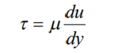
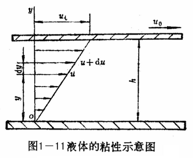

# 液压油

**液压油：** 工作介质液压油是液压系统中极为重要的组成部分，它将系统中各类元件沟通起来成为一个有机的整体。液压系统中完全靠液压油把能量从液压泵经管路、控制阀传递到执行元件，根据统计，许多液压设备的故障，皆起因于液压油的使用不当，故应对液压油要有充分的了解。

## 1. 液压油的用途

1. **传递运动与动力：** 将泵的机械能转换成液体的压力能并传至各处，由于油本身具有粘度，在传递过程中会产生一定的动力损失。

2. **润滑：** 液压元件内各移动部位，都可受到液压油充分润滑，从而减低元件磨耗。

3. **密封：** 油本身的粘性对细小的间隙有密封的作用。

4. **冷却：** 系统损失的能量会变成热，被油带出。

## 2. 液压系统对液压油的要求和分类

### 2.1 对液压油液的要求

- 粘温特性好
- 有良好的润滑性
- 成分要纯净
- 有良好的化学稳定性
- 抗泡沫性和抗乳化性好
- 材料相容性好
- 无毒，价格便宜

### 2.2 液压油主要有下列二种

#### 1. 矿物油系液压油

按照 ISO 规定，采用 40℃ 时油液的运动粘度（$mm^2/s$）作为油液粘度牌号，共分为 10、15、22、32、46、68、100、150 等 8 个等级。

主要由石腊基（paraffin base）的原油精制而成，再加抗氧化剂和防锈剂，为用途最多的一种；其缺点为耐火性差。

#### 2. 耐火性液压油

专用于防止有引起火灾危险的乳化型液压油，有水中油滴型（o/w）和油中水滴形（w/o）两种，水中油滴型（o/w）的润滑性差，会侵蚀油封和金属；油中水滴形（w/o）化学稳定性很差。

## 3. 液压油的性质

- 密度
- 闪火点
- 粘度
- 压缩性

### 3.1. 密度

矿物油系工业液压油比重约 0.85-0.95，w/o 形比重约 0.92-0.94，o/w 型比重约 1.05-1.1。比重越大，泵吸入性越差。

### 3.2. 闪火点

油温升高时，部分的油会蒸发而与空气混合成油气，此油气所能点火的最低温度称为闪火点，如继续加热，则会连续燃烧，此温度称为燃烧点。

### 3.3. 粘度

**粘性：** 流体流动时，沿其边界面会产生一种阻止其运动的流体磨擦作用，这种产生内摩擦力的性质称为粘性。液压油粘性对机械效率、磨耗、压力损失、容积效率、漏油及泵的吸入性影响很大。

**粘度：** 度量粘性大小的物理量。粘度是液压油的性能指标，习惯上使用运动粘度标志液体的粘度，机械油的牌号就是用其在400C时的平均运动粘度（$mm/s^2$）为其标号。

粘性可分为动力粘度和运动粘度两种。

**动力粘度**表示如图示 1-11 和如下公式：

**τ ：** 剪应力

**μ ：** 动力粘度（Poise ; Centi-poise; 一般用 P；cP 来表示）

**运动粘度公式：**

## $v = \frac{\mu}{\rho}$

**v ：** 运动粘度（Stoke;Centi-stoke;一般用 St;cSt 来表示，$1cst ＝ 1mm/s^2$）

**ρ** = 密度（ $g/cm^2$ ）

**粘温特性：** 粘度随着温度升高而显著下降

**粘压特性：** 粘度随压力升高而变大

油的粘性易受温度影响，温度上升，粘度降低，造成泄漏、磨损增加、效率降低等问题，温度下降，粘度增加，造成流动困难及泵转动不易等问题，如运转时油液温度超过 60 度，就必须加装冷却器，因油温在 60 度以上，每超过 10 度，油的劣化速度就会加倍。

### 3.4. 压缩性

液压油在低、中压时可视为非压缩性液体，但在高压时压缩性便不可忽视了，纯油的可压缩性是钢的 100～150 倍，它会降低运动的精度，增大压力损失使油温上升，压力信号传递时，会有时间延迟，响应不良的现象。

液压油还有其他一些性质，如稳定性、抗泡沫性、抗乳化性、防锈性、润滑性、以及相容性等。

## 4. 液压油的选用

液压油有很多品种，可根据不同的使用场合选用合适的品种，在品种确定的情况下，最主要考虑的是油液的粘度，其选择考虑的因素如下：

**1. 液压系统的工作压力**

工作压力较高的系统宜选用粘度较高的液压油，以减少泄露；反之便选用粘度较低的油。例如，当压力 p = 7.0～20.0Mpa 时，宜选用 N46～N100 的液压油；当压力 p＜7.0Mpa 时宜选用 N32～N68 的液压油。

**2. 运动速度**

执行机构运动速度较高时，为了减小液流的功率损失，宜选用粘度较低的液压油。

**3. 液压泵的类型**

在液压系统中，对液压泵的润滑要求苛刻，不同类型的泵对油的粘度有不同的要求，具体可参见有关资料。

**4. 环境温度**

温度高，选用粘度较大的液压油液。

## 5. 液压油的污染与保养

液压油使用一段时间后会受到污染，常使阀内的阀芯卡死，并使油封加速磨耗及液压缸内壁磨损。造成液压油污染的原因有三方面：

### 5.1. 污染

（1）外部侵入的污物：液压设备在组装时，一些加工时残留的切屑、焊渣、铁锈等杂物混入所造成，只有在组装后立即清洗方可解决。

（2）外部生成的不纯物：泵、阀、执行元件、O 形环长期使用后，因磨损而生之金属粉未和橡胶碎片，在高温、高压下和液压油发生化学反应所生之胶状污物。

### 5.2. 恶化

液压油的恶化速度与含水量、气泡、压力、油温、金属粉末等有关，其中以温度影响最大，故液压设备运转时，须特别注意油温之变化。

### 5.3. 泄漏

液压设备因配管不良，油封破损是造成泄漏的原因，泄漏发生时空气、水、尘埃便可轻易的侵入油中，故当泄漏发生时，必须立即加以排除。

液压油经长期使用，油质必会恶化，一般皆用目视法判定油质是否恶化，当油颜色混蚀并有异味时，须立即更换；保养方法有二种：一为定期更换（约为 5000-20000 小时），其次是使用过滤器定期过滤。

