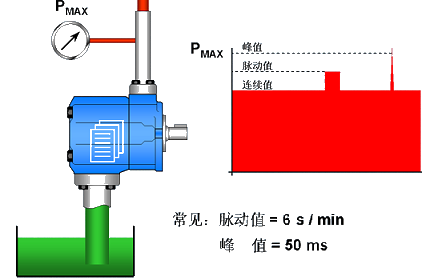
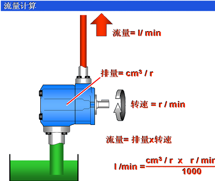
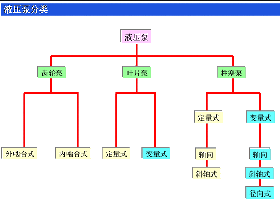
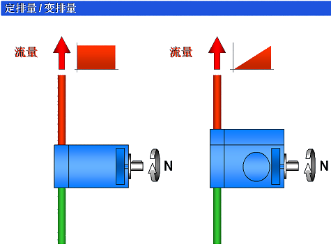
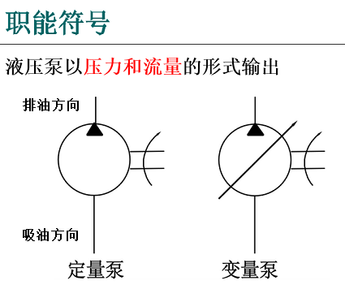

# 液压泵的基本原理与性能

1. 容积式液压泵工作原理（三个基本特点）
2. 液压泵的基本参数
3. 液压泵的分类

液压系统是以液压泵作为向系统提供一定的流量和压力的动力元件，液压泵由电动机带动将液压油从油箱吸上来并以一定的压力输送出去，使执行元件推动负载作功。

## 1. 容积式液压泵工作原理

**液压泵：** 液压传动中的能源供给。

上图所示为液压泵的工作原理图。柱塞 2 装在缸体 3 内并可作左右移动，在弹簧 4 的作用下，柱塞紧压在偏心轮 1 的外表面上。当电机带动偏心轮 1 旋转时，偏心轮则推动柱塞左右运动，使密封容积 a 的大小发生周期性的变化。当 a 由小变大时就形成部分真空，使油箱中的油液在大气压的作用下，经吸油管道顶开单向阀 6 阀进入油腔 a 实现吸油；反之，当a 由大变小时，a 腔中吸满的油液将顶开单向阀 5 流入系统而实现压油。电机带动偏心轮不断旋转，液压泵就不断的吸油和压油。

由于这种泵是依靠泵的密封工作腔的容积变化来实现吸油和压油的，因而称为容积式泵。

容积式泵的流量大小取决于密封工作腔容积变化的大小和次数。若不计泄漏，流量与压力无关。

**容积式液压泵的基本特点**

1. 有周期性变化的密封工作容积。
2. 吸油腔和压油腔要相互隔开。
3. 吸油过程中，油箱必须与大气相通。

## 2. 液压泵的主要性能和参数

- 压力 Pa
- 排量 V
- 流量 Q

### 2.1 压力 Pa

**额定压力：** 泵在连续运转情况下允许使用的最大压力。

**工作压力：** 泵实际工作时排油口的输出压力。工作压力取决于外负载的大小和排油管路上的压力损失，而与液压泵的流量无关。

**最大压力（极限）：** 泵在短时间内超载所允许的最高压力。超过此压力，泵的泄漏会迅速增加。

|压力等级|低压|中压|中高压|高压|超高压|
|---|---|---|---|---|---|
| 压力(MPa) | ≤ 2.5 | > 2.5~8 | > 8~16 | > 16~32 | > 32 |

### 2.2 排量 V

**排量V：** 是泵主轴每转一周所排出液体体积的理论值，如泵排量固定，则为定量泵；排量可变则为变量泵。一般定量泵因密封性较好，泄漏小，在高压时效率较高。

### 2.3 流量 Q

**流量Q：** 泵单位时间内排出的液体体积（L/min）），有理论流量 Qth 和实际流量 Qac两种。

1. **理论流量Qth：** 不计泄漏，泵单位时间内排出的液体体积。

    $Q_{th} = Vn$

    q : 泵的排量（L/r）

    n : 泵的转速（r/min）

2. **实际流量Qac：** 泵工作时的在单位时间内排出的液体体积。

    $Q_{ac} = Q_{th} - \Delta Q$

    ΔQ : 泵运转时，油会从高压区泄漏到低压区，是泵的泄漏损失。

> 重要特点：理论流量仅与泵的结构参数有关，与工作压力无本质联系。

### 2.4 容积效率 和 机械效率

**泵的容积效率：** $\Large \color{#08F}{\eta_V = \frac{Q_{ac}}{Q_{th}}}$

- $\large \eta_v$ : 泵的容积效率
- $Q_{ac}$ : 泵的实际流量
- $Q_{th}$ : 泵的理论流量

**泵的机械效率​：** $\Large \color{#08f}{η_m = \frac{T_{th}}{T_{ac}}}$

- $η_m$ : 泵的机械效率
- $T_{th}$ : 泵的理论输入扭矩
- $T_{ac}$ : 泵的实际输入扭矩

### 2.5 泵的总效率、功率

**泵的总效率：** $\Large \color{#08F}{η = η_m ⋅ η_v = \frac{P_{ac}}{p_M}}$

- η ：泵的总效率
- $P_{ac}$ : 泵实际输出功率
- $P_{M}$ : 电动机输出功率

**泵的实际输出功率：** $\Large \color{#08F}{P_{ac} = \frac{pQ_{ac}}{60}(kw)}$

- p : 泵输出的工作压力（MPa）
- Qac : 泵的实际输出流量（L /min），1L = $10^3cm^3$。

> **例题：** 某液压系统，泵的排量 q＝10m L/r，电机转速 n＝1200rpm，泵的输出压力 p=5Mpa 泵容积效率 ηv＝0.92，总效率 η＝0.84，  
> 求：1） 泵的理论流量；2）泵的实际流量；3）泵的输出功率；4）驱动电机功率。

解:

1） 泵的理论流量

$\large \color{#08f}{Q_{th} = q.n.10^{-3} = 10×1200×10^{-3} ＝ 12\ L/min}$

2）泵的实际流量

$\large \color{#08f}{Q_{ac} ＝ Q_{th} .η_v ＝ 12×0.92 ＝ 11.04\ L/min}$

3）泵的输出功率

$\large \color{#08f}{P_{ac} = \frac{pQ_a}{60} = \frac{5×11.94}{60} = 0.9(kw)}$

4）驱动电机功率

$\large \color{#08f}{P_m = \frac{p_{ac}}{η} = \frac{0.9}{0.84} = 1.07(kw)}$

## 3. 液压泵的分类

**液压泵的分类方式很多**

1. **压力的大小：** 低压泵、中压泵和高压泵。

2. **输出流量是否可调：** 定量泵和变量泵。

3. **泵的结构形：** 齿轮泵、叶片泵和柱塞泵，其中齿轮泵和叶片泵多用于中、低压系统，柱塞泵多用于高压系统。

### 3.1 定排量 与 变排量

> **小结：**

1、液压泵是液压系统的动力源。

2、周期性变化的密封工作容积和配流机构是液压泵的必要条件。

3、排量和压力是泵的两个基本参数。额定压力体现了泵的能力，运行过程中的工作压力是随负载变化的。

