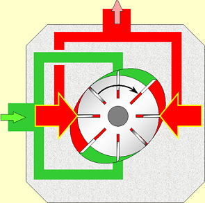

# 齿轮泵、叶片泵、柱塞泵

1. 齿轮泵的工作原理与特点
2. 叶片泵的分类与特点
3. 液压泵的参数与选用

## 1. 齿轮泵

### 1.1 外啮合齿轮泵工作原理

### 1.2 外啮合齿轮泵的结构特点

适用于运动平稳性要求不高的中低压系统。

**1、泄露**

- 端面泄露：75% - 80%（占总泄露）
- 径向泄露：15% - 20%
- 轮齿啮合处泄露：4% - 5%

解决方案：增加浮动轴套、浮动侧板

**2、径向不平衡力**

在齿轮泵中，油液作用在齿轮外缘的压力是不均匀的，从低压腔到高压腔，压力沿齿轮旋转的方向逐齿递增，因此，齿轮和轴受到径向不平衡力的作用。压力越高，径向不平衡力越大，它能使泵轴弯曲，使定子偏磨，加速轴承的磨损，降低轴承使用寿命。

解决方案：

1. 减小压油口直径。使压力油仅作用在一个齿到两个齿的范围内，这样压力油作用于齿轮上的面积减小．因而径向不平衡力也相应地减小。

2. 增大泵体内表面与齿轮齿顶圆的间隙（0.13-0.16mm），即使齿轮在压力作用下，只有靠近吸液腔的1-2个齿范围内的泵壳与齿顶保持较小的间隙，而其余大部分区间齿顶与泵壳保持较大间隙，使该区间内的液压力基本上等于液压泵出口压力值，从而使大部分径向液压力得到平衡。

3. 开设压力平衡槽，分别与高、低压油腔相通，这样便使吸油腔与压油腔相对应的径向力得到平衡，使作用在轴承上的径向力大大地减小。但此种方法会使泵的内泄漏增加，容积效率降低，所以目前很少使用。

**3、困油现象**

如图所示，液压油在渐开线齿轮泵运转过程中，因齿轮相交处的封闭体积随时间改变，常有一部分的液压油被封闭在齿间，称为困油现象，因液压油不可压缩将使外接齿轮泵产生极大的震动和噪音，故必须在侧板上开设卸荷槽，以防止其发生。

**外啮合齿轮泵的优点：** 结构简单、制造方便、价格低廉、便于维修、工作可靠、体积小、抗污染能力强。

**外啮合齿轮泵的缺点：** 噪音大、不能变量、流量脉动、困油、工作压力的提高受到限制。

---

## 2. 叶片泵

叶片泵广泛的应用于机械制造中的专用机床、自动线等中、低压液压系统中。该泵有两种结构形式：一种是单作用叶片泵，另一种是双作用式叶片泵。

### 2.1 单作用叶片泵

**组成：** 定子、转子、叶片、配油盘、传动轴、泵体、端盖等。定子和转子的间有偏心距e，叶片装在转子槽中，并可在槽内滑动。当转子回转时，由于离心力的作用，使叶片紧靠在定子内壁。

**工作原理：**

其工作原理如图所示，单作用叶片泵由转子 1、定子 2、叶片 3 和端盖等组成。

定子具有圆柱形内表面，定子和转子的间有偏心距 e，叶片装在转子槽中，并可在槽内滑动，当转子回转时，由于离心力的作用，使叶片紧靠在定子内壁，这样在定子、转子叶片和两侧配油盘间就形成若干个密封的工作空间，当转子按图示方向（逆时针方向）回转时，在图的右部，叶片逐渐的伸出，叶片间的空间逐渐增大，从吸油口吸油，这是吸油腔。在图的左部，叶片被定子内壁逐渐压进槽内，工作空间逐渐缩小，将油液从压油口压出，这就是压油腔，在吸油腔和压油腔之间，有一段封油区，把吸油腔和压油腔隔开，这种叶片泵每转一周，每个工作腔完成一次吸油和压油，因此称为单作用叶片泵。转子不停地旋转，泵就不断地吸油和排油。
改变转子与定子的偏心量，即可改变泵的流量，偏心越大，流量越大，如调成几乎是同心，则流量接近于零。因此单作用叶片泵大多为变量泵。

另外还有一种限压式变量泵，当负荷小时，泵输出流量大，负载可快速移动，当负荷增加时，泵输出流量变少，输出压力增加，负载速度降低，如此可减少能量消耗，避免油温上升。

**特点：**

单作用叶片泵只要改变转子和定子的偏心e和偏心方向，就可以改变输油量和输油方向，成为变量叶片泵。

自动调节的变量泵：

- 限压式
- 恒压式  
- 恒流量式

**特点：**

单作用叶片泵定子和转子偏心安装，其容积变化不均匀。故有流量脉动。叶片应取奇数一般  13－15片。

### 2.2 双作用叶片泵

**组成：** 定子、转子、叶片、配油盘、传动轴、壳体等。

**工作原理：** 定子内表面近似椭圆，转子和定子同心安装装，有两个吸油区和两个压油区对称布置。转子每转一周，完成两次吸油和压油。双作用叶片泵大多是定量泵。

**特点：**

- 转子转一转，吸、压油各两次。称为双作用式
- 吸、压油口对称，径向力平衡。称为卸荷式

叶片每伸缩一次，每两叶片间油液的排出量为：

 $V_密max-V_密min$

（ $V_密max-V_密min$）即一转压出油液的体积，即等于一环形体积。

**优点：** 运转平稳、压力脉动小，噪音小；结构紧凑、尺寸小、流量大；

**缺点：** 对油液要求高，如油液中有杂质，则叶片容易卡死.与齿轮泵相比结构较复杂。

**结论：**

- 双作用叶片泵为定量泵
- 双作用叶片泵仍存在流量脉动
- 当叶片数为4的整数倍、且大于8时的流量脉动较小
- 通常取叶片数为12或16

---

## 3. 柱塞泵

柱塞泵工作原理是柱塞在液压缸内作往复运动来实现吸油和压油。

与齿轮泵和叶片泵相比，该泵能以最小的尺寸和最小的重量供给最大的动力，为一种高效率的泵，但制造成本相对较高，

该泵用于高压、大流量、大功率的场合。它可分为**轴向式**和**径向式**两种形式。

### 3.1 轴向柱塞泵

柱塞轴线与缸体平行。

轴向柱塞泵如上图所示，可分为直轴式（图 a）所示）和斜轴式（图 b）所示）两种，该两种泵都是变量泵，通过调节斜盘倾角 γ，即可改变泵的输出流量。

### 3.2 径向柱塞泵

柱塞沿径向排列在缸体内。径向柱塞泵（柱塞运动方向与液压缸体的中心线垂直），又可分为：

- **固定液压缸式**
- **回转液压缸式**

上图为固定液压缸式，利用偏心轮的旋转，可使活塞产生往复行程，以进行泵的吸压作用。偏心轮的偏心量固定，所以一般为定量泵。最高输出压力可达 21MPa 以上。

上图为回转液压缸式柱塞泵，活塞安装在压缸体，压缸体的中心和转子的中心有一偏心量 e，压缸体和轴一同旋转，分配轴固定，上有 4 条油路，2 条油路成一组，分别充当压油的进出通道并和盖板的进出油口相通，改变偏心量即可改变流量，为一种变量泵。

#### 径向柱塞泵结构特点

- 配流轴配流，因配流轴上与吸压油窗口对应的方向开有平衡油槽，使液压径向力得到平衡，容积效率较高。
- 柱塞头部装有滑履，滑履与定子内圆为面接触，接触面比压很小。
- 可以实现多泵同轴串联，液压装置结构紧凑。
- 改变定子相对缸体的偏心距可以改变排量，且变量方式多样。

## 4. 液压泵的图形符号、性能

**1、液压泵的图形符号**

**2、常用泵的性能**

了解各种常用泵的性能有助于我们正确的选用泵，下表中列举了最常用泵的各种性能值，供大家在选用时参考。

---

## 5. 液压泵与电动机参数的选用

### 5.1 液压泵的选择

1. 根据对液压泵的性能要求来选定液压泵的型式

2. 再根据液压泵所应保证的压力和流量来 确定它的具体规格。

液压泵的的工作压力是根据执行元件的最大工作压力来决定的，考虑到各种压力损失，泵的最大工作压力 $P_泵$ 可按下式确定：

$\large \color{#08f}{P_泵 ≥ k_压 × P_缸}$

- $P_泵$ : 液压泵所需要提供的压力，Pa,
- $k_压$ : 系统中压力损失系数，取 1.3 ~ 1.5
- $P_缸$ : 液压缸中所需的最大工作压力，Pa

液压泵的输出流量取决于系统所需最大流量及泄漏量，即：

$\large \color{#08f}{Q_泵 ≥ K_流 × Q_缸}$

- $Q_泵$ : 液压泵所需输出的流量，$m^3/min$。
- $K_流$ : 系统的泄漏系数，取 1.1~1.3
- $Q_缸$ : 液压缸所需提供的最大流量，$m^3/min$。

若为多液压缸同时动作，$Q_缸$ 应为同时动作的几个液压缸所需的最大流量之和。

在 $P_泵$、$Q_泵$ 求出以后，就可具体选择液压泵的规格，选择时应使实际选用泵的额定压力大于所求出的 P 泵值，通常可放大 25%。泵的额定流量略大于或等于所求出的 $Q_缸$ 值即可。

### 5.2 电动机参数的选择 (样本中合理地选定) 

驱动液压泵所需的电动机功率：

$\large \color{#08f}{P_M = \frac{p_泵 × Q_泵}{60η}(KW)}$

- $P_M$ : 电动机所需的功率，kw
- $p_泵$ : 泵所需的最大工作压力，Pa,
- $Q_泵$ : 泵所需输出的最大流量，$m^3/min$
- **η** : 泵的总效率。

各种泵的总效率大致为：

- 齿轮泵 0.6 ~ 0.7
- 叶片泵 0.6 ~ 0.75
- 柱塞泵 0.8 ~ 0.85

