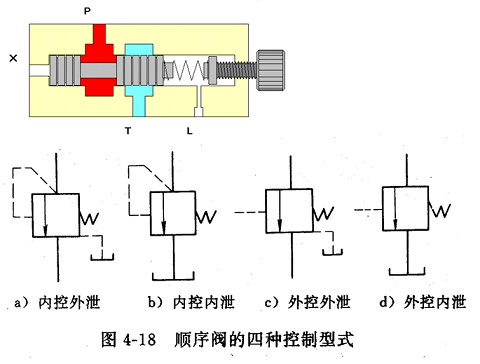

# 压力控制阀的工作原理

本章要求：

- 目的
    1. 掌握压力控制阀的工作原理、性能、区别和职能符号
    2. 了解各压力控制阀应用和特点 

- 重点
    1. 先导式溢流阀的结构、工作原理
    2. 顺序阀和溢流阀的区别
    3. 减压阀的控制特点

## 1. 压力控制阀概要

- **作用**

        控制液压系统中油液压力的高低或利 用压力作为信号来控制其它元件动作。

- **分类**
  - 溢流阀
  - 减压阀
  - 顺序阀
  - 压力继电器

- **结构**
  - 阀体
  - 阀芯
  - 弹簧
  - 调节螺帽

- **共同工作原理**

        根据阀芯受力平衡的原理，利用作用于阀芯上的液压力（受控液流压力）与弹簧力相平衡的原理进行工作。 

---

## 2. 溢流阀（Pressure  Relief valve）

溢流阀可分两种：

- 直动式
- 先导式

当液压执行元件不动时，由于泵排出的油无处可去而成一密闭系统，理论上压力将一直增至无限大，实际上压力将增至液压元件破裂为止，此时电机为维持定转速运转，输出电流将无限增大至电机烧掉为止；前者使液压系统破坏，液压油四溅；后者会引起火灾；因此要绝对避免，防止方法就是在执行元件不动时，提供一条旁路使液压油能经此路回到油箱，它就是“溢流阀（Relief valve）”，其主要用途有二个：

- 1）作溢流阀用

  在定量泵的液压系统中如图 4－16（a）所示，常利用流量控制阀调节进入液压缸的流量，多余的压力油可经溢流阀流回油箱，这样可使泵的工作压力保持定值。

- 2）作安全阀用

  图 4－16（b）所示液压系统，在正常工作状态下，溢流阀是关闭的，只有在系统压力大于其调整压力时，溢流阀才被打开溢流，对系统起过载保护作用。

  

### 2.1 直动式溢流阀

**直动式溢流阀的组成：**

**工作原理：**

当 $pA > F_T$ 时，阀口打开，p --> T 。当系统压力升高时，阀芯上升，阀口通流面积增加，溢流量增大，进而使系统压力下降 (稳压溢流或安全保护)。

溢流阀是利用被控压力作为信号来改变弹簧的压缩量，从而改变阀口的通流面积和系统的溢流量来达到定压目的。

**调压原理：**

调节调压螺帽改变弹簧预压缩量，便可调节溢流阀调整压力。

**特点：**

一般用于低压小流量场合。

由于 $F_T$ 直接与 pA 平衡,直动式弹簧力的大小与控制压力成正比。如果提高被控压力，则需增大弹簧力，因受结构限制，需采用大刚度的弹簧。

在阀芯相同位移的情况下，弹簧力变化较大，因而该阀的定压精度就低。

### 2.2 先导式溢流阀

**组成：**

先导式溢流阀由两部分组成：

- 先导阀 ： 直动式、锥阀、硬弹簧（刚度不太高）
- 主阀 ： 滑阀和软弹簧。

**工作原理：**

1. 当 $pA < F_{硬T}$ 时，导阀关闭，主阀也关闭。
2. 当 $pA > F_{硬T}$ 时，导阀打开，主阀两端产生压差

1. 当 $pA > F_{硬T}$ 时，导阀打开，主阀两端产生压差，
2. 当 $△p < F_{软T}$ 时，主阀关闭。
3. 当 $△p > F_{软T}$ 时，主阀打开，
4. 稳压（定压）溢流或安全保护。

**调压原理：**

调节调压螺帽，改变硬弹 簧压缩量，即改变压力。

**特点：**

1. 溢流阀稳定工作时，主阀阀芯上部压力小于下部压力。主阀弹簧可做的较软，流量变化引起阀芯位置变化时，弹簧力的变化量较小，压力变化小。

2. 调压弹簧调好后，上部压力为常数。压力随流量变化较小，克服了直动式阀缺点。

3. 锥阀锥孔尺寸较小，调压弹簧不必很硬。调压方便。

### 2.3 溢流阀的应用举例

1. 为定量泵系统定压溢流和定量泵、节流阀并联，阀口常开。

2. 为变量泵系统提供过载安全保护和变量泵组合，正常工作时阀口关闭，过载时打开，起安全保护作用，故又称安全阀。

3. 实现远程调压 p远程 < p主调

4. 系统卸荷

5. 形成背压

---

## 3. 减压阀（Pressure Reducing valve）

- **功能：** 利用液流流过小孔或缝隙产生压力损失，使出口压力（二次压力）低于进口压力（一次压力）。
- **分类：**
  - $\color{orange}{直动式}$
  - $\color{orange}{先导式}$
    - $\color{green}{定值减压阀}$
    - $\color{green}{定差减压阀}$
- **减压原理：** 利用油液液流流过缝隙产生压力损失，使出口压力低于进口压力，并保持恒定，故又称定值减压阀。
- **应用：** 当回路内有两个以上液压缸，其中之一需要较低的工作压力，同时其它的液压缸仍需高压运作时，此刻就得用减压阀（Reducing valve）提供一较系统压力为低的压力给低压缸。

### 3.1 先导式减压阀

#### 结构

#### 工作原理

调节调压弹簧，改变硬弹簧力，即可改变出口压力。

上图所示，为先导型减压阀，由主阀和先导阀组成，先导阀负责调定压力，主阀负责减压作用。

压力油由 p1 流入，经主阀和阀体所形成的减压缝隙从 p2 流出，故出口压力小于进口压力，出口压力经油腔 1、阻尼管、油腔 2 作用在先导阀的提动头上。当负载较小时，出口压力低于先导阀的调定压力时，先导阀的提动头关闭，油腔 1、2 的压力均等于出口压力，主阀的滑轴由油腔 2 里面的一根刚性很小的弹簧作用下处于最低位位置，主阀滑轴凸肩和阀体所构成的阀口全部打开，减压阀无减压作用。当负载增加，出口压力 p2 上升超过先导阀弹簧所调定压力时，提动头打开，压力油经排泄口流回油箱，由于有油液流过阻尼管，油腔 1的压力 p2 大于油腔 2 的压力 p3，当此压力差所产生的作用力大于主阀滑轴弹簧的预压力时，滑轴上升，减小了减压阀阀口的开度，使 p2 压力下降，直到（p2－p3）和滑轴作用面积的乘积和滑轴上的弹簧力相等时，主阀滑轴进入平衡状态，此时减压阀保持一定的开度，出口压力 p2 保持在定值。

如果外界干扰使进口压力 p1 上升，则出口压力 p2 也跟着上升，使滑轴上升，出口压力 p2 又降低，而在新的位置取得平衡，出口压力始终保持为定值。

又当出口压力 p2 降到调定压力以下时，提动头关闭，则作用在滑轴内的弹簧力使滑轴向下移动，减压阀口全打开，不起减压作用。

注意，减压阀在持续做减压作用时，会有一部分油（约 1L /min）经泄油口流回油箱而损失泵的一部分的输出流量，故在一系统中如使用数个减压阀，则必须考虑到泵输出流量的问题。

#### 特点

在减压阀出口油液不再流动 时，由于先导阀卸油仍未停止，减压口仍有油液流动，阀就处于工作状态，出口压力也就保持调定压力不变。

#### 减压阀与溢流阀比较

| 溢流阀 | 减压阀 |
| :-----: | :-----: |
| $\color{blue}{保持进口压力不变}$ |  $\color{brown}{出口压力不变}$ |
| $\color{blue}{内部回油}$        |   $\color{brown}{外部回油}$ |
| $\color{blue}{阀口常闭}$        |   $\color{brown}{阀口常开}$ |
| $\color{blue}{一般并联于系统}$   |  $\color{brown}{一般串联于系统}$ |

---

## 4. 顺序阀

顺序阀（sequence valve）是使用在一个液压泵要供给两个以上液压缸依一定顺序动作
场合的一种压力阀。

- **功用：** 利用液压系统压力变化来控制油路的通断，从而实现多个液压元件按一定的顺序动作。
- **分类：**
  - $\color{orange}{按结构形式}$
    - $\color{blue}{直动式}$
    - $\color{blue}{先导式}$
  - $\color{orange}{按泄露方式}$
    - $\color{blue}{内泄式}$
    - $\color{blue}{外泄式}$
  - $\color{orange}{按控制方式}$
    - $\color{blue}{内控式}$
    - $\color{blue}{外控式}$
- **直动式顺序阀调节原理：** 顺序阀的构造及其动作原理类似溢流阀，调节调压螺钉，改变弹簧力，即可改变开启压力。

顺序阀与溢流不同的是：出口直接接执行元件，另外有专门的泄油口。

### 4.1 顺序阀的应用

1. 用于顺序动作回路

    图 4－24 所示为一定位与夹紧回路，其前进的动作顺序是先定位后夹紧，后退是同时退后。

2. 起平衡阀的作用

    在大形压床上由于压柱及上模很重，为防止因自重而产生的自走现象，必须加装平衡阀（顺序阀），如图 4－25 所示。

### 4.2 顺序阀与溢流阀比较

| 溢流阀 | 顺序阀 |
| :-----: | :-----: |
| $\color{green}{控制进口油压力}$ |  $\color{green}{控制进口油压力}$ |
| $\color{blue}{并联在回路中}$    |  $\color{brown}{串联在回路中}$ |
| $\color{blue}{阀口出口接油箱}$  |  $\color{brown}{出口接执行元件}$ |
| $\color{blue}{内部泄油口}$      |  $\color{brown}{有专门的泄油口（外泄口）}$ |

---

## 5. 压力继电器

- **功用：** 是一种将液压系统的压力信号转换为电信号输出的元件。根据系统压力变化，自动接通或断开电路，实现执行元件的顺序控制或安全保护。

- **组成：**
  - $\color{orange}{压力—位移转换器}$
    - $\color{blue}{柱塞式}$
    - $\color{blue}{弹簧管式}$
    - $\color{blue}{膜片式}$
  - $\color{orange}{微动开关}$
- **工作原理：**
  - $P_k > P_T$ 时，柱塞上升，发出信号。
  - $P_k < P_T$ 时，柱塞下降，断开信号。

- **主要性能：** 即发出电信号的最低和最高工作压力的范围。调节调压螺帽，即调节工作压力。

图 4－28 为单触点柱塞式压力继电器，主要零件包括柱塞 1、调节螺帽 2 和电气微动开关 3。如图所示,压力油作用在柱塞的下端，液压力直接与上端弹簧力相比较。当液压力大于或等于弹簧力时，柱塞向上移压下微动开关触头，接通或断开电气线路。当液压力小于弹簧力时，微动开关触头复位。显然,柱塞上移将引起弹簧的压缩量增加，因此压下微动开关触头的压力(开启压力〉与微动开关复位的压力(闭合压力)存在一个差值，此差值对压力继电器的正常工作是必要的，但不易过大。

---

## 6. 比例式压力阀

前面所述的压力阀都需用手动调整的方式来作压力设定，若应用时碰到需经常调整压力或需多级调压的液压系统，则回路设计将变得非常复杂，操作时只要稍不注意就会产生失控状态。若回路要有多段压力用传统作法则需多个压力阀与方向阀；但亦可只用一个比例式压力阀和控制电路来产生多段压力。

比例式压力阀（Proportional Pressure Valve ）基本上是以电磁线圈所产生的电磁力，来取代传统压力阀上的弹簧设定压力，由于电磁线圈产生的电磁力是和电流的大小成正比，所以控制线圈电流就能得到所要的压力；可以无级调压，而一般的压力阀仅能调出特定的压力。

比例压力阀的结构可参阅有关资料，其职能符号如图 4－29 所示。

