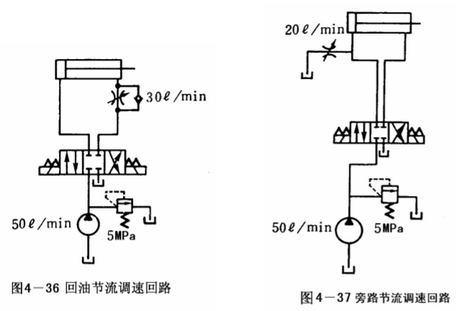

# 流量控制阀 (Flow control valve)

液压系统在工作时，常需随工作状态的不同而以不同的速度工作，只要控制流量就控制了速度；无论那一种流量控制阀，内部一定有节流阀的构造，因此节流阀可说是最基本的流量控制阀了。

**功用：** 通过改变阀口过流面积来调节输出流量，从而控制执行元件的运动速度。

**分类：**

- 节流阀
- 调速阀
- 分流阀

## 1. 速度控制的概念

1、对液压执行元件而言，控制“流入执行元件的流量” 或 “流出执行元件的流量”都可控制执行元件的速度。

液压缸活塞移动速度：$\Large \color{blue}{v = \frac{Q}{A}}$

液压马达的转速：$\Large \color{blue}{n = \frac{Q}{q}}$

式中：

- **Q ：** 流入执行元件的流量
- **A ：** 液压缸活塞的有效工作面积
- **q ：** 液压马达的排量

2、任何液压系统都要有泵，不管执行元件的推力、速度如何变化，定量泵的输出流量永远是固定不变的，所谓速度控制或控制流量只是使流入执行元件之流量小于泵的流量而已，故常将其称为节流调速。

图 4－30 所示说明定量泵在无负载且设回路无压力损失的状况下，其节流前后的差异。

节流前泵打出的的油全进入回路，此时泵输出压力趋近于零；节流后泵 50L/min 的流量才有30L/min 能进入回路，虽然其压力趋近于零，但是剩余的 20L/min 得经溢流阀流回油箱，若将溢流阀压力设定为 5MPa，此时就算是没有负载，系统压力仍将会大于 4MPa，也就是说不管负载的大小如何，只要作了速度控制，则泵的输出压力将会趋近溢流阀的设定压力，趋近的程度由节流量的多少与负载大小来决定。

## 2. 节流阀

节流阀（Throttle valve）是根据孔口与阻流管原理所作出的，图 4－31 为节流阀的结构，油液由入口进入，经滑轴上的节流口后，由出口流出。调整手轮使滑轴轴向移动，以改变节流口节流面积的大小，从而改变流量大小达到调速的目的。图中油压平衡用孔道在于减小作用于手轮上的力，使滑轴上下油压平衡。

图 4－32 为单向节流阀，与普通节流阀不同的是：只能控制一个方向的流量大小，而在另一个方向则无节流作用。

**工作原理：** 调节手柄，阀芯移动，节流口过流面积 A 变化，过流量 q 变化。

**节流阀特点：** 进口压力油通过弹簧腔径向小孔和阀体上的斜孔同时作用在阀芯的上下两端。即使在高压下，调节阀口比较方便。

### 2.1 节流阀的压力特性

图 4－33（a）所示液压系统未装节流阀，若推动活塞前进所需最低工作压力为 1MPa,那么当活塞前进时，压力表指示的压力为 1MPa；当装了节流阀控制活塞前进速度如图 4－33（b）所示，那么当活塞前进时，则节流阀入口压力会上升到溢流阀所调定的压力，溢流阀被打开，一部分油液经溢流阀流入油箱。

### 2.2 单向节流阀组成

**组成：** 阀体、阀芯、弹簧、调节手柄等 

当某一个方向控制速度，它的反方向是正常速度可使用单向节流阀。

### 2.3 节流阀流量特性

节流阀的节流口形式可归纳为三种基本形式：孔口、阻流管、与介于两者之间的节流孔。根据实验，通过节流口的流量可用下式表式：

$\Large \color{#08f}{Q = KAΔp^m}$

式中：

- **A ：** 节流口节流面积的大小
- **K ：** 由节流口形状与油液粘度决定的系数
- **Δp ：** 节流阀进出口压力差
- **m ：** 节流口形状指数：0.5<m<1，孔口 m = 0.5，阻流管 m =1。

由以上公式可知，当 k、Δp、m 不变时，改变节流阀的节流面积 A 可改变通过的流量大小，又当 k、A、m 不变时，节流阀进出口压力差 Δp 有变化，通过的流量也会有变化。

当液压缸所推动的负载变化时，使得节流阀进出口压力差变化，通过的流量也有变化，从而活塞的速度不稳定。为使活塞运动速度不会因负载的变化而变化，应该采用下文所述的调速阀。

## 3 调速阀

调速阀能在负载变化的状况下，保持进口、出口压力差恒定。

图 4 －34 所示调速阀的结构，其动作原理说明如下：

压力油 P1 进入调速阀后，先经过定差减压阀的阀口 x(压力由 p1 减至 p2〉,然后经过节流阀阀口 y 流出,出口压力为 p3。从图中可以看到,节流阀进出口压力 p2、p3 经过阀体上的流道被引到定差减压阀阀芯的两端(p3 引到阀芯弹簧端,p2 引到阀芯无弹簧端),作用在定差减压阀芯上的力包括液压力、弹簧力。调速阀工作时的静态方程如下:

调速阀内一活塞处于平衡状态时：

$\Large \color{#08f}{Fs + A3.p3 = (A1 + A2)p2}$

式中：

- **Fs ：** 弹簧力

在设计时确定：`A3 = A1 + A2`

$P_2 - p_3 = \frac{Fs}{A_3}$

此时只要将弹簧力固定，则在油温无什么变化时，输出流量即可固定。另外，要使阀能在工作区正常动作，进、出口间压力差要在 0.5 － 1MPa 以上。

以上讲的调速阀是压力补偿调速阀，即不管负载如何变化，通过调速阀内部具有一活塞和弹簧来使主节流口的前后压差保持固定，从而控制通过的流量维持不变。

另外还有温度补偿流量调整阀，能在油温变化的情况下，保持通过阀的流量不变。

调速阀控制速度回路:

## 4.  基本的速度控制回路

液压回路基本的速度控制有进油节流调速、回油节流调速、旁路节流调速三种方法。

1、进油节流调速

进油节流调速就是控制执行元件入口的流量，图 4－35 所示，该回路不能承受负负载，如有负向负荷（负荷与运动方向同向者），则速度失去控制。

2、回油节流调速

回油节流调速就是控制执行元件出口的流量，图 4－36 所示，回油节流调速是控制排油，节流阀可提供背压，使液压缸能承受各种负荷。

3、旁路节流调速

旁路节流调速是控制不需流入执行元件也不经溢流阀而直接流回油箱的油的流量，从而达到控制流入执行元件油液流量的目的。图 4-37 所示旁路节流调速回路，该回路的特点是液压缸的工作压力基本上等于泵的输出压力，其大小取决于负载，该回路中的溢流阀只有在过载时才打开。

从上所述，此三种调速方法不同点为：

1）进油调速和回油调速会使回路压力升高，造成压力损失；旁路调速则几乎不会。

2）用旁路调速作速度控制时，无溢流损失，效率最高，控制性能最差，主要用于负载变化很小的正向负载的场合。

3）用进油调速作速度控制时，效率次之，主用于负荷变化较大之正向负载的场合。

4）用回油调速作速度控制时，效率最差，控制性能最佳，主要用于有负向负载的场合。

---

## 5. 行程减速阀及其应用

一般的加工机械如车床、铣床，其刀具尚未接触工件时，需快速进给以节省时间，开始切削则应慢速进给，以保证加工质量；或是液压缸前进时，本身冲力过大，需要在行程的未端使其减速，以便液压缸能停止在正确的位置，此时就需要用图 4－38 所示行程减速阀。

行程减速阀的应用如图 4－39 所示。

---

## 6. 比例式流量阀

前面所述之流量阀都需用手动调整的方式来作流量设定，在需要经常调整流量或要作精密流量控制的液压系统，就得用到比例式流量阀了。

比例式流量阀（Proportional Flow Control Valve）也是以在提动杆外装置的电磁线圈所产生的电磁力，来控制流量阀的开口大小，由于电磁线圈有良好的线性度，故其产生的电磁力是和电流的大小成正比，在应用时可产生连续变化的流量了，从而可任意控制流量阀的开口大小。

比例式流量阀也有附单向阀的，各种比例式流量阀的符号如图 4－40 所示。

