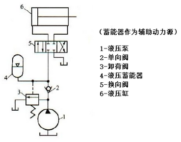

# 液压辅助元件

液压系统中除了动力元件、执行元件、控制元件外，油箱、虑油器、蓄能器、压力表、密封装置、管件等，都称为液压系统辅助元件。

## 1. 蓄能器

### 1.1 蓄能器功用

蓄能器是液压系统中一种储存油液压力能的装置，在液压传动系统中，蓄能器用来储存和释放流体的压力能。它的基本作用是，当系统的压力高于蓄能器内流体的压力时，系统中的流体充进蓄能器中，直到蓄能器内外压力相等；反之，当蓄能器内流体的压力高于系统的压力时，蓄能器内的流体流到系统中去，直到蓄能器内外压力平衡。因此，蓄能器可以在短时间内向系统提供压力流体，也可以吸收系统的压力脉动和减小压力冲击等。

其主要功用如下：

**(1) 作辅助动力源**

在液压系统工作循环中不同阶段需要的流量变化很大时，常采用蓄能器和一个流量较小的泵组成油源。当系统需要很小流量时，蓄能器将液压泵多余的流量储存起来；当系统短时期需要较大流量时，蓄能器将储存的液压油释放出来与泵一起向系统供油。在某些特殊的场合：如驱动泵的原动机发生故障，蓄能器可作应急能源紧急使用；如现场要求防火防爆，也可用蓄能器作为独立油源。

上图所示为压力机液压系统，在工作循环里，当液压缸慢进和保压时，蓄能器把液压泵输出的压力油储存起来，到达设定压力后，卸荷阀打开，泵卸荷；当液压缸在快速进退时，蓄能器与泵一起向液压缸供油，完成一个循环。这里，蓄能器的容量要选成其提供的流量加上液压泵的流量能够满足工作循环的流量要求，并能在循环之间重新充够油液。因此，在系统设计时可按平均流量选用较小流量规格的泵。

**(2) 保压和补充泄漏**

有的液压系统需要较长时间保压而液压泵卸载，此时可利用蓄能器释放所储存的液压油，补偿系统的泄漏，保持系统的压力。

**(3) 吸收压力冲击和消除压力脉动**

由于液压阀的突然关闭或换向，系统可能产生压力冲击，此时可在压力冲击处安装蓄能器起吸收作用，使压力冲击峰值降低。如在泵的出口处安装蓄能器，还可以吸收泵的压力脉动，提高系统工作的平稳性。

### 1.2 蓄能器的分类和选用

蓄能器分以下三类：

- $\color{orange}{有弹簧式}$
- $\color{orange}{重锤式}$
- $\color{orange}{充气式}$
  - $\color{green}{活塞式}$
  - $\color{green}{皮囊式}$
  - $\color{green}{气瓶式}$

**(1) 重锤式蓄能器**

当重锤式蓄能器内部重物势能小于其外部油液压力时，蓄能器处于储油状态；当重锤式蓄能器内部重物势能大于其外部油液压力时，蓄能器向系统释放能量。

重锤式蓄能器具有结构简单、容，大、压力稳定等优点，但也具有结构尺寸大而笨爪、运动惯性大、反应不灵敏、易漏油、有摩擦损失等缺点。常用于蓄能。

 **(2) 弹簧式蓄能器**

 弹簧式蓄能器的结构及职能符号如图所示。当蓄能器内部弹资弹力小于其外部油液压力时．蓄能器处于储油状态；当蓄能器内部弹簧弹力大于其外部油液压力时．蓄能器向系统释放能量。

 

**(3) 充气式蓄能器**

常用的是充气式，它利用气体的压缩和膨胀储存、释放压力能，在蓄能器中气体和油液被隔开，而根据隔离的方式不同，充气式又分为活塞式、皮囊式和气瓶式等三种，下面主要介绍常用的活塞式和皮囊式两种。

 

- (3.1) 活塞式蓄能器

    图 3 - 25a 为活塞式蓄能器，用缸筒 2 内浮动的活塞 l 将气体与油液隔开，气体(一般为惰性气体氮气〉经充气阀 3 进入上腔，活塞 1 的凹部面向充气，以增加气室的容积，蓄能器的下腔油口 a 充液压油。活塞式结构简单，安装和维修方便，寿命长，但由于活塞惯性和密封件的摩擦力影响，其动态响应较慢。适用于压力低于 2OMPa 的系统储能或吸收压力脉动。

- (3.2) 皮囊式蓄能器

    图 3－25b 为皮囊式蓄能器，采用耐油橡胶制成的气囊 2 内腔充入一定压力的惰性气体,气囊外部液压油经壳体 1 底部的限位阀 4 通入，限位阀还保护皮囊不被挤出容器之外。此蓄能器的气液完全隔开，皮囊受压缩储存压力能，其惯性小、动作灵敏，适用于储能和吸收压力冲击,工作压力可达 32MPa。

### 1.3 蓄能器的安装

在安装蓄能器时，应注意以下事项： 

1. 气囊式蓄能器应垂直安装，油口向下。

2. 用作降低噪声、吸收脉动和冲击的蓄能器应尽可能靠近振源。

3. 蓄能器与泵之间应安装单向阀。防止油液倒流以保护泵。

4. 蓄能器与系统之间设置截止阀，以充气或检修时用。

5. 蓄能器必须安装于便于检查、维修的位置，并远离热源。

6. 对用于补油保压的蓄能器应尽可能安装在执行元件附近。

7. 用于缓和液压冲击、吸收压力脉动的蓄能器，应安装于冲击源或脉动源的近旁。

8. 必须用支架或支板将蓄能器固定。

---

## 2. 滤油器

**功用：** 滤去油中杂质，维护油液清洁，防止油液污染，保证系统正常工作。

滤油器可以安装在油泵的的吸油管路上，或某些重要零件之前。滤油器也可安装在回油管路上。

滤油器可分成液压管路中使用和油箱使用的两种。油箱内部使用的滤油器亦称为滤清器和粗滤器，用来过滤掉一些太大的，容易造成泵损坏的杂质（在 0.1mmm3 以上），图 3－15为壳装滤清器（strainer），装在泵和油箱吸油管途中。无外壳滤清器，安装在油箱内，拆装不方便，但价格便宜。

管路用滤油器有压力管用滤油器及回油管用滤油器。压力管用滤油器，因要受压力管路中的高压力，故耐压力问题必须考虑；回油管用滤油器是装在回油管路上，压力低，只需注意冲击压力的发生。就价格而言，压力管路用滤油器较回油管路用滤油器贵出许多。

**结构：** 滤油器一般由滤芯(或滤网)和壳体构成。

 

### 2.1 滤油器分类

- **表面型：** 网式过滤器、线隙式过滤器
- **深度型：** 纸芯式过滤器、烧结式过滤器
- **磁形过滤器**

#### 2.1.1 网式过滤器（短片）

网式过滤器为粗过滤器，其结构在周围开有很多窗孔的塑料或金属筒形骨架上，包着一层或两层铜丝网过滤精度由网孔大小和层数决定，有 80μm 、 100μm 和 180μm 三个等级。

由于网式过滤器阻力损失小，过滤精度不高，通常安装在液压泵的吸油口，以防止较大的杂质颗粒进入泵内。目前常用的网式过滤器网孔直径为 0.88~0.18mm 时，其压力损失不超过 $0.25×10^5Pa$；网孔直径为 0.13~0.4mm 时，其压力损失不超过 $0.04×10^5Pa$。应选择过滤器的过滤通流能力是液压泵流量的 2 倍以上，以保证液压泵吸油充分，防止液压泵口吸油阻力过大而产生气蚀。

网式过滤器结构简单、清洗方便、通油能力大，但过滤精度低，常用于吸油管路作吸滤器，对油液进行粗滤。

#### 2.1.2 线隙式过滤器

线隙式过滤器是一种普通过滤器。它用铜线或铝线密绕在这种过滤器结构简单、通筒形心架的外部来组成滤芯，并装在壳体内(用于吸油管路上的过滤器无壳体)。油液经线间间隙和芯架槽孔流入过滤器内，再从孔道流出。其过滤精度有 0.3mm 和 0.08mm 两种。回流线隙式过滤器的结构由 `端盖1`、`壳体2`、`筒型芯架3` 和绕在芯架外部的 `铜线圈4` 组成。当油液从孔 a 进入过滤器内，经过线间的缝隙进入滤芯内部再由孔 b 流出。吸油线隙式过滤器结构其过滤原理是由绕线间隙过滤掉油液中杂质。

油能力大、过滤精度适中，般常用于压力低于 2.5MPa 的回路或油泵吸油管路中。可用作吸滤器或回流过滤器，但不易清洗。

#### 2.1.3 金属烧结式过滤器

金属烧结式过滤器的结构形状较多，图 6.13 所示为其中一种。它由`端盖1`、`壳体2` 和 `滤芯3` 等部件组成。油液从进油口进入过滤器，通过滤芯后从出油口流出。滤芯一般由颗粒状青铜压制、烧结而成。它是利用铜颗粒之间的微孔来过滤杂质的。选择不同粒度的粉末制成不同壁厚的滤芯就能获得不同精度的过滤效果。通常其过滤精度在 0.01~0.1mm 之间。压力损失为 $0.3×10^5$ ~ $2×10^5Pa$。它的主要特点是滤芯可按需要烧结成各种不同的形状，如杯状、管状等，其强度高，承受热应力和抗冲击性能好，可以在较高温度下工作，有良好的抗腐蚀性，制造简单，过滤精度较高。它可用在不同的位置。缺点是易堵塞，难清洗，烧结颗粒使用中可能会脱落，再次造成油液的污染。

#### 2.1.4 纸质过滤器

纸质过滤器又称纸芯式过滤器，目前它应用得最为广泛，其结构如图 6.14 所示。它的结构与线隙式过滤器基本相同，只是滤芯采用了纸芯。纸芯由厚为 0.35~0.7mm 的平纹或皱纹的酚醛树脂或木浆微孔滤纸组成。

为了增大滤芯强度，滤芯一般分为三层，外层采用粗眼钢板网，中层为纸质滤芯，折叠成图 6.14b 所示形状以增大过滤面积，里层由金属丝网与滤纸一并折叠在一起。滤芯的中央还装有支承弹簧。这样就提高了滤芯强度，延长了寿命。纸质过滤器的过滤精度高(5~30um)，通常有 0.1mm 和 0.02mm 两种。其压力损失为 0.1×105~0.4×105Pa， 可在高压 (38MPa) 下工作。由于较小的壳体中可装入表面积很大的滤纸芯，因此，其结构紧凑、通油能力大，一般配备壳体后用作压滤器。其缺点是无法清洗，为一次性使用，需经常更换滤芯。

纸质过滤器的滤芯能承受的压力差较小(0.35MPa) ，为了保证过滤器能正常工作，不致因杂质逐渐聚积在滤芯上引起压差增大而压破纸芯，故过滤器顶部装有堵塞状态发信装置。

#### 2.1.5 磁性过滤器

磁性过滤器的工作原理就是利用磁铁吸附油液中的铁质微粒。但一般结构的磁性过滤器对其它污染物不起作用，通常用作回流过滤器。它常被用作复式过滤器的一部分。

#### 2.1.6 复式过滤器

复式过滤器即上述几类过滤器的组合。例如在图 6.13所示的滤芯中间，再套入一组磁环即成为磁性烧结式过滤器。复合过滤器性能更为完善，一般设有多种结构原理的堵塞状态发信装置，有的还设有安全阀。当过滤杂质逐渐将滤芯堵塞时，滤芯进出油口的压力差增大，若超过所调定的发信压力，发信装置便会发出堵塞信号。如不及时清洗或更换滤芯，当压差达到所调定的安全压力时，类似于直动式溢流阀的安全阀便会打开，以保护滤芯免遭损坏。

安装在回油路上的纸质磁性过滤器，适用于对铁质微粒要求去除干净的传动系统。

#### 2.1.7 过滤器发信装置

过滤器长期工作，油液中的杂质集聚在滤芯表面，使得通流面积逐渐减小，通流阻力逐渐上升。为了保证过滤器能够正常工作，需要过滤器带有堵塞发信装置。

过滤器发信装置与过滤器并联，其结构如图 6.15 所示。

它的工作原理是其 P1 口与过滤器进油口相通，P2 口与出油口相通。过滤器进、出油口两端的压力差 Δp (=p1 - p2 )在发讯装置的活塞 2 上的作用力与弹簧 5 的弹簧力相平衡。当油液杂质逐渐堵塞过滤器，使 p 压力上升，当压力差 Δp 达到一定数值时，压力差作用力大于弹簧力，推动活塞及永久磁铁 4 右移。这时，感簧管 6 受磁性作用吸合触点，接通电路，使接线柱 1 连接的电路报警，提醒操作人员更换滤芯。电路上若增设延时继电器，还可在发讯一定时间后实现自动停机保护。

通常， 过滤器堵塞报警压力差值为 0.3MPa 左右。

### 2.2 过滤器的安装

- `滤油器（滤清器）1` 安装在泵的吸入口，其作用如前文所述。

- `滤油器 2` 安装在泵出口，属于压力管路用滤油器，在保护泵以外的其它元件。一般装在溢流阀下游管路上或和安全阀并联，以防止滤油器被堵塞时泵形成过载。

- `滤油器 3` 安装在回油管路上，属于回油管用滤油器，此滤油器的壳体耐压性可较低。

- `滤油器 4` 安装在溢流阀的回油管上，因其只通泵部分的流量，故滤油器容量可较小。如其容量 2、3 相同，则通过流速降低，过滤效果更好。

- `滤油器 5` 为独立的过滤系统，其作用在不断净化系统中之液压油，常用在大型的液压系统里。

 

### 2.3 过滤器的选用

#### 2.3.1 过滤精度

原则上大于滤芯网目的污染物就不能通过滤芯。滤油器上的过滤精度常用能被过滤掉的杂质颗粒的公称尺寸大小来表示。系统压力越高，过滤精度越低。表格中为液压系统中建议采用的过滤精度。

| 使用场所 | 提高换向阀操作可靠度 | 保持微小流量控制 | 一般液压机器操作可靠度 | 保持伺服阀可靠度 |
| --- | --- | --- | --- | ---  |
| 建议采用的过滤精度 | 10 µm 左右 | 10 µm | 25 µm 左右 | 5－10 µm |

**过滤精度应满足的系统要求：**

| 粗滤器 | 普通滤器 | 精滤器 | 特精滤器 |
| --- | --- | --- | --- |
| d ≥ 0.1mm | d ≥ 0.01mm | d ≥ 0.005mm | d ≥ 0.001mm |

#### 2.3.2 液压油通过的能力

液压油通过的流量大小和滤芯的通流面积有关。一般可根据要求通过的流量选用相对应规格滤油器。（为减低阻力，滤油器的容量为泵流量的 2 倍以上）。

#### 2.3.3 耐压

选用滤油器时尤须注意系统中冲击压力的发生。而滤油器的耐压包含滤芯的耐压和壳体的耐压。一般滤芯的耐压为 0.01~0.1MPa ,这主要靠滤芯有足够的通流面积，使其压降小，以避免滤芯被破坏。滤芯被堵塞，压降便增加。必须注意滤芯的耐压和滤油器的使用压力是不同的，当提高使用压力时，要考虑壳体是否承受得了而和滤芯的耐压无关。

---

## 3. 油箱

油箱的主要功能是储存油液，此外，还有散热以控制油温、阻止杂质进入、沉淀油中杂质、分离气泡等功能。

油箱容量如太小，会使油温上升，油箱容量一般设计为泵每分钟流量的 2 ~ 4 倍；或当所有管路及元件均充满油时，油面需高出过滤器 50-100mm，而液面高度只占油箱高度 80％时的油箱容积。

**油箱的功用**

- 储存油液
- 散发油液的热量
- 溢出溶解在油液中的空气
- 沉淀油液中的污物

**油箱的容积和结构**

- 低压系统 V=（2~4）q
- 中压系统 V=（5~7）q
- 高压系统 V=（6~12) q

### 3.1 邮箱形式

> - 开式油箱
> - 闭式油箱

按油箱液面是否与大气相通，可分为开式油箱和闭式油箱。开式油箱广泛用于一般的液压系统；闭式油箱则用于水下和高空无稳定气压或对工作稳定性或噪声有严格要求的场合(空气混入油液是工作不稳定和产生噪声的主要原因)。这里仅介绍开式油箱。

即：在初步设计油箱时，其有效容量可按下述经验公式确定，即：

> $\Large V = mq_p$

对功率较大且连续工作的液压系统，必要时还应进行热平衡计算，以最后确定油箱 容量。

### 3.2 油箱结构

开式油箱大部分是以钢板焊接而成，图 3－12 所示为工业上使用的典型焊接式油箱。

 

#### (3.2.1) 基本结构

为了在相同的容量下得到最大的散热面积，油箱外形以立方体或长六面体为宜。油箱的顶盖上一般要安放泵和电机(也有的置于油箱旁边或油箱下面)以及阀的集成装置等，据此可基本决定箱盖的尺寸；另外，最高油面只允许达到箱高的 80%。这样就可基本确定箱高的尺寸。油箱一般用厚度为 2.5 ~ 4mm 的钢板焊成，顶盖要适当加厚并用螺钉通过焊在箱体上的角钢加以固定。顶盖可以是整体的，也可分为几块。泵、电动机和阀的集成装置可直接固定在顶盖上，也可固定在安装板上，安装板与顶盖间应垫上橡胶板以缓和振动。油箱底脚高度应在 150mm 以上，以便散热、搬移和放油。油箱四周要有吊耳，以便吊装和运输。油箱应有足够的刚度，大容量且较高的油箱要采用骨架式结构。

#### (3.2.2) 吸、回和泄油管的设置

油箱中常见的配油管有回油管、吸油管及排泄管等，有关安装尺寸见图 3－14 所示。泵的吸油管与系统回油管管口之间的距离应尽可能远些，并且都应插在最低油面之下。

吸油管应采用容易将过滤器从油箱内取出的连接方式，所安装过滤器的安装位置要在油面以下较深的部位，距油箱底面不得小于 50mm，这是因为油箱底部有沉淀物，安装太低时容易把杂质吸入泵内。吸油管离箱壁要有3倍管径的距离，以便四面进油。吸油管的口径应为其余供油管径的 1.5 倍，以免泵吸入不良。

回油管口应加工成 45° 斜口形状，以增大通流截面，并面向箱壁，以利散热和沉淀杂质。回油管口在最低油面以下是以防止回油时带入空气，这样可使大流量油液返回油箱时不会剧烈地扰动油面，从而可以防止气泡混入油中，并能使高温油迅速流向易于散热的油箱四壁，但离箱底要大于管径的 2~3 倍，以免飞溅起泡。

系统中泄油管应尽量单独接入油箱。各类控制阀的泄油管口应在液面之上，以免产生背压；液压马达和液压泵的泄油管则应在液面之下，以免吸入空气。为防止油箱表面泄油落地，必要时要在油箱下面或顶盖四周设盛油盘。

 

#### (3.2.3) 隔板及配管的安装位置

隔板装在吸油侧和回油侧之间，如图 3－13 所示，以达到沉淀杂质、分离气泡及散热作用。

在油箱中设置隔板的目的是将吸、回油隔开，迫使油液循环流动，分离回油带进来的气泡与杂质，利于散热和沉淀。一般设置一到二个隔板，高度约为油面的 2/3 或接近最大液面高。为了使散热效果好，应使液流在油箱中有较长的流程，如果与四壁都接触，效果更佳。油箱底面应有适当的倾斜度，并在最低处设置放油塞。

 

#### (3.2.4) 空气滤清器与液位计的设置

空气滤清器的作用是使油箱与大气相通，保证泵的自吸能力，滤除空气中的灰尘杂物；兼作加油口用，它的容量大小可根据液压泵输出油量的大小进行选择，当油箱内的油面发生剧烈变化时，可保证油箱内不出现负压情况。它一般布置在顶盖上靠近油箱边缘处。

液位计用于监测油面高度，故其窗口尺寸应能满足对最高与最低液位的观察，有的油箱要求是低油位报警，这些皆为标准件，可按需要选用。

#### (3.2.5) 放油口与清洗窗的设置

图 6.18 中油箱底面做成斜面，在最低处设放油口，平时用螺塞或放油阀堵住，换油时将其打开放走污油。

#### (3.2.6) 防污密封

油箱盖板和窗口连接处均需加密封垫，各进、出油管通过的孔都需要装有密封垫。

#### (3.2.7) 油温控制

油箱正常工作温度应在15~65℃之间，必要时应安装温度计、温控器和热交换器。

#### (3.2.8) 油箱内壁加工

新油箱经喷丸、酸洗和表面清洁后，四壁可涂一层与工作液不相容的塑料薄膜或耐油清漆。如果油箱用不锈钢板焊制时，可不必涂层。

#### (3.2.9) 较大的油箱应设置手孔或人孔，便于维护

---

## 4. 热交换器

### 4.1 冷却器

液压油的工作温度以 400C~600C 为宜，最高不得大于 600C，最低不得低于 150C，液压系统在运转时难免会有能量损失，此能量损失大部分变成热量。热量一部分由元件或管路等表面散热掉了，大部被液压油带回油箱而促使油温上升。油温如超过 600C，将加速液压油的恶化促使系统性能下降。如果油箱的表面散热量能够和所产生的热量相平衡，油温就不过高，否则必须加油冷却器来抑制油温的上升。

一般说来，造成油箱散热面积不够，必须采用冷却器来抑制油温的原因有三：

1. 因机械整体的体积和空间使油箱的大小受到限制。
2. 因经济上的理由，需要限制油箱的大小等。
3. 要把液压油的温度控制得更低。

油冷却器可分成 **水冷式** 和 **风冷式** 两大类。

### 4.2 水冷式油冷油器

水冷式冷却器分为：

- 蛇形管式
- 多管式
- 板式等型式

蛇形管冷却器如图所示，在油箱中安放水冷蛇形
管式冷却器进行冷却是最简单的方法。它制造容易、装设方
便，但冷却效率低，耗水量大，故不常使用。

水冷式油冷却器通常都采用壳管式（shell-and –tube type）油冷却器，它是由一束小管子（冷却管）装置在一个外壳里所构成。

壳管式油冷器形式多种，但一般都采用直管形油冷却器，如图 3－20 所示。其构造是把直管形冷却管装在一外壳内，两端再用可移动的端盖（管帽）封闭，金属隔板装置在内，使液压油产生垂直于冷却管流动以加强热的传导。

冷却管通常由小直径管子组成（$\phi\frac{1}{4}$~1），材料可用铝、钢、不锈钢无缝钢管，但为增加热传效果，一般采用铜管并在铜管上滚牙以增进散热面积。冷却管的安装分为固定式和可移动式两种，可移动式冷却器可由外壳中抽出来清洗或修理；固定式固定在内不能取出。

冷却器的外壳是由 2"~30" 开口的管子构成，材料可用铝、铜或不锈钢管等。

### 4.3 气冷式油冷却器

气冷式构造如图 3－21 所示，由风扇和许多带散热片的管子所构成。油在冷却管中流动，风扇使空气穿过管子和散热片表面，使液压油冷却。其冷却效率较水冷低，但如果冷却水取得不易或水冷式油却器不易安装的场所，必须采用气冷式，尤以行走机械的液压系统使用较多。

### 4.4 冷却器的计算

冷却器的计算主要是根据热交换量确定需要的散热面积和冷却水量。

#### 4.4.1 散热面积

冷却器散热面积的确定应根据发热功率来计算。冷却器必需的散热面积A为：

$\large \color{#08f}{A = \frac{P}{hΔt_m}}$

式中：

为了平衡油温，冷却器冷却水的吸热量应等于液压油
因此需要的冷却水量：

需要的冷却水量
放出的热量，即：

