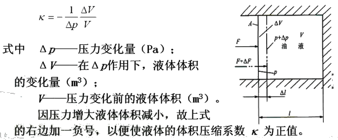
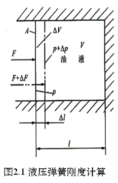
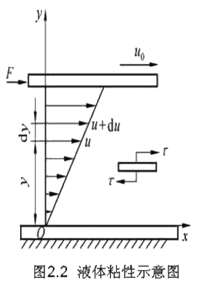

# 液压油的性质和选择

## 1. 液压油的种类

1. 石油基液压油

    - 无添加剂的石油基液压液（L-**HH**）
    - HH ＋ 抗氧化剂、防锈剂（L-**HL**）- 抗氧防锈液压油
    - HL + 抗磨剂（L-**HM**）- 抗磨液压油
    - HL + 增粘剂（L-**HR**）- 高粘度指数液压油
    - HM + 增粘剂（L-**HV**）- 低温液压油
    - HM + 防爬剂（L-**HG**）- 液压导轨油

2. 难燃液压液

   1. $\color{red}{含水液压液}$
       - $\color{orange}{高含水液压液（L-HFA）}$
         1. $\color{green}{水包油乳化液（L-HFAE）}$
         2. $\color{green}{水的化学溶液（L-HFAS）}$
       - $\color{orange}{油包水乳化液（L-HFB）}$
       - $\color{orange}{水—乙二醇（L-HFC）}$

   2. $\color{red}{合成液压液}$
      - $\color{orange}{磷酸酯无水合成液（L-HFDR）}$
      - $\color{orange}{氯化烃（L-HFDS）}$
      - $\color{orange}{HFDR + HFDS(L-HFDT)}$

**石油基的液压油** 是以机械油为基料。精炼后加入适当的添加剂而制成。添加剂有两类：
- 一类是用来改善油液化学性质的。如抗氧化剂、防锈剂等；
- 一类是用来改善油液物理性质的。如增粘剂、抗磨剂等。

`石油基的液压油润滑性好，但抗燃性差。`由此又研制出难燃型液压液（含水型、合成型等）供选择。以满足轧钢机、压铸机、挤压机等对耐高温、热稳定、不腐蚀、不挥发、防火等方面的要求。

**抗氧防锈油（HL）** 中加有抗氧化、防锈等添加剂，常用于低压传动系统，在液压传动系统中使用最广。

**抗磨液压油（HM）** 是在抗氧防锈油的基础上改善了抗磨性的液压油。适用于低、中、高压传动系统。

**高粘度指数液压油（HR）** 是在抗氧防锈油的基础上改善了粘温性能，适用于环境温度变化较大和土作条件恶劣的低压传动系性统。

**低温液压油（HV）** 是在抗磨液压油的基础上改善了粘温性能的液压油，适用于低、中、高压传动系统。

**液压导轨油（HG）** 是在抗磨液压油的基础上改善了粘滑性。适用于液压系统和导轨润滑合用的设备。

**水包油（O/W）乳化液（HFAE）** 是一种乳化型高水基液，通常含水 80% 以上。

**油包水（W/0）乳化液（HFB）** 通常含油 60% 以上，其余为水和添加剂。

**水的化学溶液（HFAS）** 是一种含有化学品添加剂的高水基液。

以上三种，低温性、粘温性和润滑性差，但难燃性好。 价格便宜，适用于难燃液的液压传动系统或金属加工设备。

**磷酸酯无水合成液（HFDR）** 是以无水的各种磷酸酯为基础加入各种添加剂制成，难燃性较好，但粘温性和低温性较差，使用温度范围宽。

**含聚合物水溶液**，即水—乙二醇液（HFC）是含乙二醇或其它聚合物的水溶液，低温性、粘温性和对橡胶适应性好，难燃性好，但比磷酸酯无水合成液要差。

---

## 2. 液压油液的物理性质

### 2.1 密度和重度

**密度：** 对于均质液体，单位体积内的液体质量被称为密度$\boldsymbol{\rho}$。

## $\rho = \frac{m}{V}$

**重度：** 对于均质液体，单位体积内的液体重量被称为重度$\boldsymbol{\gamma}$。

## $\gamma = \frac{G}{V}$

---

### 2.2 液压油的可压缩性

液体受压力的作用而使液体体积发生变化的性质被称为液体可压缩性。

压缩性用体积压缩系数 K 来表示，定义为：受压液体在单位压力变化时发生的体积相对变化量，即

液体体积压缩系数的倒数被称为液体的体积弹性模量。简称体积摸量。用 K 表示，即：

## $K = \frac{1}{k} = -\frac{V}{\Delta V} \Delta p$

体积弹性模量 K 表示压力增量与液体体积相对变化量的比值。在使用中，可用 K 值来说明液体抵抗压缩能力的大小。石油基液压油体积模量的数值是钢（$K = 2.06 \times 10^5 MPa$）的 1/( 100- 150)。即它的可压缩性是钢的 100~150 倍。但在实使因际使用中。由于在液体内不可避兔地会混入空气等原因，使其抗压缩能力显著降低。这会影响液压系统的工作性能。因此，在有较高要求或压力变化较大的液压系统中，应尽量减少油液中混入的气体及其它易挥发性物质（如煤抽、汽油）的含量。由于油液中的气体难以完全排除，在工程计算中常取液压油的体积弹性模量 $K = 0.7 \times 10^3 MPa$ 左右。

体积弹性模量 K 与温度和压力有关，温度升高 K 减小，压力谱大 K 力加大。有 0.05 - 0.25 的变化，当压力大于 3MPa 时 K 基本不变。

封闭在容器内液体的可压缩情况极像一根弹簧。在液体承压面积 A 不变时（见图 2.1）。可以通过压力变化： $\Delta p = \Delta F / A$ ；体积变化 $\Delta V = A \Delta l$ 和体积模量 K 求出它的液压弹簧刚 $k_h$为：

## $k_h = - \frac{\Delta F}{\Delta l} = \frac{A^2K}{V}$

液压油液的可压缩性对液压传动系统的动态性能影响较大。但当液压传动系统在静态（稳态）下工作时，一般可不考虑。

---

### 2.3 液压油液的粘性

液体在外力作用下流动或有流动趋势时，液体内分子间的内聚力要阻止液体质点的相对运动，由此产生一种内摩擦力，这种现象被称为液体的粘性。

液体流动时，如图2.2所示，设两平行平板间充满液体。下平板不动，上平板以速度 $u_0$ 向右平移。由于液体的粘性作用，紧贴下平板液体层的速度为零，紧贴上平板液体层的速度为 $u_0$。而中间各液层的速度则视它距下平板距离的大小按线性规律或曲线规律变化。实验表明。液体流动时相邻液层间的内摩擦力 $F_f$ 与液层接触面积 A 和液层间的速度梯度 du/dy 成正比，即：

## $F_f = uA\frac{du}{dy}$

液体粘性的大小用粘度来表示。常用的液体粘度表示方法有三种，即 **动力粘度**、**运动粘度**和**相对粘度**。

1. 动力粘度 u，动力粘度又称为绝对粘度

    # $u = \frac{F_f}{A \frac{du}{dy}}$

液体动力粘度的物理意义是：液体在单位速度梯度下流动或有流动趋势时，相接触的液层间单位面积上产生的内摩擦力。

动力粘度的法定计量单位为 Pa·s ( 1Pa·s = 1N·s / $m^2$），以前沿用的单位为 P （泊， dyn·s / $cm^2$ ) ，它们之间的关系是， 1 Pa·s = 10 P 。

