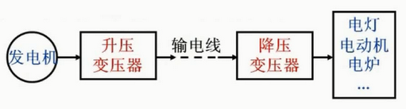
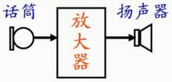
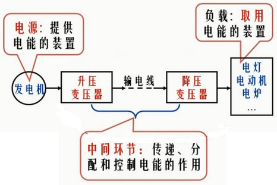
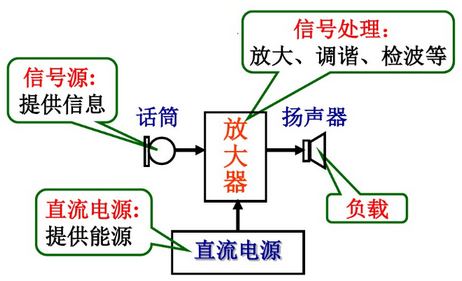
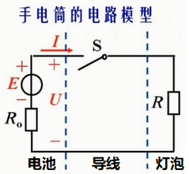
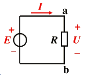
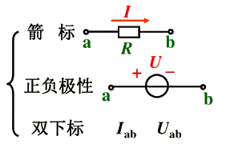
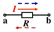
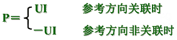

# 电路和电路模型、电路的基本物理量

## 1. 电路的作用

电路是电流的通路，是为了某种需要由电工设备或电路元件按一定方式组合而成。

**(1) 实现电能的传输、分配与转换**

**(2) 实现信号的传递与处理**

## 2. 电路的组成部分

**电源：** 将非电形态的能量转换为电能

**负载：** 将电能转换为非电形态的能量

**中间环节（开关和导线等）：** 起传递、分配和控制电能的作用

电源或信号源的电压或电流称为激励，它推动电路工作；由激励所产生的电压和电流称为响应。

> **小结：** 电路按功能可分为两类

1、电力线路（强电）

- 作用：传输、分配、控制和转换能量
- 构成：电源 -> 中间环节 -> 负载

2、电子线路（弱点）

- 作用：传递和处理信号
- 构成：信号源 -> 中间环节 -> 负载

## 3. 电路的模型

为了便于用数学方法分析电路，一般要求将实际电路模型化，用足以反应其电磁性质的理想电路元件或其组合来模拟实际电路中的器件，从而构成与实际电路相对应的电路模型。

理想电路元件主要有`电阻元件`、`电感元件`、`电容元件`和`电源元件（恒压源、恒流源）`等。

> **例：手电筒**

手电筒由电池、灯泡、开关和筒体组成。

**电池：** 是电源元件，其参数为电动势 E 和内阻 $R_{o}$

**灯泡：** 主要具有消耗电能的性质，是电阻元件，其参数为电阻 R

**筒体：** 用来连接电池和灯泡，其电阻忽略不计，认为是无电阻的理想导体

**开关：** 用来控制电路的通断

## 4. 电流、电压的参考方向

### 4.1 电路基本物理量的实际方向

物理中对基本物理量规定的方向

| 物理量 | 实际方向 | 单  位 |
| :----: | :----: | :----: |
| 电流 `I`| 正电荷运动的方向 | kA、A、mA、uA |
| 电压 `U` | 高电位 -> 低电位 （电位降低的方向） | kV、V、mV、uV |
| 电动势 `E` | 低电位 -> 高电位 （电位升高的方向） | kV、V、mV、uV |

### 4.2 电路基本物理量的参考方向

#### 1. 参考方向

在分析与计算电路时，对电量任意假定的方向。

#### 2. 参考方向的表示方法

#### 3. 实际方向的表达（与参考方向的关系）

实际方向与参考方向一致，电流（或电压）值为正值；

实际方向与参考方向相反，电流（或电压）值为负值。

| 示例 | 说明 |
| --- | --- |
|  | 若 `I=5A`，则电流从 a 流向 b 若 `I=-5A`，则电流从 b 流向 a |
|  | 若 `U=5A`，则电流从 a 指向 b 若 `U=-5A`，则电流从 b 指向 a |

#### 4. 关联参考方向

电压、电流的参考方向选择**一致**时称之为关联的参考方向，否则为非关联。

采用关联参考方向可仅标出一个参数的参考方向即可，电路分析师一般都采用关联参考方向。

**注意：**

- 在参考方向选定后，电流（或电压）值才有正负之分的代数量
- 电路分析时，参考方向一旦选定不得改变
- 一般情况下，选用关联参考方向便于分析电路

## 5. 电路元件的电功率

电路分析及实际应用中常用的时用功率表示电能消耗，习惯上以消耗功率作为正值便于分析。即 `P>0` 为负载，`P<0` 时为电源：

**单位：** W、KW、MW、mW

### 电能

**定义：** 在时间 t 内转换的电功率称为`电能：W=Pt`

**基本单位：** `J`

**常用单位：** 千瓦时（kW.h），1 千瓦时为 1 度电，1kW.h = 3.6 x $10^{6}J$

