# 理想电路元件

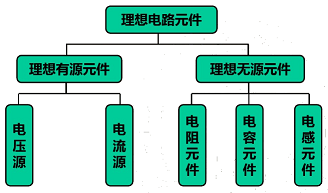

## 1. 电阻、电感和电容

### 电阻元件

当电路的某一部分只存在电能的消耗而没有电场能和磁场能的储存，这一部分电路可用电阻元件来代替。

## R = $\frac{u}{i}$(Ω)

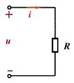

### 电阻图片

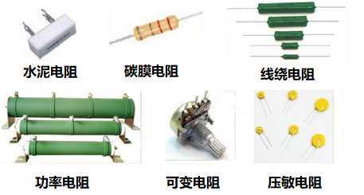

金属导体的电阻与导体的尺寸及导体材料的导电性能有关，表达式为：

## R = $p\frac{l}{s}$

### 可变电阻器（电位器）

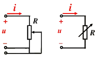

### 欧姆定律

| U、I参考方向相同时 | U、I参考方向相反时 |
| --- | --- |
| 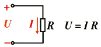 | 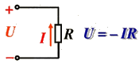 |

表达式中有两套正负号：

- 表达式前的正负号由U、I参考方向的关系确定
- U、I值本身的正负则说明实际方向与参考方向之间的关系。

通常取 U、I 参考方向相同（关联参考方向）。

### 线性电阻与非线性电阻

遵循欧姆定律的电阻称为线性电阻（即理想电阻），它表示该段电路电压与电流的比值为常数。

即：R = $\frac{U}{I}$ = 常数

**伏安特性：** 电路端电压与电流的关系称为伏安特性。

线性电阻的伏安特性时一条过远点的直线，伏安特性表示电阻大小：与电流轴夹角的正切（即直线斜率）

**R = tg ，a = u/i**

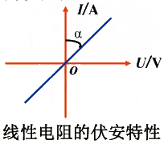

### 实际电阻与理想电阻的关系

电工设备实际等效电阻与理想电阻总有差距，在电压电流变化时其 U、I 比值不是常数，称非线性电阻。

电路分析时可视为理想电阻的情况：

设备工作状态不变（如 Q 点可用原点到 Q 点直线等效）

设备工作区间一定（如 A、B 点间可近似为直线）

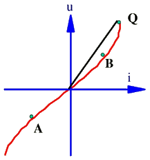

**电阻消耗的功率：**

### P = UI = $RI{^2}$ = $\frac{U^2}{R}$

**电阻的能量关系:**

### W = $\int_{0}^{t} uidt\, = \int_{0}^{t} Ri^2dt \ge 0$

随时间增长电阻上的能量单调上升表明电能全部消耗在电阻上，转换为各种非电能、热能散发。

## 2. 电路的状态

### 通路

当电源与负载接通，电路中有了电流及能量的输送和转换。电路的这一状态称为通路。

通路时，电源向负载输出电功率，电源这时的状态称为有载或称电源处于负载状态。

**负载大小的概念：**

负载增加指负载取用的电流和功率增加（电压一定）。（负载大、重指的是电流大，在常用电压供电电路重 R 小）

#### 电气设备的额定值

**额定值：** 电气设备在正常运行时的规定使用值

1. 额定值反映电气设备的使用安全性
2. 额定值表示电气设备的使用能力

**例：**

灯泡：$U_N = 220V, P_N = 60W$

电阻：$R_N = 100Ω, P_N = 1W$

电气设备的三种运行状态

- 工作状态：$I = I_N, P = P_N$ （经济合理安全可靠）
- 过载（超载）：$I > I_N , P > P_N$ （设备易损坏）
- 欠载（轻载）：$I < I_N, P < P_N$ （不经济）

### 开路

开关或负载 R 断开

**特征：**

- I = 0
- $U = U_0 = E$ 电源端电压（开路电压）
- P = 0 负载功率

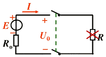

**电路中某处断开时的特征：**

1. 开路处的电流等于零：I = 0
2. 开路处的电压 U 视电路情况而定

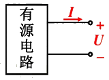

若电路中 I=0 则该电路可视为开路

### 短路

负载两端被短接

**特征：**

- $I = I_S = \frac{E}{R_0}$ 短路电流（很大）
- U = 0 电源端电压
- P = 0 负载功率

**电路中某处电路时的特征：**

1. 短路处的电压等于零，U = 0
2. 短路处的电流 I 视电路情况而定

若电路中 U = 0 则该电路可视为短路。

### 电感

公式： $u = L \frac{di}{dt}$

电感式用来表征电路中磁场能量储存这一物理性质的理想元件。

线圈式典型的电感元件，线圈的磁链：$\psi = N \phi$

## $L = \frac{\psi}{i}$

- $\psi$ 表示磁链，单位为韦\[伯](Wb)

- i 表示电流，单位为安\[培](A)

- L 表示电感，单位为亨\[利](H)

### 电感图片

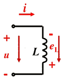

规定：e 的方向与磁感线的方向符合右手螺旋定则时，e 为正，否则为负。

## $\frak{e} = - N \frac{d\phi}{dt} = - \frac{d\psi}{dt}$

## $L = \frac{\Psi}{i}$

## $\frak{e} = - L\frac{di}{dt}$

由基尔霍夫电压定律 u = -e

    线性电感：L为常数
    非线性电感：L不为常数

于是 $u = L\frac{di}{dt}$

> 电感上 u、$e_L$ 与电流随时间变化量有关故称为动态元件

