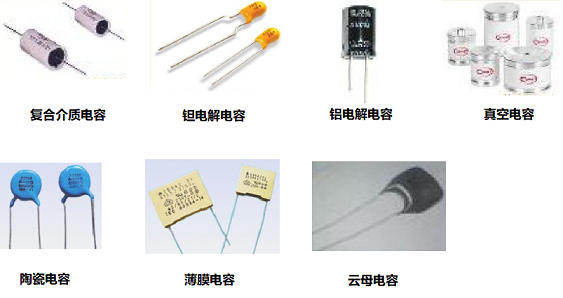
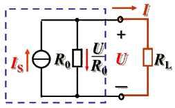

# 理想电路元件

## 1. 电阻、电感和电容

### 电阻元件

当电路的某一部分只存在电能的消耗而没有电场能和磁场能的储存，这一部分电路可用电阻元件来代替。

## R = $\frac{u}{i}$(Ω)

### 电阻图片

金属导体的电阻与导体的尺寸及导体材料的导电性能有关，表达式为：

## R = $p\frac{l}{s}$

### 可变电阻器（电位器）

### 欧姆定律

| U、I参考方向相同时 | U、I参考方向相反时 |
| --- | --- |
|  |  |

表达式中有两套正负号：

- 表达式前的正负号由U、I参考方向的关系确定
- U、I值本身的正负则说明实际方向与参考方向之间的关系。

通常取 U、I 参考方向相同（关联参考方向）。

### 线性电阻与非线性电阻

遵循欧姆定律的电阻称为线性电阻（即理想电阻），它表示该段电路电压与电流的比值为常数。

即：R = $\frac{U}{I}$ = 常数

**伏安特性：** 电路端电压与电流的关系称为伏安特性。

线性电阻的伏安特性时一条过远点的直线，伏安特性表示电阻大小：与电流轴夹角的正切（即直线斜率）

**R = tg ，a = u/i**

### 实际电阻与理想电阻的关系

电工设备实际等效电阻与理想电阻总有差距，在电压电流变化时其 U、I 比值不是常数，称非线性电阻。

电路分析时可视为理想电阻的情况：

设备工作状态不变（如 Q 点可用原点到 Q 点直线等效）

设备工作区间一定（如 A、B 点间可近似为直线）

**电阻消耗的功率：**

### P = UI = $RI{^2}$ = $\frac{U^2}{R}$

**电阻的能量关系:**

### W = $\int_{0}^{t} uidt\, = \int_{0}^{t} Ri^2dt \ge 0$

随时间增长电阻上的能量单调上升表明电能全部消耗在电阻上，转换为各种非电能、热能散发。

## 2. 电路的状态

### 通路

当电源与负载接通，电路中有了电流及能量的输送和转换。电路的这一状态称为通路。

通路时，电源向负载输出电功率，电源这时的状态称为有载或称电源处于负载状态。

**负载大小的概念：**

负载增加指负载取用的电流和功率增加（电压一定）。（负载大、重指的是电流大，在常用电压供电电路重 R 小）

#### 电气设备的额定值

**额定值：** 电气设备在正常运行时的规定使用值

1. 额定值反映电气设备的使用安全性
2. 额定值表示电气设备的使用能力

**例：**

灯泡：$U_N = 220V, P_N = 60W$

电阻：$R_N = 100Ω, P_N = 1W$

电气设备的三种运行状态

- 工作状态：$I = I_N, P = P_N$ （经济合理安全可靠）
- 过载（超载）：$I > I_N , P > P_N$ （设备易损坏）
- 欠载（轻载）：$I < I_N, P < P_N$ （不经济）

### 开路

开关或负载 R 断开

**特征：**

- I = 0
- $U = U_0 = E$ 电源端电压（开路电压）
- P = 0 负载功率

**电路中某处断开时的特征：**

1. 开路处的电流等于零：I = 0
2. 开路处的电压 U 视电路情况而定

若电路中 I=0 则该电路可视为开路

### 短路

负载两端被短接

**特征：**

- $I = I_S = \frac{E}{R_0}$ 短路电流（很大）
- U = 0 电源端电压
- P = 0 负载功率

**电路中某处电路时的特征：**

1. 短路处的电压等于零，U = 0
2. 短路处的电流 I 视电路情况而定

若电路中 U = 0 则该电路可视为短路。

### 电感

公式： $u = L \frac{di}{dt}$

电感式用来表征电路中磁场能量储存这一物理性质的理想元件。

线圈式典型的电感元件，线圈的磁链：$\psi = N \phi$

## $L = \frac{\psi}{i}$

- $\psi$ 表示磁链，单位为韦\[伯](Wb)

- i 表示电流，单位为安\[培](A)

- L 表示电感，单位为亨\[利](H)

### 电感图片

规定：e 的方向与磁感线的方向符合右手螺旋定则时，e 为正，否则为负。

## $\frak{e} = - N \frac{d\phi}{dt} = - \frac{d\psi}{dt}$

## $L = \frac{\Psi}{i}$

## $\frak{e} = - L\frac{di}{dt}$

由基尔霍夫电压定律 u = -e

    线性电感：L为常数
    非线性电感：L不为常数

于是 $u = L\frac{di}{dt}$

> 电感上 u、$e_L$ 与电流随时间变化量有关故称为动态元件

直流电路中由于 I 恒定不变，即：di/dt $\equiv$ 0 , u $\equiv$ 0

> 电感元件在直流电路中可视为短路

对于变动电流（非直流电路中）由于 I 不断变化即 di/dt $\ne$  0 , 电感上产生电压 u（感应电动势$e_L$）, 根据电压 u （电动势$e_L$）电流关系及参考方向可见：

电感L（由于$e_L$的作用）具有阻碍电流变化的性质

绕制紧密，导线电阻很小的空心线圈可近似为理想电感。实际中使用的线圈都有非线性及导线电阻。

#### 电感元件储能（能量关系）

## ${\color{maroon} u = L \frac{di}{dt}}$

电感的瞬时功率

## ${\color{maroon} p = ui = Li \frac{di}{dt}}$

i 的绝对值增大时，${\color{maroon} i \frac{di}{dt} > 0 , p > 0}$ ,电感从外部输入功率，把电能转换成了磁场能。

i 的绝对值减小时，${\color{maroon} i \frac{di}{dt} < 0 , p < 0}$ , 电感向外部输出功率，磁场能又转换成了电能。

### ${\color{maroon} t = 0 \rightarrow t = \xi}$

### ${\color{maroon} i = \rightarrow i = I}$

电感元件消耗的能量与时间无关，和电流 $i_2$ 成比例。由于能量不能无故消失或增加，只能是不同形式转换。

电感中存储的磁场能：

### $\color{maroon}{W_L = \frac{1}{2}LI^2}$

由于：$\color{maroon}{p = \frac{dW_L}{dt}}$

若外部不能向电感提供无穷大的功率，磁场能就不可能发生突变。因此，电感的电流 $i$ 不可能发生突变。

### 电容

## $\color{maroon}{i = C\frac{du}{dt}}$

电容是用来表征电路中电场能量储存这一物理性质的理想元件。

电容器：两相互绝缘的极板构成 $\color{maroon}{C = \frac{q}{u}}$

## $\color{maroono}{C = \frac{\varepsilon S}{d}(F)}$

- C — 电容，单位为法\[拉]（F）
- S — 极板面积（m2）
- d — 板间距离（m）
- $\varepsilon$ — 介电常数（F/m）

#### 电容图片

> 电容中电流 i 与电压随时间变化量有关故称为动态元件

直流电路中由于 U 恒定不变，即 $\color{blue}{du/dt \equiv 0}$ , $\color{blue}{i \equiv 0}$

> 电容元件在直流电路中可视为断路

实际中所用的电容元件基本上可认为是理想电容

特殊电容器：电解点容器。为增加容量靠用高介电系数电解液做绝缘的电容器。使用时需加正确的极性，符号表示时在需高电位端标 `+` 号。

#### 电容元件储能（能量关系）

电容的瞬时功率：$\color{blue}{p = ui = Cu\frac{du}{dt}}$

u 的绝对值增大时，$\color{blue}{u\frac{du}{dt}>0,p>0}$，电容从外部输入功率，把电能转换成了电场能。

u 的绝对值减小时，$\color{blue}{u\frac{du}{dt}<0,p<0}$，电容向外部输出功率，电场能又转换成了电能。

#### 电感、电容的记忆作用

若电路中电容断路（i=0）时，由于电容上充有电荷，虽然电容未接电源，但两端将保持原有电压。称为记忆作用。

---

## 2. 理想电源元件

### 2.1 电压源

可提供一个固定的电压 $\color{blue}{U_s}$，称为源电压。

**电压源的特点：**

输出电压 $U$ 等于源电压 $U_S$，是由其本身所确定的定值，与输出电流和外电路的情况无关。

输出电流 $I$ 不是定值，与输出电压和外电路的情况有关。

#### 实际电源的电路模型

**电动势和电阻组合**

实际电源是电动势 E 和内阻 $R_0$ 串联的电源的电路模型。

实际电压源由上图电路可得：$\color{blue}{U - E - IR_0}$

若 $\color{blue}{R_0 = 0}$ 电压源：$\color{blue}{U \equiv E}$ 

若 $\color{blue}{R_0 << R_L , U \approx E }$，可近似认为是理想电压源。

**电压源的外特性**

### 2.2 电流源

可提供一个固定的电流 $I_s$ ，称为源电流。

**电流源的特点：**

- 输出电流 $I$ 等于源电流 $I_S$ ，是由其本身所确定的值，与输出电压和外电路的情况无关。

- 输出电压 $U$ 不是定值，与输出电流和外电路的情况有关。

#### 实际电源的电路模型

**电激流和电阻组合**

由上图电路可得：$I = I_S - \frac{U}{R_0}$

若 $R_0 = \infty$ ，理想电流源：$I \equiv I_S$

若 $R_0 >> RL$ , $I \approx I_S$ ，可近似认为是理想电流源。

#### 实际电压源与实际电流源的等效变换

#### 电压源与电流源及其等效变换分析电路

**利用电压源、电流源变换简化电路思路：**

- 若多个电源（或电路）串联可变换为电压源合并
- 若多个电源（或电路）串联可变换为电流源合并
- 与恒压源并联的电路可等效为恒压源
- 与恒流源串联的电路可等效为恒流源

> 例1：求下列各电路的等效电源

解：

> 例2：试用电压源与电流源等效变换的方法计算 2Ω 电阻中的电流。

**注意事项：**

1. 电压源和电流源的等效关系只对外电路而言，对电源内部则是不等效的。
    例：当 $R_L = \infty $ 时，电压源的内阻 $R_0$ 中不损耗功率，而电流源的内阻 $R_0$ 中则损耗功率。

2. 等效变换时，两电源的参考方向要一一对应。

    

3. 理想电压源与理想电流源之间无等效关系。

4. 任何一个电动势 $E$ 和 某个电阻 $R$ 串联的电路，都可化为一个电流为 $I_S$ 和这个电阻并联的电路。（不局限与电源内阻）

### 2.3 受控源

**独立电源：** 指电压源的电压或电流源的电流不受外电路的控制而独立存在的电源（前述电压、电流源）。

**受控电源：** 指电压源的电压或电流源的电流受电路中其它部分的电流或电压控制的电源（非独立电源）。

**受控源的特点：** 当控制电压或电流消失或等于零时，受控源的电压或电流也将为零（受电流、电压控制）。

### 2.4 四种理想受控电源的模型

以后我们所研究的电路，都是由前述五种理想电路元件及其组合而成的电路模型；

或者说：实际使用的电工设备在一定条件下都可用前述的五种理想电路元件来构成电路模型以便于电路分析。

