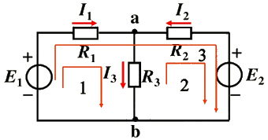
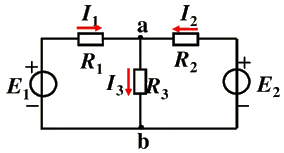
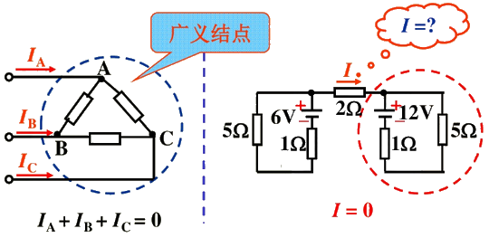
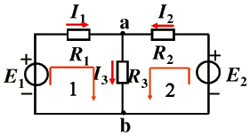
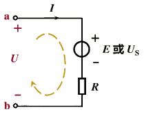
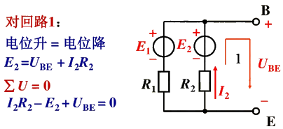
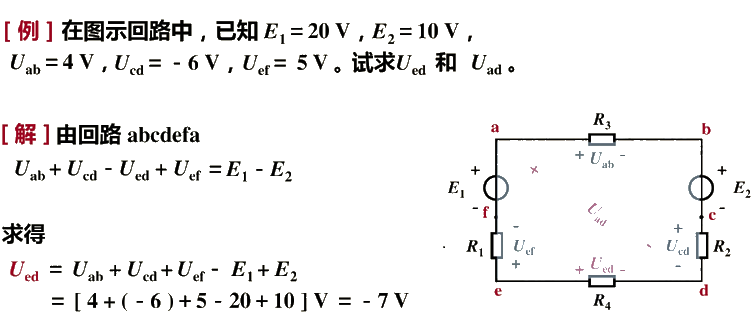
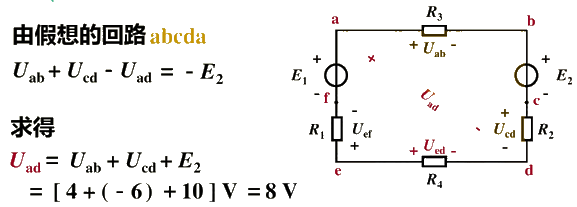

# 基尔霍夫定律

**支路：** 电路中的每一个分支。（无分岔）一条支路流过一个电流，称为支路电流。

**结（节）点：** 三条或三条以上支路的联接点。

**回路：** 由支路组成的闭合路径。

**网孔：** 内部不含支路的回路。（单孔回路）

## 1. 基尔霍夫电流定律（KCL）

### 1.1 定律

在任一瞬间，流向任一结点的电流等于流出该节点的电流。

### 即：$\color{blue}{\sum I_入 = \sum I_出}$

### 或：$\color{maroon}{\sum I = 0}$

### 对节点 a：$I_1 + I_2 = I_3$ 或 $I_1 + I_2 - I_3 = 0$

实质：电流连续性的体现。

基尔霍夫电流定律（KCL）反映了电路中任一结点处各支路电流间相互制约的关系。

### 1.2 推广

电流定律可以推广应用于包围部分电路的任一假设的闭合面。

流入节点的电流前取正号，流出节点的电流前取负号。

## 2. 基尔霍夫电压定律（KVL）

### 2.1 定律

在任一瞬间，从回路中任一点出发，沿回路循行一周，则在这个方向上电位升之和等于电位降之和。

在任一瞬间，沿任一回路循行方向，回路中各段电压的代数和恒等于零。

### 即：$\color{maroon}{\sum U = 0}$ 

### 对回路1：$E1 = i_1R_1 + I_3R_3$ 或 $\color{blue}{I_1R_1 + I_3R_3 - E_1 = 0}$

### 对回路2：$I_2R_2 + I_3R_3 = E_2$ 或 $\color{blue}{I_2R_2 + I_3R_3 - E_2 = 0}$

基尔霍夫电压定律不仅适用于电路中任一闭合的回路，而且还可以推广应用于任何一个假想闭合的一段电路。

将 a、b 两点间的电压作为电阻电压降一样考虑进去。

### $\color{maroon}{RI - U = -E}$ 或 $\color{maroon}{RI - U + U_S = 0}$

**🎈注意：**

1、列方程前标注回路循行方向；

2、应用 $\color{maroon}{∑ U = 0}$ 列方程时，项前符号的确定：如果规定电位降取正号，则电位升就取负号。

3、开口电压可按回路处理

