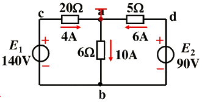
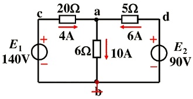
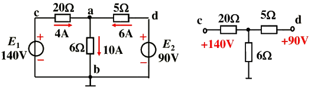
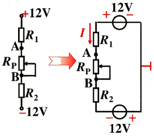

# 电路中电位的概念及计算

## 1. 电位的概念

**电位：**

- 电路中某点至参考点的电压，记为“$V_X$”。通常设参考点的电位为零。
- 某点电位为正，说明该点电位比参考点高
- 某点电位为负，说明该点电位比参考点低

**电位的计算步骤：**

- 任选电路中某一点为参考点，设其电位为零
- 标出各电流参考方向并计算
- 计算各点至参考点间的电压即为各点的电位

> **举例1：**

求图示电路中各点的电位：$V_a$、$V_b$、$V_c$、$V_d$。

解：设 a 为参考点，即

$\color{maroon}{V_a = 0V}$

$\color{maroon}{V_b = U_ba = -10×6 = -60V = 4×20-140 = -60V}$

$\color{maroon}{V_C = U_ca = 4×20 = 80V = 140-6×10 = 80V}$

$\color{maroon}{V_d = U_da = 6×5 = 30V = 90-6×10 = 30V}$

$\color{blue}{U_ab = 10×6 = 60V}$

$\color{blue}{U_cb = E_1 = 140V}$

$\color{blue}{U_db = E_2 = 90V}$

> **举例2：**

求图示电路中各点的电位：$V_a$、$V_b$、$V_c$、$V_d$。

解：设 b 为参考点，即

$\color{maroon}{V_b = 0V}$

$\color{maroon}{V_a = U_ab = 10×6 = 60V = 140-4×20 = 60V}$

$\color{maroon}{V_e = U_cb = E_1 = 140V = 4×20+6×10 = 140V}$

$\color{maroon}{V_d = U_db = E_2 = 90V = 6×5+6×10 = 90V}$

$\color{blue}{U_ab = 10×6 = 60V}$

$\color{blue}{U_cb = E_1 = 140V}$

$\color{blue}{U_db = E_2 = 90V}$

> **结论：**

1. 电位值是相对的，参考点选取的不同，电路中各点的电位也将随之改变

2. 电位的单值性：无论从何路径计算结果相同

3. 电路中两点间的电压值是固定的，不会因参考点的不同而变，即与零电位参考点的选取无关。

借助电位的概念可以简化电路作图：

> **例：**

电路如下图所示，

（1）零电位参考点在哪里？

（2）当电位器 $R_p$ 的滑动出点向下滑动时，A、B 两点的电位增高了还是降低了？

> **解：**

（1）电路图如左图，零电位参考点为 +12V 电源的 “-” 端与 -12V 电源的 “+” 端的联接处。

（2）$V_A = -IR_1 + 12$ , $V_B = IR_2 - 12$

当电位器 $R_p$ 的滑动触点向下滑动时，回路中的电流 $I$ 减小，所以 A 电位增高、B 点电位降低。