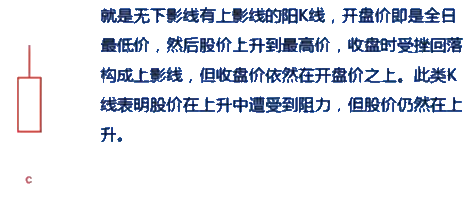

# K 线基础知识

K 线是以每个分析周期的开盘价、最高价、最低价和收盘价绘制而成。以绘制日 k 线为例，首先确定开盘和收盘的价格，如果收盘价格高于开盘价格，则 k 线被称为阳线，用白色实体或红色实体来表示。如果收盘价低于开盘价，则 K 线被称为阴线，用黑色实体或绿色实体表示。在国内股用红色表示阳线票和期货市场，通常，绿色表示阴线。最高价和实体之间的线被称为上影线，最低价和实体间的线称为下影线。

## 1. K 线的类型

**按 4 个价位的关系 K 线可分成 3 类：**

- 阳线类
- 阴线类
- 非阳非阴类

### 1.1 阳线类

### 1.2 阴线类

### 1.3 “T” 字型

### 1.4 “一” 字型

### 1.5 “十” 字型

### 1.6 “⊥” 字型

### 1.7 K 线的时间区分

**K 线的 4 个价位实际上是一个四维向量，反应的是股价的高低和变化趋向。按时机周期不同 K 线可分为：**

- 5 分钟 K 线
- 15 分钟 K 线
- 30 分钟 K 线
- 60 分钟 K 线
- 日 K 线
- 周 K 线
- 月 K 线
- 年 K 线等

### 1.8 K 线包含的信息

---

## 2. K 线组合三大类

1. 上升形态和见底形态的K线组合

2. 下跌形态和滯涨形态的K线组合

3. 既是上升形态又是下跌形态的K线组合

### 2.1 上升形态和见底形态的K线组合

### 2.2 下跌形态与滞涨形态

### 2.3 既是上升形态又是下跌形态的K线组合

---

## 3. 支撑线和压力线

### 3.1 支撑线

支撑线又称抵抗线，时指当股价下跌至某个价位附近时会受到下方的支撑，股价停止下跌，甚至有可能开始回升。阻止股价继续下跌的每个点位又称支撑位。把这些点为连接起来就形成了支撑线。

### 3.2 压力线

压力线又称阻力线，是指当股价上涨至某个价位附近时会受到上方的压制，股价停止上涨，甚至有可能开始回落。阻止股价上涨的每个点位又称压力位。把这些点为连接起来就形成了压力线。

### 3.3 分析支撑与压力时的注意点

**1.** 支撑压力的力度主要由股票`持有成本`、`心理因素`决定。

**2.** 支撑被`跌破`将变成压力，压力被`突破`将变成支撑。

**3.** 压力位被突破要有`能量配合`，支撑位被跌破`不一定有能量配合`。

**4.** `实质性`压力或支撑的力度要比`心理性`支撑或压力的力度大，两者的重合力度最大。

**5.** 支撑和压力的`力度`与`大盘和热点`有密切关系，大盘强势或个股符合热点时，个股压力的力度会减轻．支撑的力度会加大，否则相反。

**6.** 支撑和压力的`力度`与个股当时所处的`趋势`有密切关系，个股处于`上升趋势`时．个股压力的力度会减轻，支撑的力度会加大，否则相反。

