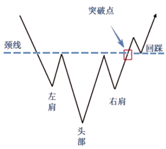
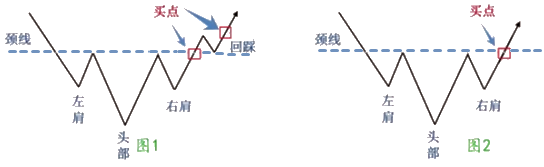
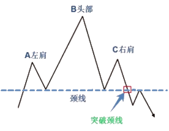
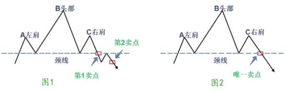
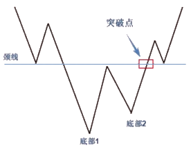
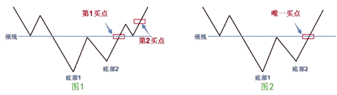

# K线技术图形

**技术图形的成因：**

- 交易时间一长，股价从走势上就会出现各种不同的图形，如：山、岛、旗子。
- 人们发现一旦形成这些图形后，股价后期的走势几乎如同一辙。
- 因为这种规律性变化，人们开始研究它，总结它，于是，就形成了技术图形理论。

## 1. 技术图形主要分两大类

1. 转势形态

1. 整理形态

### 1.1 转势形态技术图形

转势形态技术图形又细分为两类：

- 底部转势形态：头肩底、双底、圆底、潜伏底、 V 形、底部三角形、向下竭尽缺口、底部岛形反转等。（开始上涨的信号）

- 顶部转势形态：头肩顶、双顶、圆顶、倒置 V 形、向上竭尽缺口、顶部岛形反转等。（股价见顶，下跌的信号）

### 1.2 整理形态的技术图形

- 经过整理后突破向上：上升三角形、上升旗形、下降楔形。

- 经过整理后突破向下：下降三角形、下降旗形、上升楔形、扩散三角形。

- 整理过程中，多空双方势均力敌，很难判断后市是上还是向下：收敛三角形、矩形。

## 2. 股票技术图形的识别和操作实战

### 2.1 头肩底的识别和运用

**特征：**  

1、急速的下跌，随后止跌反弹，形成第一个波谷，这就是通常说的左肩。形成左肩部分时，成交量在下跌过程中出现放大迹象，而在左肩最低点回升时则有减少的倾向。

2、第一次反弹受阻，股价再次下跌，并跌破了前一低点，之后股价再次止跌反弹形成了第二个波谷，这就是通常说的头部。形成头部时成交量会有所增加。

3、第二次反弹再次在第一次反弹高点处受阻，股价又开始第三次下跌，但股价到与第一个波谷相近的位置后就不下去了，此后股价再次反弹形成了第三个波谷，这就是通常说的右肩。此时的下跌，成交量极度萎缩，但反弹时，成交量显着增加。

4、第一次反弹高点和第二次反弹高点的连线就是一根阻碍股价上涨的颈线。但当第三次反弹时会在成交量的配合下，将这根颈线冲破，使股价站在其上方。

**操作建议：**

投资者见到头肩底这个图形，应该想到这是个底部回升的信号，此时不能再继续看空，而要做好随时进场抢筹的准备。一旦股价放量冲破颈线时就可考虑买进一些股票。这通常成为第一买点。

如果股价冲破颈线回抽，并在颈线附近止跌回升再度上扬时加码买进，这通常称为第二买点。

值得注意的是，若是股价向上突破颈线时成交量并无显著增加，很可能是一个“假性突破”，这时投资者应逢高卖出，考虑暂时退出观望。

**备注：**

头肩底有两种突破形态，一种是突破颈线后有一个回踩，这时就会出现明显的两个买点，如 `图1` ；

一种是突破颈线后就一路上扬，这时只有一种明显的买点出现，如 `图2`。

### 2.2 头肩顶的识别和运用

**特征：**

头肩顶形态形成于上涨趋势的末期，股价在上涨过程中出现 3 个峰顶，这 3 个峰顶分别称为左肩、头部和右肩。

从图形上看左肩、右肩的最高点基本相同，而头部最高点比左肩、右肩最高点要高。另外股价在上冲失败向下回落时形成的两个低点又基本上处在同一水平线上。这个水平线，就是通常说的颈线，当股价第三次上冲失败回落时，这根颈线就会被击破。于是头肩顶正式宣告成立。在头肩须形成过程中，左肩的成交量最大，头部的成交量略小些，右肩的成交量最小。成交量呈递减现象，说明股价上升时追涨力量越来越弱，股价有涨到头的意味。

**操作建议：**

1、当一只股价形成头肩顶雏形时，就要引起高度警惕，这时股价虽然还没跌破颈线，但是可以先卖出手中的一些筹码，将仓位减轻，日后一旦发觉股价跌破颈线，就将手中剩余的股票全部卖出，退出观望；

2、上涨时要放量，下跌时量可放大，也可以缩小，对头肩顶这种形态来说，先是用很小的量击破颈线，然后再放量下跌，甚至仍旧维持较小的量往下滑落也是常有的事；

3 、头肩顶对多方杀伤力度大小，与其形成的时间成正比，因此投资者不能光关心日 K 线图，也应对周 K 线图、月 K 线图高度重视。

**备注：**

头肩顶有两种突破形态，一种是突破颈线后有一个回抽，这时就会出现明显的两个卖点，如 `图1`；

一种是突破颈线后就一路直泻，这时只有一种明显的卖出点，如 `图2`。

### 2.3 双底的识别和运用

**特征：**

1、在双底形成的第一个底部后的反弹，幅度一般在 10 ％左右。

2、在第二个底部形成时，成交量经常较少且市况沉闷，很容易出现圆形的形态，而向上突破颈线时，成交量必须迅速放大；

3、突破之后常常有回踩，在颈线附近止跌回升，从而确认向上突破有效；

4、第二个底点一般比第一个底点高，但也可能比第一个底点更低，因为对于主力而言，探底必须要彻底，必须要跌到令其他多头害怕，不敢持股，这样才能达到低位建仓的目的。

5、一个低点与第二个低点之间，时间跨度应不少于一个月。如果时间太短形成的双底，其触底回升的信号就不太可靠，反弹上去就要注意它可能随时回落，因为主力常用这种手段诱骗投资者，对此，大家要引起警觉。

6、双底不如头肩底的信号可靠性高。

**备注：**

双底有两种突破形态，一种是突破颈线后有一个回踩，这时就会出现明显的两个买点，如 `图1` ；

另一种是突破预线后就一路上扬，这时只有一个明显的买点出现，如 `图2`。

