# 移动平均线的识别与运用

1. 多头排列
2. 空头排列
3. 黄金交叉
4. 死亡交叉
5. 银山谷
6. 金山谷
7. 死亡谷
8. 首次粘合向上与向下散发形
9. 首次交叉向上与向下散发形
10. 再次交叉向上与向下散发形
11. 上山爬坡形
12. 下山滑坡形
13. 逐浪上升
14. 逐浪下降
15. 加速上涨
16. 加速下跌
17. 快速上涨
18. 快速下跌
19. 烘云托月
20. 乌云密布
21. 蛟龙出海
22. 断头铡刀

## 1. 多头排列

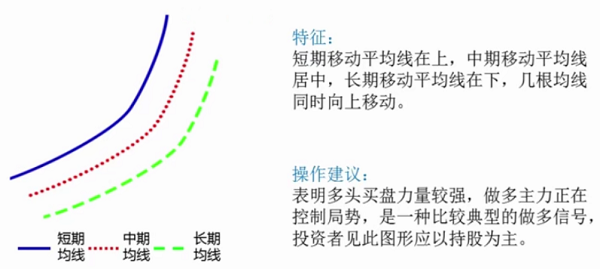

 

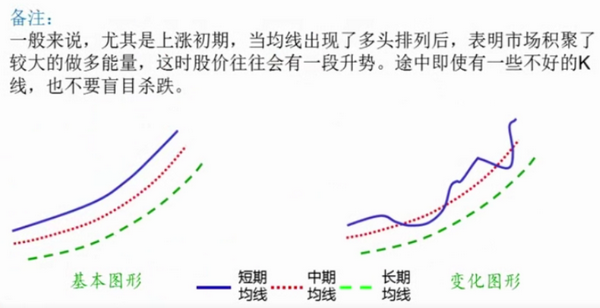

## 2. 空头排列

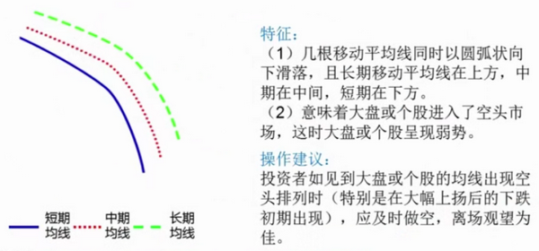

 

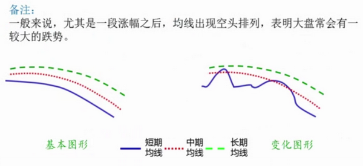

## 3. 黄金交叉

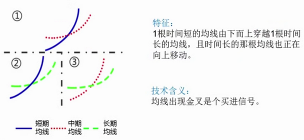

 

 

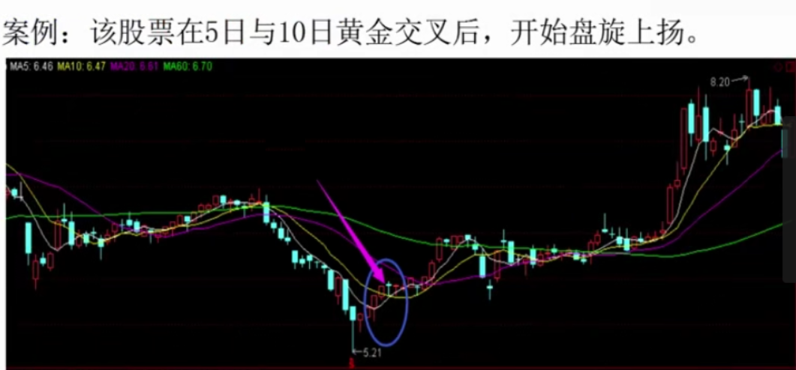

## 4. 死亡交叉

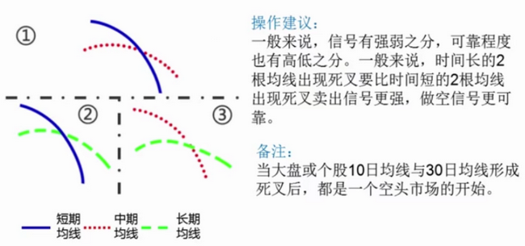

 

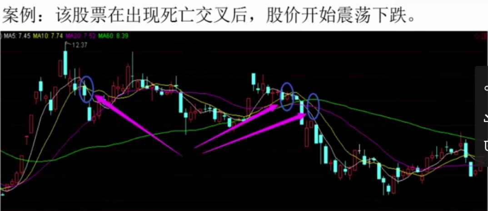

## 5. 银山谷

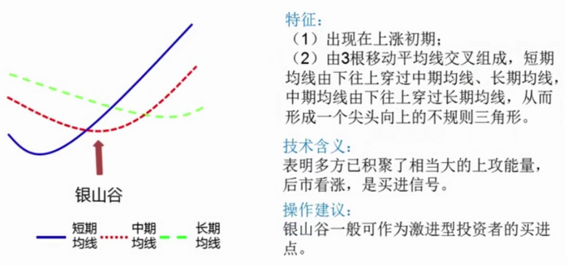

 

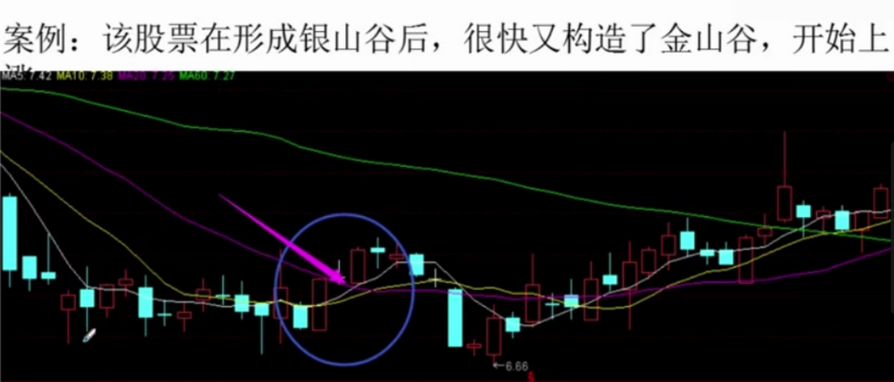

## 6. 金山谷

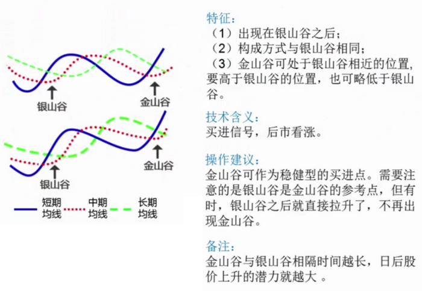

 

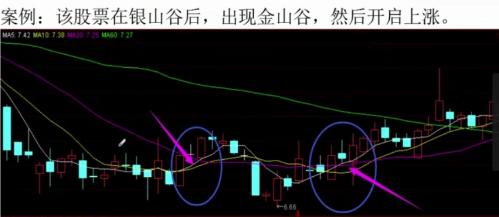

## 7. 死亡谷

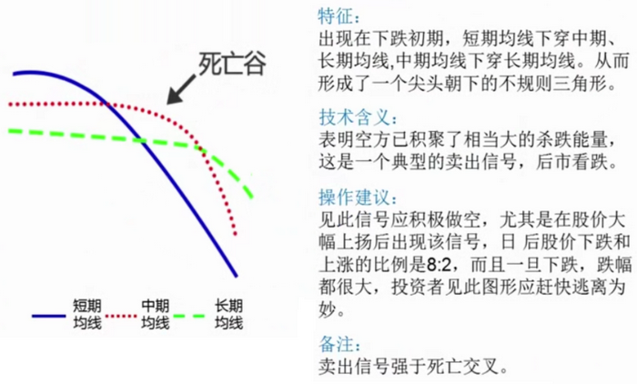

 

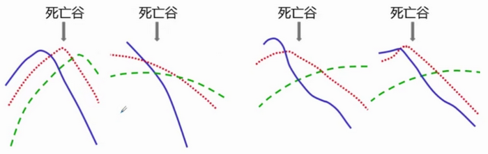

 

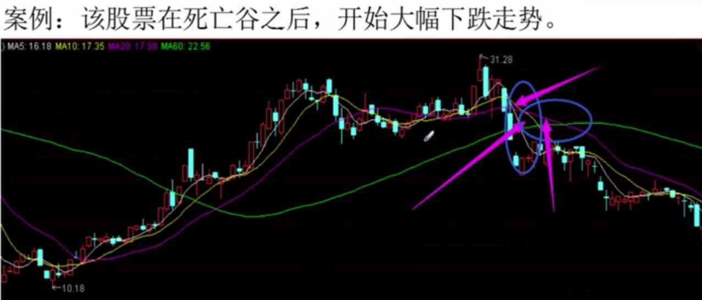

## 8. 首次粘合向上与向下散发形

## 9. 首次交叉向上与向下散发形

## 10. 再次交叉向上与向下散发形

## 11. 上山爬坡形

## 12. 下山滑坡形

## 13. 逐浪上升

## 14. 逐浪下降

## 15. 加速上涨

## 16. 加速下跌

## 17. 快速上涨

## 18. 快速下跌

## 19. 烘云托月

## 20. 乌云密布

## 21. 蛟龙出海

## 22. 断头铡刀

