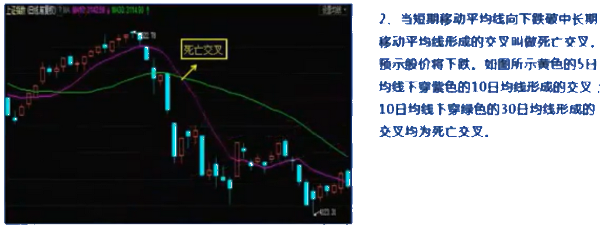

# 股票入门

## 1. 股市交易规则

### 1.1 交易时间

1. 交易日：周一至周五（法定休假日除外）

2. 上午 9:15 -- 9:25 开盘集合竞价时间
   - 9:15 -- 9:20 可以挂单也可以撤单
   - 9:20 -- 9:25 只可以挂单不能撤单

3. 上午 9:30 -- 11:30  连续竞价

4. 下午 13:00 -- 15:00 连续竞价

### 1.2 交易单位

股票的交易单位为“股”，100股 = 1手，委托买入数量必须为100股或其整数倍。

最小变动的价格是 0.01 元。

### 1.3 交易方式

**现价委托：** 所谓限价委托是指投资者委托证券投资公司按自己限定的价格买卖。

**市价委托：** 是指投资者按市场价格买卖证券。

### 1.4 集合竞价与连续竞价

竞价原则：先以 价格优先、时间优先 来排列买卖有效委托，以 不高于买价、不低于卖价的原则成交。

**集合竞价：** 开盘时的集合竞价，在规定时间内接受的买卖申报一次性中撮合的竞价方式。

不高于申买价和不低于申卖价的原则产生一个成交价格，且在这各价格下成交的股票数量最大，并将这个价格作为全部成交委托的交易价格。


> 集合竞价的基本过程如下：设定一支股票A，在开盘前分别有6笔买入委托，和5笔卖出委托。根据价格优先原则：按买入价格由高到低和卖出价格由低到高的顺序将其分别排列(如图所示)。  
> 按不高于申买价和不低于申卖价的原则，首先可成交图中第一笔，若要同时符合申买者和申卖者的意愿，其成交价格必须实在 3.52 元和 3.80 元之间。

**连续竞价：** 开盘后的连续竞价，是指对买卖申报逐笔连续撮合的竞价方式。

先以 价格优先、时间优先 来排列买卖有效委托。以 不高于买价、不低于卖价的原则成交，一对一的成交。其成交价为：

1. 最高买入申报价格与最低卖出申报价格相同，以该价格为成交价格。

2. 买入申报价格高于即时揭示的最低卖出申报价格的，以即时揭示的最低卖出申报价格为成交价格。

3. 卖出申报价格低于即时揭示的最高买入申报价格的，以即时揭示的最高买入申报价格为成交价格。

### 1.5 股市交易规则

#### 涨跌幅限制

在一个交易日内，除首日上市证券外，每只证券的交易价格相对上一个交易日收市价的涨跌幅度不得超过 10% ，超过涨跌限价的委托为无效委托。

```txt
涨跌幅价格 = 上个交易日收盘价 x (1 +或- 涨跌幅比例)
```

三种无涨幅限制的股票：

1. 首次公开发行上市的。
2. 暂停上市后恢复上市的。
3. 证券交易所认定的其它情形。

涨跌幅限制，是为了保护投资者利益，防止过度投机炒作。

#### " T + 1 " 交易

"T" 表示交易， " T + 1 " 表示交易日第二天。

" T + 1 " 交易制度指投资者当天买入的证券不能在当天卖出．需待第二天才可以卖出。 ( A 股为 T + 1 交收， B 股为 T + 3 交收。）

---

## 2. 投资方法与技巧

- 证券分析的主要方法？
- 证券投资分析的主要步骤？
- 技术分析的基础知识？

### 2.1 证券分析的主要方法

1. 基本面分析
    - 招股说明书
    - 上市报告书
    - 公司财务报告
    - 公司派系公告
    - 报纸、杂志

2. 技术分析

3. 资金面分析

### 2.2 证券投资分析的主要步骤

1. 信息资料的收集和整理

2. 大势研判

3. 个股选择
    - 中长线投资：行业、区域、概念、业绩、成长性、发展潜力
    - 短期投资：技术分析、资金面分析

4. 制定操作计划

5. 确定买卖时机

### 2.3 技术分析的基础知识

1. 技术分析的基本要素
2. 技术分析的最大优点
3. 技术分析的主要方法
4. 技术分析的使用范围

### 2.4 MA（移动平均线）


移动平均线( MA ) : (Moving Average)是以道 · 琼斯的“平均成本概念”为理论基础．采用统计学中“移动平均”的原理．将一段时期内的股票价格平均值连成曲线，用来显示股价的历史波动情况．进而反映股价指数未来发展趋势的技术分析方法。

移动平均线依计算周期分为短期（如 5 日、 10 日 ) 、中期（如 30 日）和长期 ( 如 60 日、 120 日 ) 移动平均线。

#### 移动平均线所表示的意义

1. 黄金交叉

    

2. 死亡交叉

    

3. 多头排列

    

4. 空头排列

    

5. 支撑作用

    在上升行情中股价位于移动平均线之上，走多头排列的均线可视为多方的防线；当股价回档至移动平均线附近，各条侈动平均线依次产生支撑力量，买盘入场推动股价再度上升，这就是移动平均线的助涨作用。

6. 助跌作用

    在下跌行情中，股价在移动平均线的下方．呈空头排列的移动平均线可以视为空方的防线．当股价反弹到移动平均线附近时，便会遇到阻力，卖盘涌出．促使股价进一步下跌，这就是移动平均线的助跌作用。

### 2.5 成交量怎么看

- 多头市场特征？
- 空头市场特征？
- 成交量的小技巧

---

## 3. 股市常见术语

### 3.1. 委比

表示股票当日买卖量差额和总额的比值，是衡量某一时段买卖盘相对强度的指标。

计算公式：

```txt
委比 = (委买手数 - 委卖手数) / (委买手数 + 委卖手数) x 100%
```

委比值变化范围：+100% ~ -100%

当委比值为正值，并且委比数正值越大说明市场买盘强劲。

当委比值为负值，并且委比数负值越小说明市场抛盘较强。

委比值从-100% 至 +100%，则说明是买盘逐渐增强，卖盘逐渐减弱的一个过程。

委比值从+100% 至 -100%，则说明是买盘逐渐减弱，卖盘逐渐增强的一个过程。

### 3.2. 委差

委差是委买、委卖的差值。是投资者医院的体现，在一定程度上反映了价格的发展方向。

- 委差为正：价格上升的可能性大。
- 委差为负：价格下降的可能性大。

### 3.其它术语

| 术 语 | 含 义 |
| ---- | ---- |
| **现价** | 当前的成交价格 |
| **今开** | 今日的开盘价格 |
| **涨跌** | 今日的涨跌幅度（单位元）|
| **涨幅** | 今天相对昨天收盘价格的涨跌比率 |
| **总量** | 今日该股成交的总手数 |
| **量比** | 开始后平均每分钟的成交量<br>与过去5个交易日平均每分钟成交量之比 |
| **最高** | 今日的最高成交价格 |
| **最低** | 今日的最高低交价格 |
| **外盘** | 股票以卖出价成交（说明买盘比较积极，又称主动性买盘） |
| **内盘** |  股票以买入价成交（说明抛盘比较踊跃，又称主动性卖盘） |
| **换手** | 也称周转率，指在一个交易日内某只股票当日的日成交量除以该股的流通股本<br>换手率越高，该股的交投越活跃<br>换手率越低，该股的交投越清谈 |
| **股本** | 指公司所发行的股票数量 |
| **净资** | 指股票的每股净资产 |
| **流通** | 流通股，上市公司发行的股份中可以在交易所交易的股份数量 |
| **收益** | 截止上市公司最新季报后的每股收益情况 |
| **PE[动]** | 动态市盈率：是指还没有真正实现的下一年度的预测利润的市盈率 |

量比计算公式：

```txt
量比 = 现成交总手 / (过去5日平均每分钟成交量 x 当日累计开市时间（分）)
```

换手率计算公式：

```txt
日换手率 = 成交股数 / 流通股本
```

净资计算公式：

```txt
每股净资产 = 股东权益 / 总股数
```

---

## 4. 市盈率研究

市盈率简称 PE，指在一个考查期（通常为 12 个月的时间）股票价格与每股收益的比率，市盈率是衡量股价高低和企业盈利能力的一个重要指标。

由于市盈率把股价和企业盈利能力结台起来，其水平高低更真实地反映了股票价格的高低，其计算公式为：

```txt
市盈率 = 股价 / 每股收益
```

投资者在股票市场中，一般需要关注 大盘平均市盈率、行业平均市盈率、个股市盈率。

### 4.1 大盘平均市盈率

大盘平均市盈率可以揭示整个市场的运行状况。

- 当股市平均市盈率处于较低水平时

    ```txt
    说明市场上绝大部分股票已经具有了投资价值。即使现在仍处于熊市，可能也只是熊市后期，此时应该参考买入股票。
    ```

- 当股市平均市盈率处于较高水平时

    ```txt
    说明了这个市场上绝大部分股票已经没有了投资价值。即使现在仍处于牛市，可能也只是牛市后期，此时应该参考降低股票仓位。
    ```

#### 大盘平均市盈率的七种情况和七种策略


### 4.2 行业平均市盈率

可以通过分析行业平均市盈率的高低，判断出该行业所处的位置。

### 4.3 个股市盈率

个股市盈率可分为动 态市盈率 和 静态市盈率 两种。

- 通过个股市盈率的高低情况，用来区分个股价格高低及公司盈利情况。

- 用个股市盈率与行业平均市盈率做比较，判断个股在所处的行业中市盈率的高低。


